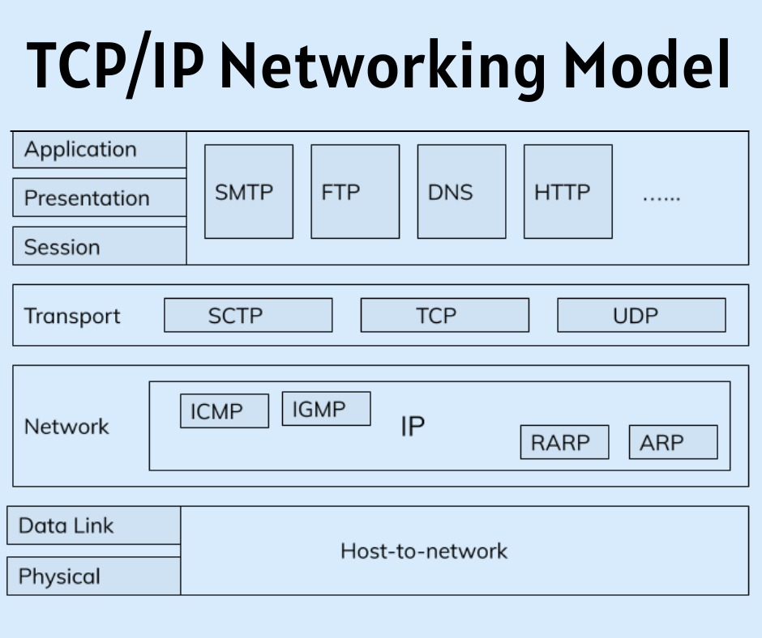
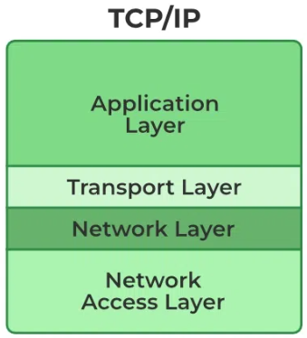
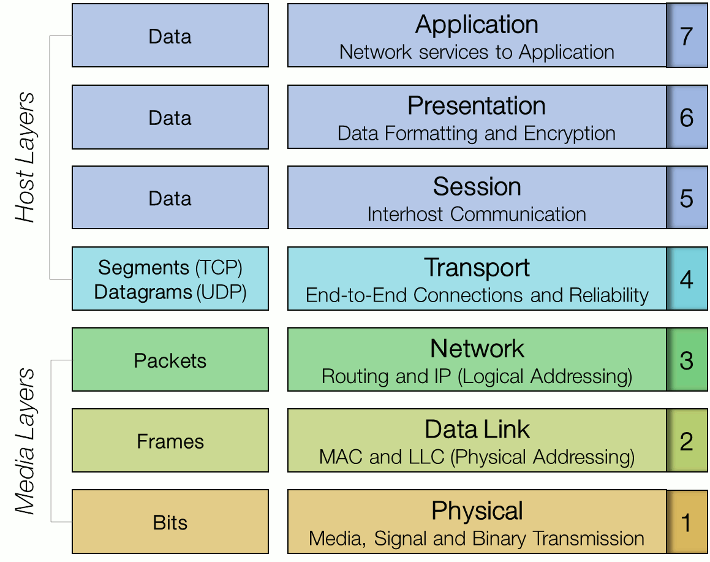
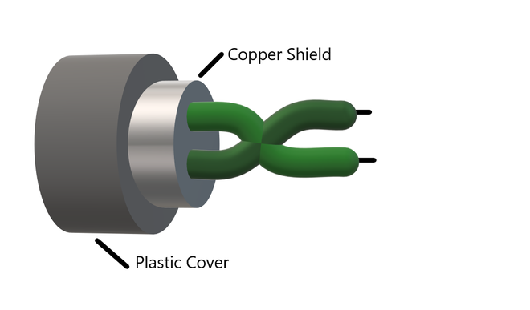
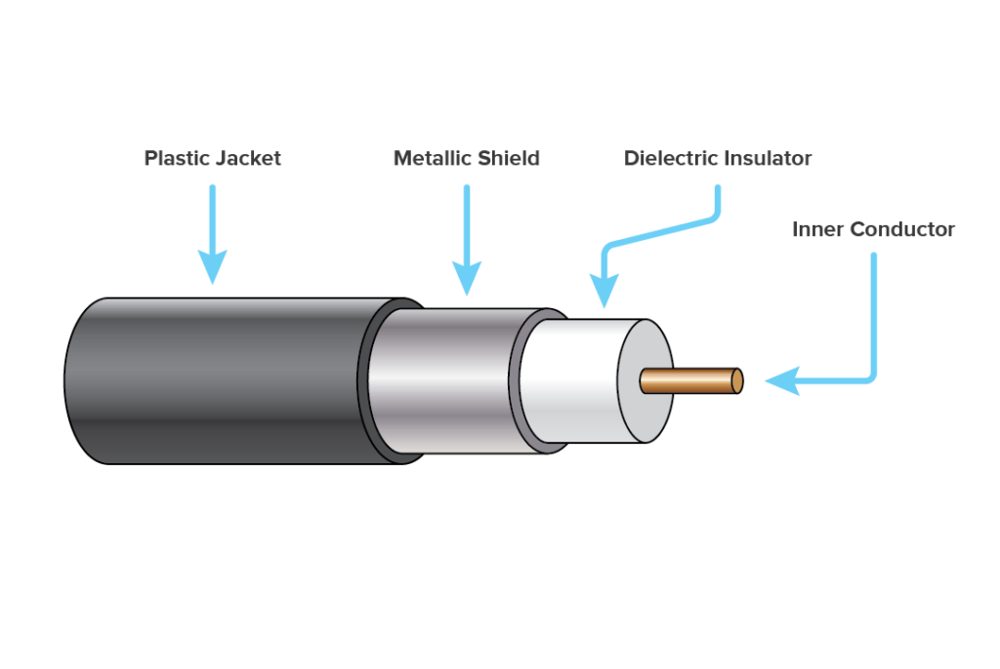
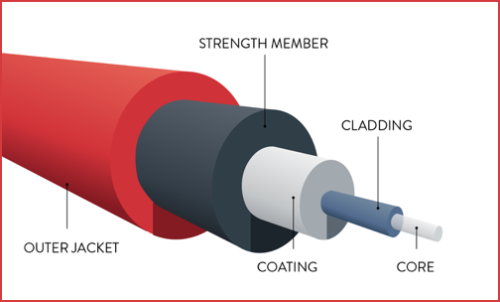

# 
 Unit 1 

## Basics

**Computer Network:**

A computer network is like a digital community where computers and devices are connected, allowing them to communicate and share resources. Think of it as a virtual neighborhood where devices like computers, smartphones, and printers can talk to each other. Networks have some key features:

- **Communication Speed:** Networks allow devices to exchange information quickly, ranging from local networks in your home to global networks like the internet. Faster communication speed means quicker data transfer.

- **File Sharing:** Networks enable devices to share files and data. This is useful for collaborative work, sharing documents, or sending pictures between devices.

- **Security:** Networks need security measures to protect data from unauthorized access. Just like locking your front door, networks use firewalls and encryption to keep your data safe.

- **Scalability:** Networks can grow to include more devices as needed. Whether you're connecting a few computers at home or building a large corporate network, scalability allows for expansion.

- **Reliability:** Networks strive to stay operational without disruptions. Reliable networks ensure that devices can consistently communicate and access resources.

**Components of a Computer Network:**

- **Network Interface Cards (NICs):** These are like the passports of devices to enter the network. NICs are hardware components that allow devices to physically connect to the network, enabling communication.

- **Hubs:** Imagine a hub as a central meeting place where devices connect. However, hubs are quite basic and tend to send data to all devices connected to them, which can lead to inefficiencies.

- **Switches:** Switches are like smart hubs. They only send data to the device it's intended for, making communication more efficient. It's like sending a private message to a specific person in a room full of people.

- **Router:** Routers are like postal workers of the network. They direct data between different networks. They decide the best path for data to travel so it reaches its intended destination, even if it's across the globe.

- **Modem:** If the router is like a postal worker, the modem is like the translator between the digital world and the analog world. It converts data from your devices into a form that can be transmitted over the internet (and vice versa).

**Internet:**

The internet is a vast global network of interconnected computers and servers. It enables people to access and share information, communicate, and use various online services through websites and applications.

**World Wide Web:**

The World Wide Web (WWW) is a collection of web pages and resources that are accessible over the internet. It's like a library of information that you can access from anywhere in the world. The WWW is just one of many services that the internet provides.

**CRC:**

CRC stands for Cyclic Redundancy Check. It is a method of error detection in data transmission. It is used to detect accidental changes to raw data. It's a hash function that detects accidental changes to raw computer data commonly used in digital telecommunications networks and storage devices such as hard disk drives.

## TCP/IP Model

The TCP/IP model, where TCP stands for Transmission Control Protocol and IP stands for Internet Protocol, is a network model designed to facilitate communication across diverse computer systems. It's a practical framework tailored to meet the original design of the Internet. TCP/IP comprises two primary protocols and encompasses numerous sub-protocols across four layers.

**Application Layer:**

The Application layer protocols serve applications on computers, acting as an interface between software and the network. It's the layer where users interact with the network. It's responsible for identifying and establishing the availability of intended communication partners and determining resource availability. Furthermore, it also synchronizes communication and establishes privacy and security boundaries. Some protocols used in this layer are:

- **HTTP:** Hypertext Transfer Protocol is used for transmitting data between clients (like web browsers) and servers, forming the basis for web communication.
- **FTP:** File Transfer Protocol ensures secure data exchange between devices, often used in large organizations and institutions.
- **SMTP:** Simple Mail Transfer Protocol standardizes email transmission on the Internet, facilitating communication between servers for sending messages.
- **DNS:** Domain Name Server maps host names to numerical addresses, crucial for Internet functionality.

**Transport Layer:**

This layer maintains communication between sender and receiver. At the Transport layer, data is divided into smaller units called segments.  It employs either TCP or UDP. TCP supporting segmentation for large data and UDP being more straightforward for smaller data. 

- **TCP:** Transmission Control Protocol breaks down large messages into smaller segments with headers for efficient delivery.
- **UDP:** User Datagram Protocol is used for simpler, smaller data transfers.

There's also a third protocol called SCTP, which is less common.

- **SCTP:** Stream Control Transmission Protocol offers reliable, message-oriented communication. It divides messages into chunks, providing error-checking, reordering, and multiplexing for enhanced data transfer in a more versatile manner than TCP.

**Network Layer:**

This layer establishes connections between source and destination computers, with routers helping determine the best path for each packet. It's responsible for logical addressing and routing.

- **Logical Addressing:** IP addresses are assigned to segments to ensure proper routing across networks.
- **Routing:** Determines the path for packets to reach their destination, not necessary within the same network.

**Data Link Layer:**

This layer is responsible for the physical transmission of data. It's responsible for the node-to-node delivery of messages. It's also responsible for error detection and correction. It's divided into two sublayers:

- **Logical Link Control (LLC):** This sublayer is responsible for error checking and flow control.
- **Media Access Control (MAC):** This sublayer is responsible for controlling how devices in a network gain access to a medium and permission to transmit data.

**Physical Layer:**

This layer physically carries bits within frames across links. It's the lowest layer in TCP/IP, with communication occurring via transmission media like cables or airwaves. It's responsible for the physical connection between devices. Likewise, it also defines the electrical and physical specifications for devices. It's the layer where data is converted into binary bits and transmitted over the network.

The Data Link and Physical layers are often combined into a single layer in the TCP/IP model as the Link layer or Network Interface layer/ Network Access layer.

Hence, the TCP/IP model has four layers:

## OSI Model

The OSI Reference Model, developed by the International Standards Organization (ISO), is a structured framework for understanding how different systems communicate. It comprises seven layers, each with specific responsibilities, enabling seamless communication across networks.

**1. Physical Layer:**

The bottom layer focuses on transmitting raw data bits across the network. It encompasses transmission media like cables and wireless signals, ensuring reliable propagation of binary data (0s and 1s). It's the layer where data is converted into binary bits and transmitted over the network. Furthermore, it's also responsible for defining the electrical and physical specifications for devices.

**2. Data-Link Layer:**

The second layer ensures error-free communication over physical links. It forms frames from raw data, handles error detection and correction, manages flow control, and decides which device controls the shared communication channel. 

**3. Network Layer:**

Layer three facilitates routing across interconnected networks. Routers and software work here to determine the optimal path for data, addressing, and delivering packets between devices, even when multiple networks are involved. It also handles congestion control to prevent network overload i.e. in situations where there's too much data to handle.

**4. Transport Layer:**

The fourth layer ensures end-to-end data integrity. It segments and reassembles messages, ensures reliable data transfer, establishes flow control, and handles error recovery by retransmitting damaged segments. It also manages data congestion to prevent network overload.

**5. Session Layer:**

This layer establishes and maintains communication channels between devices. It handles session initiation, maintenance, and termination, along with data checkpointing for resuming interrupted transfers. It also manages security and authentication. This layer is responsible for establishing, managing, and terminating connections between applications.

**6. Presentation Layer:**

Layer six prepares data for transmission. It encodes, encrypts, compresses, and translates data formats, ensuring proper representation for transmission between devices. It also handles data decryption and decompression at the receiving end.

**7. Application Layer:**

The topmost layer provides access to network services. It manages communication between applications and users, using protocols like HTTP, FTP, POP, SMTP, and DNS to deliver meaningful data and control the sequence of activities within applications. It's the layer where users interact with the network.

## TCP/IP vs OSI Model

| **Aspect**                     | **TCP/IP Model**                               | **OSI Model**                                   |
|-------------------------------|-----------------------------------------------|------------------------------------------------|
| **Definition**                | Practical, real-world model designed for the original Internet design, directly used in the Internet.  | Conceptual model, providing a theoretical framework for understanding network communication. |
| **Number of Layers**          | Four layers: Application, Transport, Network, and Physical. | Seven layers: Physical, Data Link, Network, Transport, Session, Presentation, and Application. |
| **Layers' Alignment**         | Not a perfect match with OSI layers. | Aligned more closely with theoretical communication functions. |
| **Development**               | Evolved from real-world Internet needs. | Developed as a standardized, conceptual framework for universal understanding. |
| **Scope**                     | Primarily focused on practical Internet communication and networking. | Theoretical model applicable to any network communication environment. |
|**Approach**                   | It is horizontally approached.| It is vertically approached.| 
|**Reliability**                | It is more reliable than OSI Model.| It is less reliable than TCP/IP Model.| 
| **Rigor**                     | Less formal and theoretical. | More structured and theoretical. |
| **Protocols**                 | Fewer explicitly defined protocols, but commonly used ones like TCP, UDP, and IP. | Each layer has specific, standardized protocols. |
| **Layer Nomenclature**        | Named after the protocols at those layers. | Named with descriptive functions to enhance understanding. |
| **Conceptual Emphasis**       | Emphasizes practical implementation of Internet communication and networking. | Focuses on the theoretical concept of communication and network layers. |
| **Ease of Implementation**     | Practical and directly applicable for Internet-based systems. | Offers a more theoretical framework that may require adaptation for real-world use. |
| **Adoption and Use**          | Actively used in the operation of the Internet and many modern networks. | Used for educational purposes, standardizing communication concepts across industries. |
| **Original Intent**           | Addressing real-world Internet communication challenges and needs. | Intended to provide a universal, structured approach to network communication understanding. |

## Types of Transmission Media

In networking, communication channels / Transmission media are categorized into two main types: guided media and unguided media. These terms refer to the physical pathways through which data signals are transmitted from one point to another. Each type has distinct characteristics that affect their applications and performance in network communication.

**Guided Media:**

Guided media, also known as wired or bounded media, are physical channels that use physical connectors or conductors to transmit signals. 

In simpler terms guided media is a physical medium that uses physical connectors or conductors to transmit signals. These media provide a dedicated pathway for the signals, resulting in more controlled and reliable transmission. Some common types of guided media include:

1. **Twisted Pair Cable:** This is a widely used guided medium for local area networks (LANs). It consists of pairs of insulated copper wires twisted together to reduce interference. Twisted pair cables are further categorized into unshielded twisted pair (UTP) and shielded twisted pair (STP), with varying levels of protection against external interference.

2. **Coaxial Cable:** Coaxial cables consist of a central copper conductor surrounded by layers of insulation, metallic shield, and an outer protective sheath. They are often used for cable television and broadband internet connections.

3. **Fiber Optic Cable:** Fiber optic cables use thin strands of glass or plastic to transmit data using light signals. They offer high bandwidth, low signal loss, and resistance to electromagnetic interference. Fiber optics are commonly used for long-distance communication and high-speed data transmission.

**Unguided Media:**

Unguided media, also known as wireless or unbounded media, use the air or atmosphere as a medium for signal transmission. These media provide mobility and flexibility but can be more susceptible to interference and attenuation. Some common types of unguided media include:

1. **Radio Waves:** Radio waves are electromagnetic signals used for wireless communication, including radio broadcasts, Wi-Fi networks, and cellular networks. They have varying frequencies, with longer wavelengths for broadcasting and shorter wavelengths for data transmission.

2. **Microwaves:** Microwaves have higher frequencies than radio waves and are commonly used for point-to-point communication in microwave towers. They are also utilized in satellite communication and microwave ovens.

3. **Infrared Waves:** Infrared waves are used for short-range wireless communication, such as remote controls, infrared data transfer between devices, and some wireless LAN technologies.

4. **Light Waves:** Visible light can be modulated to transmit data, a concept known as Visible Light Communication (VLC). LEDs (Light Emitting Diodes) are used to send data using light waves, offering secure and high-speed data transfer within a limited area.

**Comparison:**

- **Propagation:** Guided media have a defined physical pathway, while unguided media rely on air or space for signal propagation.
- **Interference:** Guided media generally experience less interference compared to unguided media, which are prone to atmospheric and environmental factors.
- **Distance:** Guided media often have distance limitations due to signal degradation, while unguided media can cover larger distances depending on the frequency used.
- **Mobility:** Unguided media offer more mobility and flexibility since they are not constrained by physical cables.
- **Bandwidth:** Fiber optic cables among guided media and certain radio frequency ranges in unguided media offer high bandwidth capabilities.

## Data Link Layer and its Issues

The data link layer, the second layer after the physical layer, plays a crucial role in maintaining the data link between two hosts or nodes. Before delving into the design issues within the data link layer, it's important to understand its sub-layers and their functions.

The data link layer is divided into two sub-layers:

**Logical Link Control Sub-layer (LLC):**
The LLC provides the logical framework for the data link, encompassing synchronization, flow control, and error checking functions. Its functions include:
- **Error Recovery:** Handling errors that occur during transmission.
- **Flow Control Operations:** Managing the pace of data transfer to prevent congestion.
- **User Addressing:** Enabling proper addressing of users within the network.

**Media Access Control Sub-layer (MAC):**
As the second sub-layer, the MAC controls flow and multiplexing for the transmission medium, meaning it decides which device controls the shared communication channel. Its functions include:
- **Access Control:** Regulating access to the shared transmission medium.
- **Unique Addressing:** Assigning unique addresses to devices connected to the Local Area Network (LAN).
- **Error Detection:** Identifying errors that occur during transmission.

The data link layer acts as an intermediary between the network layer. It primarily facilitates the transfer of data from the network layer on the sending machine to the network layer on the destination machine. This transfer occurs via the Data Link Layer (DLL), ensuring seamless communication between the two layers.

The design issues within the data link layer are as follows:

1. **Frame Synchronization:**
   In data communication, the source machine transmits data in the form of frames to the destination machine. Ensuring effective communication requires accurate identification of the beginning and end of each frame. This synchronization is crucial for the destination machine to recognize and process frames correctly.

2. **Flow Control:**
   Flow control mechanisms are vital to prevent data frame overflow at the receiver's end. To maintain efficient communication, the source machine must regulate its data frame transmission rate based on the capacity of the destination machine to accept and process the incoming frames.

3. **Error Control:**
   Error control mechanisms focus on detecting and preventing frame duplication during transmission. Since errors may be introduced during data transfer from the source to the destination machine, it's essential for the destination machine to identify and correct these errors to ensure accurate data reception.

4. **Congestion Control:**
   Congestion control mechanisms are crucial for preventing network congestion, which occurs when the network is unable to handle the volume of data being transmitted. Congestion control mechanisms help regulate the flow of data to prevent network overload and ensure efficient communication.