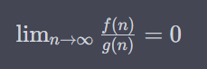

```
The word Algorithm means ”A set of finite rules or instructions to be followed in calculations or other problem-solving operations”
Or
”A procedure for solving a mathematical problem in a finite number of steps that frequently involves recursive operations”.
```

# Properties/Criteria of an Algorithm:

1. **Clear and Unambiguous:** An algorithm should be expressed in a clear and unambiguous manner. Each step must be precisely defined and leave no room for interpretation or confusion. This ensures that anyone following the algorithm will execute the same steps and produce the same results.

2. **Well-Defined Inputs:** If an algorithm requires input, these inputs should be well-defined. The algorithm should specify the type, format, and range of acceptable inputs. This ensures that the algorithm can handle a variety of inputs without ambiguity.

3. **Well-Defined Outputs:** An algorithm must specify the expected output or outcomes. This output should also be well-defined and relevant to the problem being solved. The algorithm should provide a clear description of the result it aims to achieve.

4. **Finiteness:** The algorithm should terminate after a finite number of steps. This ensures that the execution of the algorithm doesn't go on indefinitely, making it feasible for practical use. Infinite loops or processes that never terminate are not considered valid algorithms.

5. **Feasible:** An algorithm should be feasible to execute using available resources. It should not rely on technologies or resources that are not currently available. It should be practical, efficient, and possible to implement within the constraints of the computing environment.

6. **Language Independent:** Algorithms should be designed in such a way that they can be implemented in any programming language. The logic and steps of the algorithm should remain the same regardless of the programming language used. This promotes flexibility and compatibility.

7. **Input:** An algorithm can accept zero or more inputs. It should be designed to handle various input scenarios effectively. Algorithms with input parameters can adapt to different situations and provide customized outputs based on those inputs.

8. **Output:** An algorithm must produce at least one output. The output should be meaningful and relevant to the problem being solved. Even if the algorithm is used for internal calculations, it should provide some form of result that contributes to the solution.

9. **Definiteness:** Each step in an algorithm must be unambiguous, clear, and easy to understand. Any person referring to the algorithm should be able to interpret the instructions without confusion. The use of precise language and logical constructs is crucial here.

10. **Finiteness:** An algorithm must have a termination condition, ensuring that it will finish executing within a finite number of steps for any input. This prevents infinite loops and guarantees that the algorithm will eventually produce a result or halt.

11. **Effectiveness:** The algorithm should be constructed using basic, simple, and feasible operations. It should be possible to trace and execute the algorithm using manual methods, like pencil and paper. Complex or abstract operations that are difficult to follow are not ideal for an algorithm.

# Importance of Algorithms:

Algorithms are essential tools in problem-solving across various fields due to their efficiency, reliability, and effectiveness. They enable automation, optimization, and intelligent decision-making. Algorithms play a critical role in:

**Computer Science:**
Algorithms are the building blocks of computer programming, solving problems from simple sorting to complex AI tasks. They empower software to execute accurately, from basic text editing to advanced simulations.

**Mathematics:**
Algorithms are crucial in math, systematically solving equations, optimizing processes, and finding the shortest paths in graphs. They reveal insights from complex mathematical challenges.

**Operations Research:**
Algorithms optimize decisions in transportation, logistics, and resource allocation. They enhance efficiency, reducing costs and improving operations.

**Artificial Intelligence:**
Algorithms form AI's core, enabling image recognition, language processing, and decision-making. They process data and drive intelligent systems.

**Data Science:**
Algorithms analyze large datasets, extracting insights in fields like marketing, finance, and healthcare. They're essential for modern problem-solving across disciplines.


# Explain Algorithm Design steps


Explanation of the Algorithm Design Steps:

1. **Understand the Problem:** Begin by thoroughly comprehending the problem you're tasked with solving. Understand its context, requirements, constraints, and desired outcomes.

2. **Decide the Exact Appropriate Solution:** Based on your understanding of the problem, determine the most suitable approach or solution strategy. This decision is guided by your analysis of the problem's characteristics.

3. **Algorithm Design Techniques:** Choose the appropriate algorithm design techniques that align with your chosen solution strategy. These techniques can include divide-and-conquer, dynamic programming, greedy algorithms, etc.

4. **Prove Correctness:** Before proceeding further, verify that your algorithm is logically correct. You need to ensure that it fulfills the problem's requirements and produces the expected results.

5. **Analyze the Algorithm (Is it Effective?):** Evaluate the algorithm's efficiency in terms of time and space complexity. If the analysis indicates that the algorithm is effective (fast and resource-efficient), proceed to coding.

6. **Code the Algorithm:** Translate your algorithm into actual code using a programming language. This step involves converting the logical steps into a syntax that a computer can understand and execute.

If the correctness of the algorithm is proven and the analysis indicates effectiveness, the algorithm progresses to the coding phase. If either condition is not met, you can revisit the choice of algorithm design techniques for refinement. This iterative approach ensures a well-crafted, correct, and efficient algorithm design.


# What is Pseudo Code? Explain the steps required for writing a Pseudo Code.

**Pseudocode** is a high-level description of an algorithm or program written in a manner that resembles a programming language, but is meant to be easily understandable by humans, without getting into the specifics of actual programming syntax. It's used as a tool to plan and outline the logical steps of an algorithm before translating it into a specific programming language.

**Steps for Writing Pseudocode:**

1. **Start with Problem Understanding:**
   Begin by comprehending the problem thoroughly. Understand the requirements, constraints, and desired outcomes. This lays the foundation for your pseudocode.

2. **Outline the Main Steps:**
   Break down the solution into major steps. Describe what the algorithm needs to accomplish at each stage. Use simple and descriptive statements.

3. **Use Variables and Constants:**
   Employ variable names that are indicative of their purpose. Declare and initialize variables as needed to hold data.

4. **Control Structures:**
   Utilize control structures like loops (for, while) and conditionals (if, else) to dictate the flow of the algorithm based on different scenarios.

5. **Modularize with Functions/Procedures:**
   Break down complex tasks into smaller sub-tasks using functions or procedures. Describe what each function does without delving into the specifics of its implementation.

6. **Input and Output:**
   Include input and output statements that represent user interactions or data processing.

7. **Commenting:**
   Add comments to clarify the logic or steps, especially when dealing with complex portions.

8. **Iteration and Loops:**
   Use loops for repetitive tasks. Specify loop conditions and how the iteration should be performed.

9. **Conditionals:**
   Employ conditionals for decision-making. Describe the conditions that trigger specific actions or branches.

10. **Error Handling:**
    Include error handling statements, such as try-catch blocks, if relevant to the problem.

11. **Termination:**
    Clearly indicate how the algorithm should terminate or exit.

12. **Testing:**
    Mentally simulate the algorithm by reading through the pseudocode. Verify that the logic is sound and the steps align with the intended solution.

Here's an example of pseudocode for finding the sum of even numbers from 1 to N:

```c
Start
  Declare N, sum as Integer
  Input N
  sum = 0

  For i = 1 to N do
    If i % 2 == 0 then
      sum = sum + i
    End If
  End For

  Output sum
End
```


# Priori Analysis vs. Posteriori Analysis

In the analysis of algorithms, the choice of the best algorithm for a problem is based on factors such as CPU time and memory space.

| Aspect                            | Priori Analysis                             | Posteriori Analysis                           |
|-----------------------------------|----------------------------------------------|-----------------------------------------------|
| Analysis Nature                   | Absolute analysis independent of the system. | Relative analysis based on specific system.   |
| Dependency                        | Independent of compiler and hardware.        | Depends on compiler, hardware, and input data. |
| Precision                         | Provides estimates based on theoretical analysis.| Provides exact answers based on real scenarios.|
| Notation Usage                    | Uses asymptotic notations to represent efficiency.| Does not use asymptotic notations.            |
| Time Complexity Variation         | Theoretical time complexity remains consistent. | Varies across different systems and inputs.   |
| Credit Distribution               | Credits programmer for algorithm efficiency. | Credits both hardware and algorithm design for speed. |
| Timing                           | Done before algorithm execution.            | Done after algorithm execution.               |
| Resource Utilization              | Relies on theoretical assumptions.          | Requires real hardware and input data.        |
| Cost                              | Cheaper in terms of resources.              | Costlier due to software, hardware, and test data needs. |
| Maintenance for Tuning           | Maintenance phase not needed after design. | Requires ongoing maintenance to adapt to changing systems. |
| Suitability for Real-world Scenarios | More suited for theoretical efficiency analysis. | Well-suited for real-world performance comparisons. |


# Explain Time Complexity with examples Using Counter method.

**Time Complexity with Counter Method:**

Time complexity is a measure of the amount of time an algorithm takes to run as a function of the length of the input. The counter method involves using a count variable to track the number of basic operations performed during an algorithm's execution. Let's explore this with examples of summing an array and matrix multiplication:

**1. Sum of Array:**

Consider calculating the sum of an array using a loop:

```c
Algorthm sum(a, n){
   s := 0.0; // count := count + 1;
   for i := 1  to n do{ // count := count + 1;  ----
      s := s + a[i]; // count := count + 1;        | ---> 2n
   }  // count := count + 1;                    ----
   return s; // count := count + 1;
}
```

For an array of size `n`, the count of operations (count variable) would increase by approximately `2n` since each addition operation contributes to the count.

Total time of count = `2n + 3` (3 for the initialization and return statements)

**2. Matrix Addition:**

Let's analyze a simple matrix addition algorithm:

```c
Algorithm add(a, b, c , n, m){
   for i := 1 to m do
   {  // count := count + 1;                                 ---------------------                  
      for j := 1 to n do                                  //                     |
      {  // count := count + 1;                                   ----           |
         c[i][j] := a[i][j] + b[i][j]; // count := count + 1;        | ---> 2mn  | ---> 2m
      }                                                   //      ----           |
      // count := count + 1;                                                     |
   }                                                      //----------------------                   
   // count := count + 1;
}
```

Here, the count increases by `2mn + 2m + 1` for the nested loops and the initialization and return statements.

**3. Matrix Multiplication:**

Let's analyze a simple matrix multiplication algorithm:


Total time of count = `2mnp + 3mp + 2m + 1`


# Explain Space Complexity with examples

**Space Complexity with Examples:**

Space complexity refers to the amount of memory space an algorithm or program requires to execute, as a function of the input size. It includes the memory used by variables, data structures, function call stack, and other resources.

Consider the given pseudocode example for matrix addition:

```c
Algorithm add(a, b, c, n, m) {
   for i := 1 to m do
   {
      for j := 1 to n do
      {
         c[i][j] := a[i][j] + b[i][j];
      }
   }
}
```

In this example, we have three matrices: `a`, `b`, and `c`, each having dimensions `m x n`. Let's analyze the space complexity step by step:

1. **Input Space:** The matrices `a` and `b` each occupy space `O(m x n)` in memory.

2. **Output Space:** The matrix `c`, which stores the result, also occupies space `O(m x n)`.

3. **Variables Space:** The variables `i`, `j`, and any loop control variables occupy constant space.

4. **Temporary Variables:** The temporary variable storing the sum `a[i][j] + b[i][j]` occupies constant space for each iteration.

5. **Total Space Complexity:** Considering all the components, the space complexity of this algorithm is `O(m x n)`, since the space required by the input matrices, output matrix, and temporary variables dominates the space used by other variables and constants.


Consider the following pseudocode example for calculating the factorial of a number:

```c
Algorithm factorial(n) {
   if (n == 0)
      return 1;
   else
      return n * factorial(n - 1);
}
```

Here's the analysis of space complexity for this algorithm:

1. **Input Space:** The input parameter `n` takes constant space.

2. **Function Call Stack:** Recursion involves function calls, which create a stack frame for each recursive call. In this case, the maximum depth of the call stack will be `n`, as we are calling the function recursively `n` times.

3. **Variables Space:** The variable `n` and any temporary variables used within the function take constant space.

4. **Total Space Complexity:** The space complexity of this algorithm is determined by the maximum depth of the function call stack. Since the maximum depth is `n` in this case, the space complexity is `O(n)`.


# Discuss all the Asymptotic Notations with suitable examples.

**Asymptotic Notations with Examples:**

Asymptotic analysis, which includes the concepts of Worst, Average, and Best Cases of Algorithms, aims to assess algorithm efficiency independently of machine-specific constants. Asymptotic notations, like Big-O, Omega, and Theta, serve as mathematical tools for representing the time complexity of algorithms during this analysis.

**Asymptotic Notations:**

**Big-O Notation (O-notation):**
The function f(n) = O(g(n)) if and only if there exists positive constants C and n₀ such that f(n) ≤ C * g(n) for all values of 'n' greater than or equal to n₀.

**Omega Notation (Ω-notation):**
The function f(n) = Ω(g(n)) if and only if there exists positive constants C and n₀ such that C * g(n) ≤ f(n) for all values of 'n' greater than or equal to n₀.

**Theta Notation (Θ-notation):**
The function f(n) = Θ(g(n)) if and only if there exist positive constants C₁, C₂, and n₀ such that C₁ * g(n) ≤ f(n) ≤ C₂ * g(n) for all values of 'n' greater than or equal to n₀.

**Little-oh Notation (o-notation):**
The function f(n) = o(g(n)) if and only if:



where g(n) represents the upper bound function.

**Little-omega Notation (ω-notation):**
Similarly, the function f(n) = ω(g(n)) if and only if:


where g(n) represents the lower bound function.

**Examples:**

1. **Big-O Notation (O-notation):**
   - Example: Bubble Sort's worst-case time complexity is O(n^2), indicating quadratic growth rate.

2. **Omega Notation (Ω-notation):**
   - Example: Merge Sort's best-case time complexity is Ω(n log n), indicating linearithmic growth.

3. **Theta Notation (Θ-notation):**
   - Example: Quick Sort's average-case time complexity is Θ(n log n), balanced between linear and quadratic rates.

4. **Little-oh Notation (o-notation):**
   - Example: If an algorithm's time complexity is o(n^2), it grows slower than quadratic time but faster than linear.

5. **Little-omega Notation (ω-notation):**
   - Example: If an algorithm's time complexity is ω(n^2), it grows faster than quadratic time but slower than exponential.


# Describe Performance Analysis of Algorithms with examples.

Performance analysis involves evaluating the efficiency of algorithms in terms of their time and space complexity. It helps us understand how algorithms behave as input sizes increase and provides insights into selecting the best algorithm for a particular problem. 

Here are examples of performance analysis using different algorithms:

**Example 1: Linear Search vs. Binary Search (Time Complexity Analysis)**

Suppose you have a sorted list of numbers and want to find a specific element within it.

- **Linear Search:**
  In linear search, you iterate through the list sequentially until you find the desired element or reach the end. The worst-case time complexity is O(n), where 'n' is the number of elements.

- **Binary Search:**
  In binary search, you repeatedly divide the list in half and eliminate half of the remaining elements based on a comparison. The worst-case time complexity is O(log n), where 'n' is the number of elements.

Here, binary search is more efficient for large lists as it has a logarithmic time complexity compared to linear search's linear time complexity.

**Example 2: Sorting Algorithms (Time and Space Complexity Analysis)**

Consider various sorting algorithms to arrange a list of numbers in ascending order.

- **Bubble Sort:**
  Bubble sort compares adjacent elements and swaps them if they're in the wrong order. Its worst-case time complexity is O(n^2), and it has a constant space complexity.

- **Merge Sort:**
  Merge sort divides the list into smaller sublists, sorts them, and then merges them back. Its worst-case time complexity is O(n log n), and it requires additional space for merging, resulting in a space complexity of O(n).

Comparing these two algorithms, merge sort is more efficient for larger lists due to its better time complexity, even though it requires more memory.

**Example 3: Matrix Multiplication (Time and Space Complexity Analysis)**

Matrix multiplication involves multiplying two matrices to produce a resulting matrix.

- **Naive Matrix Multiplication:**
  The naive approach involves iterating through rows and columns of matrices, resulting in a time complexity of O(n^3) for two n x n matrices. The space complexity is O(n^2) for the resulting matrix.

- **Strassen's Algorithm:**
  Strassen's algorithm uses a divide-and-conquer approach to reduce the number of multiplications needed. Its time complexity is approximately O(n^2.81), making it more efficient for large matrices. However, its space complexity is also higher due to the recursive nature.

In this case, Strassen's algorithm is preferred for large matrices despite its higher space complexity, as its lower time complexity dominates for sufficiently large 'n'.

Performance analysis helps us make informed decisions about algorithm selection based on factors such as input size, available memory, and computational resources. It guides us in designing efficient algorithms that can handle real-world scenarios effectively.


# What is Divide-and Conquer method? Explain General Method (Control Abstraction) of Divide-and Conquer

**Divide and Conquer Method:**

The divide and conquer method is a problem-solving strategy in computer science and mathematics. It involves breaking down a complex problem into smaller sub-problems, solving them individually, and then combining their solutions to solve the original problem. This approach is particularly useful for solving problems that can be divided into similar sub-problems, making it easier to manage and optimize the solution process.

**General Method (Control Abstraction) of Divide and Conquer:**

1. **Divide:**
   - The problem instance is divided into smaller sub-problems of the same type.
   - These sub-problems are typically disjoint and share the same characteristics as the original problem.

2. **Conquer:**
   - The sub-problems are solved recursively, often using the same divide-and-conquer approach.
   - When the sub-problems are small enough, their solutions are computed directly (base case).

3. **Combine:**
   - The solutions of the sub-problems are combined to obtain the solution for the original problem.
   - This step involves merging the solutions in a way that aligns with the problem's requirements.

**Control Abstraction for the Divide and Conquer Strategy:**

```c
Algorithm DAndC(P)
{
    if Small(P) then return S(P);
    else
    {
        divide P into smaller instances P1, P2, P3, ..., Pk, k ≥ 1;
        Apply DAndC to each of these subproblems;
        return Combine(DAndC(P1), DAndC(P2), ..., DAndC(Pk));
    }
}
```

Here,
- `Small(P)` is a Boolean function that determines whether the input size is small enough to compute the answer directly.
- `S(P)` represents the solution for small instances.

**Recurrence Relation:**

The time complexity of many divide-and-conquer algorithms can be represented by recurrence relations of the form:

$T(n) = 1, n = 1$

$T(n) = a \cdot T(n/b) + f(n), n>1$

Where:
- `T(n)` is the time complexity for a problem of size 'n'.
- 'a' is the number of sub-problems.
- 'b' is the factor by which the problem size is reduced.
- `f(n)` represents the time for dividing the problem and combining solutions to sub-problems.
- $n = b^k$ is the base case.
- $k = \log_b n$ is the number of levels in the recursion tree.

**Solving the Recurrence Relation:**

By solving the recurrence relation, the time complexity of the algorithm can be determined. For example, if we substitute $a = 2$, $b = 2$, and $T(1) = 2$ into the recurrence relation $T(n) = 2T(n/2) + n$, we can solve it to obtain $T(n) = O(n \log n)$.

**Applications:**

Divide and conquer is a powerful strategy used in various algorithms:
- **Binary Search:** Divide the search range in half at each step to find a key element efficiently.
- **Quick Sort:** Partition the array into smaller sub-arrays, sort them, and then combine to achieve efficient sorting.
- **Merge Sort:** Divide the array into halves, sort each half, and merge them to achieve efficient sorting.
- **Strassen's Matrix Multiplication:** Divide matrices into sub-matrices, perform matrix operations, and combine results to multiply matrices more efficiently.


# Write both Recursive and Non-Recursive algorithms on Binary Search

**Recursive Binary Search Algorithm:**

```c
int binarySearchRecursive(int arr[], int low, int high, int key) {
    if (low <= high) {
        int mid = low + (high - low) / 2;

        if (arr[mid] == key) {
            return mid;
        }

        if (arr[mid] < key) {
            return binarySearchRecursive(arr, mid + 1, high, key);
        }

        return binarySearchRecursive(arr, low, mid - 1, key);
    }

    return -1;  // Element not found
}
```

**Non-Recursive Binary Search Algorithm:**

```c
int binarySearchNonRecursive(int arr[], int size, int key) {
    int low = 0, high = size - 1;

    while (low <= high) {
        int mid = low + (high - low) / 2;

        if (arr[mid] == key) {
            return mid;
        }

        if (arr[mid] < key) {
            low = mid + 1;
        } else {
            high = mid - 1;
        }
    }

    return -1;  // Element not found
}
```

In both versions, the `low` and `high` parameters represent the current range of the array being searched. The recursive version divides this range in half during each recursive call, while the non-recursive version updates the range within the `while` loop until the key is found or the range is exhausted.


# Quick Sort Algorithm

- QuickSort is a popular sorting algorithm.
- It uses the divide-and-conquer approach.
- The algorithm selects a pivot element from the array. Elements are partitioned into two sub-arrays based on the pivot. Sub-arrays are recursively sorted using QuickSort.
- This process continues until the entire array is sorted.
- QuickSort is known for its efficiency and fast average-case time complexity of O(n log n).
- It's widely used in programming libraries and is a fundamental algorithm in computer science.

Here's the algorithm in pseudocode:

```c
Algorithm quickSort(low, high) {
    if (low < high) then {
        pivotIndex := partition(low, high);
        quickSort(low, pivotIndex - 1);
        quickSort(pivotIndex + 1, high);
    }
}

Algorithm partition(low, high) {
    pivot := arr[high];
    i := low - 1;

    for (j := low to high - 1) do {
        if (arr[j] <:= pivot) then {
            i := i + 1;
            swap(arr[i], arr[j]);
        }
    }

    swap(arr[i + 1], arr[high]);
    return i + 1;
}

Algorithm swap(a, b) {
    temp := a;
    a := b;
    b := temp;
}
```

**Time Complexity:**

The time complexity of QuickSort depends on the partitioning strategy. The worst-case time complexity is O(n^2), but the average-case time complexity is O(n log n).

**Worst Case Analysis for QuickSort:**

In the worst-case scenario, QuickSort's pivot selection leads to unbalanced partitioning, causing it to approach its worst-case time complexity.

**Equation:**
The recurrence relation for the worst case of QuickSort can be expressed as:

$T(n) = T(1) + T(n-1) + n$

Where:
- $T(1)$ is the time taken by a partition with one element (base case).
- $T(n-1)$ is the time taken by the remaining elements except the pivot element.
- $n$ is the number of comparisons required to identify the exact position of the pivot element.

In the worst case, the pivot is selected in a way that consistently divides the array into subarrays with sizes $1$ and $n-1$, leading to unbalanced partitioning. This results in a quadratic time complexity of $O(n^2)$.

**Average Case Analysis for QuickSort:**

The average-case scenario for QuickSort assumes that the pivot element divides the array into roughly equal subarrays, leading to more balanced partitioning.

**Equation:**
For the average case, we consider that the pivot element divides the array into two subarrays of approximately equal sizes. The recurrence relation can be approximated as:

$T(n) = 2 \cdot T(\frac{n}{2}) + n$

The average time complexity for QuickSort in this case is $O(n \log n)$.

**Best Case Analysis for QuickSort:**

The best-case scenario for QuickSort occurs when the pivot element consistently divides the array into two subarrays of nearly equal sizes.

**Equation:**
In the best case, the pivot element divides the array into two nearly equal subarrays. The recurrence relation can be expressed as:

$T(n) = 2 \cdot T(\frac{n}{2}) + n$

The best-case time complexity for QuickSort is $O(n \log n)$, similar to the average case.

It's important to note that while the average and best cases have a time complexity of $O(n \log n)$, the worst case can degrade to $O(n^2)$ due to unbalanced partitioning. To mitigate this, randomized pivot selection or other pivot strategies are often used in practical implementations.


# Merge Sort Algorithm

- MergeSort is a sorting algorithm that follows the divide-and-conquer strategy.
- It divides the array into smaller sub-arrays until they contain only one element each.
- It then merges these sub-arrays back together while maintaining their sorted order.
- The merging process compares elements from the sub-arrays and arranges them in order.
- This merging continues until a single sorted array is obtained.
- It's efficient for large datasets and is often used in practice for its stable sorting and reliable performance.

Here's the algorithm in pseudocode:

```c
Algorithm mergeSort(low, high) {
    if (low < high) then {
        mid := (low + high) / 2;
        
        mergeSort(low, mid);
        mergeSort(mid + 1, high);
        
        merge(low, mid, high);
    }
}

Algorithm merge(low, mid, high) {
    h := low;
    i := low;
    j := mid + 1;

    while ((h <:= mid) && (j <:= high)) do {
        if (arr[h] <:= arr[j]) then {
            temp[i] := arr[h];
            h := h + 1;
        } else {
            temp[i] := arr[j];
            j := j + 1;
        }
        i := i + 1;
    }

    if (h > mid) then {
        for (k := j to high) do {
            temp[i] := arr[k];
            i := i + 1;
        }
    } else {
        for (k := h to mid) do {
            temp[i] := arr[k];
            i := i + 1;
        }
    }

    for (k := low to high) do {
        arr[k] := temp[k];
    }
}
```

**Time Complexity:**

The time complexity of MergeSort is O(n log n) in all cases. This is because the array is divided into halves during each recursive call. The merging process takes O(n) time, and the number of recursive calls is O(log n). Therefore, the total time complexity is O(n log n).

**Time Complexity Analysis of Merge Sort:**

Merge Sort is known for its consistent performance across different scenarios, with a time complexity of \(O(n \log n)\) for all cases.

**Equation:**
The recurrence relation for Merge Sort is expressed as:

\[ T(n) = 2 \cdot T\left(\frac{n}{2}\right) + n \]

- \(T\left(\frac{n}{2}\right)\) represents the time taken for sorting two subarrays of size \(\frac{n}{2}\).
- \(n\) represents the time taken for merging the subarrays.

**Worst Case:**
In the worst case, where the array is evenly divided during each recursive step, the recursion depth will be \(\log n\), and at each level, \(n\) comparisons are performed for merging. This leads to a worst-case time complexity of \(O(n \log n)\).

**Average Case:**
The average-case time complexity is also \(O(n \log n)\) because Merge Sort consistently divides the array into balanced subarrays, resulting in similar behavior to the worst case.

**Best Case:**
Even when dealing with a nearly sorted array, Merge Sort maintains its \(O(n \log n)\) time complexity. Although some initial divisions may lead to smaller subarrays, the subsequent merging steps still contribute to the \(O(n \log n)\) behavior.

Merge Sort's time complexity remains stable regardless of the input characteristics, making it a dependable choice for sorting tasks. However, its auxiliary space complexity should also be considered due to the additional memory required for merging.


# Dijkstra's Algorithm - Single Source Shortest Path

**Dijkstra's Algorithm:**
1. Initialize a set of unvisited nodes and set the distance of all nodes to a very large value except for the start node, which is set to 0.
2. While there are unvisited nodes:
   - Choose the node with the smallest distance from the unvisited set. Mark it as visited.
   - For each neighbor of the chosen node:
     - Calculate the distance from the start node to the neighbor through the chosen node.
     - If this calculated distance is smaller than the current distance of the neighbor, update the distance.
3. Continue step 2 until all nodes have been visited.
4. The distances computed in step 2 represent the shortest path from the start node to all other nodes.

**Example:**
Consider a simple graph with nodes A, B, C, D, and E, and weighted edges as described earlier.

**Step-by-step:**
1. Initialize distances: A(0), B(∞), C(∞), D(∞), E(∞).
2. Choose node A with distance 0.
   - Update distances: B(4), C(2), D(∞), E(∞).
3. Choose node C with distance 2.
   - Update distances: B(4), D(5), E(∞).
4. Choose node B with distance 4.
   - Update distances: D(5), E(∞).
5. Choose node D with distance 5.
   - Update distances: E(12).
6. Choose node E with distance 12.
7. Algorithm terminates.

The final distances represent the shortest paths from node A to other nodes: B(4), C(2), D(5), E(12).


# Bellman-Ford Algorithm - Single Source Shortest Path

**Bellman-Ford Algorithm:**
1. Initialize distances and predecessors for all nodes. Set the distance of the source node to 0 and others to infinity.
2. Repeat for the number of nodes - 1 times:
   - For each edge (u, v) with weight w:
     - Relax the edge: If distance[u] + w < distance[v], update distance[v] to distance[u] + w and set predecessor[v] to u.
3. Check for negative-weight cycles:
   - For each edge (u, v) with weight w:
     - If distance[u] + w < distance[v], then a negative-weight cycle exists.
4. The distances and predecessors computed represent the shortest paths from the source node to all other nodes.

**Example:**
Consider a directed graph with nodes A, B, C, D, and E, and weighted edges as described earlier.

**Step-by-step:**
1. Initialize distances: A(0), B(∞), C(∞), D(∞), E(∞). Predecessors: A(nil), B(nil), C(nil), D(nil), E(nil).
2. **Iteration 1:**
   - Relax edges: A-B(3), A-C(5).
   - Update distances: A(0), B(3), C(5), D(∞), E(∞).
3. **Iteration 2:**
   - Relax edges: B-C(2), B-D(4), C-D(1), C-E(4).
   - Update distances: A(0), B(3), C(5), D(6), E(9).
4. **Iteration 3:**
   - Relax edges: D-E(2).
   - Update distances: A(0), B(3), C(5), D(6), E(8).
5. No negative-weight cycles found.

The final distances represent the shortest paths from the source node A to other nodes: B(3), C(5), D(6), E(8).

Bellman-Ford algorithm efficiently finds the shortest paths from a source node to all other nodes in a weighted graph, handling negative-weight edges and detecting negative-weight cycles. It iterates over edges multiple times, relaxing them to find the shortest paths gradually.
