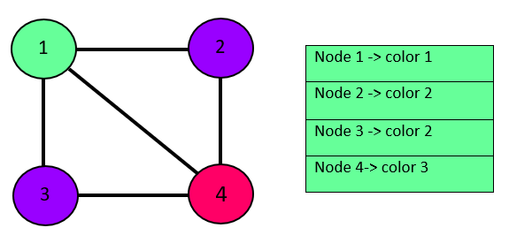
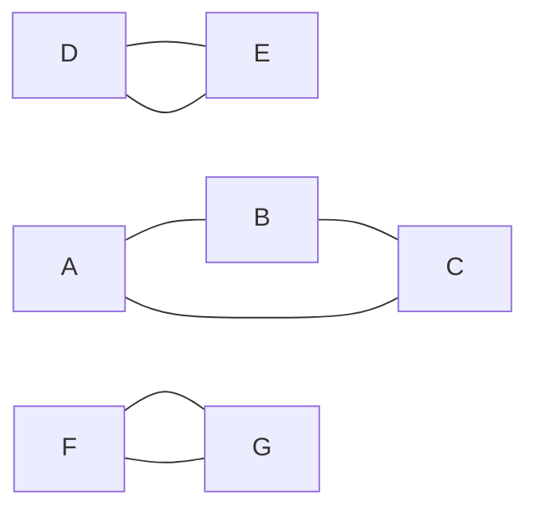
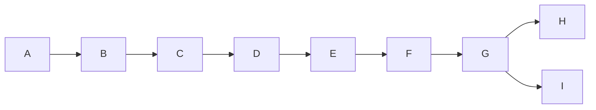
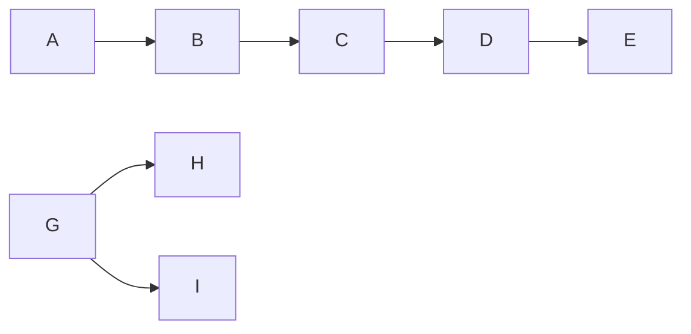

# Unit 1

## 1. **What is an Algorithm? How to devise an Algorithm?**
   An algorithm is a step-by-step procedure to solve a problem or perform a task. To devise an algorithm, follow these steps: 
   1. Understand the problem.
   2. Break down the problem into smaller subproblems.
   3. Design a high-level plan or pseudocode.
   4. Refine the plan and handle details.
   5. Implement and test the algorithm.

## 2. **Describe the characteristics of an Algorithm.**
   An algorithm should be: 
   - Clear: Well-defined steps.
   - Input: Takes inputs and produces outputs.
   - Finiteness: Terminates after a finite number of steps.
   - Effective: All steps are doable.
   - Unambiguous: Steps have precise meanings.
   - Efficient: Solves problem in a reasonable time.

## 3. **Write short notes on calculating Space complexity.**
   Space complexity measures memory usage by an algorithm. It includes: 
   - **Auxiliary space:** Space for variables and data structures.
   - **Input space:** Memory required by input.
   - **Output space:** Memory required by output.
   Analyze these spaces to determine the algorithm's memory requirements.

## 4. **Define Big O notation. Explain with suitable example.**
   Big O notation describes the upper bound of an algorithm's growth rate. 
   - The function f(n) = O(g(n)) if and only if there exists positive constants C and n₀ such that f(n) ≤ C * g(n) for all values of 'n' greater than or equal to n₀.

## 5. **Define Omega notation. Explain with suitable example.**
   Omega notation represents the lower bound of an algorithm's growth rate. 
   - The function f(n) = Ω(g(n)) if and only if there exists positive constants C and n₀ such that C * g(n) ≤ f(n) for all values of 'n' greater than or equal to n₀.

## 6. **Define Theta notation. Explain with suitable example.**
   Theta notation provides both upper and lower bounds, indicating a tight bound on growth rate. 
   - The function f(n) = Θ(g(n)) if and only if there exist positive constants C₁, C₂, and n₀ such that C₁ * g(n) ≤ f(n) ≤ C₂ * g(n) for all values of 'n' greater than or equal to n₀.

## 7. **Describe control abstraction of Divide and Conquer strategy.**
   Divide and Conquer breaks a problem into smaller subproblems, solves them independently, and combines their solutions to solve the original problem. Control abstraction involves the steps of dividing, conquering, and combining to create a modular and efficient algorithm.

## 8. **Solve the recurrence relation for a=2, b=2, T(1)=2, and f(n)=n.**
   - Given the recurrence relation $T(n) = 2 \cdot T\left(\frac{n}{2}\right) + n$, we want to find  its time complexity.  
   - The Master Theorem helps us analyze this kind of recurrence.   
   - For our values $a = 2$ and $b =   2$, we compare $f(n)$ (which is $n$) with $n^{\log_b a}$ (which is $n^{\log_2 2} = n$).   
   - Since $f(n)$ and $n^{\log_b a}$ are in the same category, the time complexity is in the 2nd case of the Master Theorem. This means the time complexity is approximately $T(n) =   \Theta(n \log n)$.   
   - So, for the given recurrence relation, the time complexity is $\Theta(n \log n)$.

## 9. **Derive the time complexity for a=28, b=3, and f(n)=cn^3 using the substitution method.**
   ! Answer unknown

## 10. **Derive the time complexity of Strassen’s Matrix multiplication?**

Strassen's algorithm recursively divides the problem into smaller subproblems. For each of the four submatrices, there are seven matrix multiplications (denoted as M1, M2, ..., M7) involved. These multiplications occur on submatrices of size $n/2 \times n/2$.

The recursive algorithm has a recurrence relation $T(n) = 7T(n/2) + O(n^2)$, where the $7T(n/2)$ accounts for the seven subproblems and $O(n^2)$ is the cost of combining the subproblems.

Using the Master Theorem or recurrence solving techniques, we can determine that the time complexity of Strassen's Matrix Multiplication is approximately $O(n^{\log_2 7}) \approx O(n^{2.81})$. This complexity is better than the naive matrix multiplication algorithm, which is $O(n^3)$, especially for large matrices.

---


Additional Information:

    
Given two $n \times n$ matrices A and B, Strassen's algorithm breaks them into four 
$n/2 \times n/2$ submatrices each, resulting in the following partitions:

```
A = | A11  A12 |    B = | B11  B12 |
    | A21  A22 |        | B21  B22 |
```

The multiplication of matrices A and B using Strassen's algorithm can be expressed as:

```
C = | C11  C12 |
    | C21  C22 |
```

Where each $C_{ij}$ is calculated as follows:

```
C11 = A11*B11 + A12*B21
C12 = A11*B12 + A12*B22
C21 = A21*B11 + A22*B21
C22 = A21*B12 + A22*B22
```

**Master Theorem:**

The Master Theorem is a tool used to analyze the time complexity of divide-and-conquer algorithms with recurrence relations of the form $T(n) = aT(n/b) + f(n)$, where $a$ is the number of subproblems, $b$ is the factor by which the problem size is reduced, and $f(n)$ is the cost of combining the subproblems.

The Master Theorem has several cases depending on how $f(n)$ compares with $n^{\log_b a}$:

1. If $f(n) = O(n^{\log_b a - \epsilon})$ for some constant $\epsilon > 0$, then $T(n) = \Theta(n^{\log_b a})$.
2. If $f(n) = \Theta(n^{\log_b a})$, then $T(n) = \Theta(n^{\log_b a} \log n)$.
3. If $f(n) = \Omega(n^{\log_b a + \epsilon})$ for some constant $\epsilon > 0$ and $a f(n/b) \leq k f(n)$ for some constant $k < 1$ and sufficiently large $n$, then $T(n) = \Theta(f(n))$.

**Applying the Master Theorem to Strassen's Matrix Multiplication:**

1. We have the recurrence relation $T(n) = 7T(n/2) + O(n^2)$, where $a = 7$ (due to seven subproblems created), $b = 2$ (because matrices are divided into four parts), and $f(n) = O(n^2)$ (the cost of combining subproblems).

2. We need to compare $f(n)$ with $n^{\log_b a}$:

   - $f(n) = O(n^2)$.
   - $n^{\log_b a} = n^{\log_2 7}$.

   Since $f(n)$ is polynomially smaller than $n^{\log_b a}$, we are in Case 1 of the Master Theorem. Therefore, the time complexity of Strassen's Matrix Multiplication is $T(n) = \Theta(n^{\log_b a}) = \Theta(n^{\log_2 7})$.

**Approximating the Logarithm:**

$\log_2 7$ is approximately 2.8074. Hence, $T(n)$ is often approximated as $O(n^{2.8074})$, which is better than the $O(n^3)$ time complexity of the naive matrix multiplication algorithm.

Keep in mind that while Strassen's algorithm has a theoretically better time complexity, it's not always faster in practice due to constants and overhead. Nonetheless, the analysis provides valuable insights into how divide-and-conquer techniques can lead to improved algorithms for specific problems.


# Unit 2

## 1. **Define Greedy method?**
   **Greedy Method** is an algorithmic approach where solutions are constructed incrementally by making locally optimal choices at each step. The chosen choice is the one that offers the most immediate benefit. Problems suitable for Greedy are those in which local optimal choices lead to a global solution.

## 2. **Define a spanning tree?**
   A spanning tree of a graph is a subgraph that includes all the vertices of the original graph while forming a tree structure (no cycles). It must be connected and have the minimum possible number of edges to ensure connectivity.
   

## 3. **Formally represent the Knapsack problem?**
   The Knapsack problem is represented as follows:
   Given a set of items with weights and values, determine the optimal selection of items to include in a knapsack of limited capacity, maximizing the total value while staying within the weight constraint.

## 4. **Write the differences between Prim’s and Kruskal’s algorithms.**
   Prim's Algorithm:
   - Builds the Minimum Spanning Tree (MST) from a starting vertex.
   - Always connects to the closest vertex.
   - Guarantees that the MST is connected.
   - May result in a different MST for different starting vertices.
   
   Kruskal's Algorithm:
   - Builds the MST by sorting and selecting edges in increasing order of weight.
   - Can connect distant vertices directly.
   - May result in disconnected components before the final MST is formed.
   - Always results in the same MST regardless of the starting vertex.

## 5. **Differentiate Greedy and Divide-and-Conquer algorithms?**
   Greedy Algorithm:
   - Makes locally optimal choices at each step.
   - Doesn't guarantee a globally optimal solution.
   - Often simpler and faster for certain problems.
   - Can be used to find approximate solutions.

   Divide-and-Conquer Algorithm:
   - Divides the problem into smaller subproblems.
   - Solves subproblems recursively and combines their solutions.
   - Guarantees globally optimal solutions.
   - Often more complex and slower for certain problems.

## 6. **Define Job sequencing with deadlines problem?**
   Job sequencing with deadlines is a problem where a set of jobs with associated profits and deadlines must be scheduled on a single machine, considering that each job takes a unit of time and cannot miss its deadline. The goal is to maximize the total profit by choosing an optimal order of job execution.

## 7. **Define feasible solution?**
   A feasible solution is one that satisfies all the given constraints and requirements of a problem. It might not necessarily be optimal, but it meets the necessary conditions.

## 8. **Define optimal solution?**
   An optimal solution is the best possible solution among all feasible solutions for a given problem. It provides the highest value or the lowest cost, depending on the problem's objective.

## 9. **Write the aim of the single source shortest path problem?**
   The aim of the single source shortest path problem is to find the shortest paths from a specified source vertex to all other vertices in a weighted graph. The objective is to determine the minimum cumulative weight of paths from the source vertex to all other vertices.


# Unit 3

## 1. **Define Dynamic programming**
   Dynamic Programming is a problem-solving technique that involves breaking down complex problems into simpler overlapping subproblems. It stores and reuses solutions to subproblems to avoid redundant calculations, aiming to solve larger problems efficiently.

## 2. **State the Principle of optimality**
   The principle of optimality states that an optimal solution to a larger problem contains optimal solutions to its smaller subproblems. This forms the basis of dynamic programming, where solutions to subproblems are reused to solve the main problem.

## 3. **What is the aim of the All Pairs Shortest Path problem?**
   The aim of the All Pairs Shortest Path problem is to find the shortest path between all pairs of vertices in a weighted graph, considering both directed and undirected graphs.

## 4. **How single source shortest path problem can be solved using dynamic programming?**
   The problem can be solved using the Bellman-Ford algorithm, which iteratively relaxes edges to find the shortest paths from a single source vertex to all other vertices. Dynamic programming is used by maintaining an array to store minimum distances.

## 5. **Define Optimal Binary Search Tree problem**
   The Optimal Binary Search Trees problem involves constructing a binary search tree from a sorted list of keys, aiming to minimize the expected search cost by assigning higher probabilities to frequently searched keys.

## 6. **Differentiate Greedy and Dynamic programming algorithms**
   Greedy Knapsack:
   - Chooses items based on their immediate benefit.
   - Doesn't guarantee an optimal solution in all cases.
   Dynamic Programming Knapsack:
   - Solves subproblems and combines solutions for an optimal global solution.
   - Guarantees an optimal solution using a bottom-up approach.

## 7. **Define Purging Rule**
   The **Purging Rule** is employed in Backtracking algorithms to prune specific choices that cannot lead to a solution. If a set of pairs $(P_j, W_j)$ and $(P_k, W_k)$ in sequence $s_{i+1}$ satisfy $P_j \leq P_k$ and $W_j \geq W_k$, then $(P_j, W_j)$ can be eliminated. This rule, also known as the dominance rule, removes dominated tuples. In essence, it discards the pair with lower profit and higher weight to streamline the search space for a solution.

## 8. **Represent Reliability Design Problem Formally**
   In the Reliability Design problem, given a network with components connected in series or parallel, having reliability values, the goal is to find a configuration that maximizes the overall reliability of the network, considering component failures and the connectivity between components.

## 9. **Define a Tour of Traveling Salesperson Problem**
   A tour in the Traveling Salesperson Problem refers to a circular route that visits all given cities exactly once and returns to the starting city. The objective is to find the shortest possible tour that covers all cities and returns to the starting point.


# Unit 4

## 1. **State the concept of bounding function**
A bounding function estimates the potential of a partial solution to lead to an optimal solution. It prunes branches of the search tree that cannot improve the current best solution, reducing search space and enhancing efficiency.

## 2. **List out the importance of LC search in branch and bound**
- **Enhanced Pruning:** LC (Linear Constraints) search improves lower bounds efficiently, allowing faster pruning of unpromising branches.
- **Optimal Solutions:** It aids in identifying promising solution candidates by utilizing constraints, contributing to the discovery of optimal solutions.
- **Accelerated Exploration:** LC search narrows down the search space, guiding the algorithm toward potential optimal solutions earlier in the process.
- **Reduced Complexity:** By leveraging linear constraints, it minimizes unnecessary exploration, leading to improved efficiency in solving complex problems.

## 3. **How is row minimization performed in TSP using Branch and Bound**
Row minimization in Traveling Salesperson Problem (TSP) involves subtracting the minimum value in each row of the cost matrix. This step reduces problem size and doesn't affect optimal solutions.

## 4. **Discuss about column minimization in TSP using Branch and Bound with an example**
Column minimization in TSP entails subtracting the minimum value in each column of the cost matrix. It doesn't change optimal solutions but aids in faster pruning. For instance, if the cost matrix is:
```
5 4 8
7 6 9
9 8 10
```
Subtracting column minima yields:
```
0 0 2
2 2 3
4 4 4
```

## 5. **State the principle of LIFO branch and bound**
The LIFO (Last In, First Out) principle in branch and bound explores recently generated nodes first. It utilizes a stack data structure. This approach intensifies search in a particular branch, potentially leading to a solution quicker.

## 6. **Explain the principle of FIFO branch and bound**
The FIFO (First In, First Out) principle explores nodes in the order they are generated. It employs a queue. This strategy provides a breadth-first exploration of the search tree, ensuring optimality in finding solutions.

## 7. **Suggest a solution for the 8 Queens Problem**
The 8 Queens Problem can be solved by backtracking. Place queens sequentially in rows, ensuring no two queens threaten each other. If a safe position isn't found, backtrack and try a different position.

## 8. **Discuss M-coloring concept**
M-coloring involves coloring the vertices of a graph with M colors such that no two adjacent vertices have the same color. This concept is vital in map coloring, register allocation, and scheduling problems.


## **Compare and contrast Brute force approach Vs backtracking**
**Brute Force Approach:**
- Brute force examines every possible solution without any intelligent pruning.
- It's straightforward to implement, as it straightforwardly searches through all options.
- Due to its exhaustive nature, brute force becomes highly inefficient for problems with large solution spaces.
- It doesn't utilize heuristics or strategies to optimize the search process.
- Brute force may require significant computational resources and time.

**Backtracking:**
- Backtracking selectively explores solution paths, pruning unfeasible options and improving efficiency.
- It prunes branches that can't lead to a solution, reducing the search space.
- Backtracking is advantageous for problems with a high branching factor or complex constraints.
- It uses resources more judiciously by discarding unfruitful paths, leading to quicker solutions.
- Backtracking can be designed to guarantee optimal solutions, unlike brute force.
- Backtracking requires careful handling of branching, recursion, and constraints.
- It can incorporate heuristics to guide the search and further improve efficiency.

## **Explain connected components and strongly connected components with an example?**

Connected components are subgraphs where every vertex has a path to every other vertex. Strongly connected components are subgraphs where every vertex has a directed path to every other vertex.

Example:

Components: {A, B, C}, {D, E}, {F, G}

## **Illustrate the concept of articulation points with an example?**

Articulation points are vertices whose removal splits a graph into disconnected components.

Example:

In this graph, vertex F is an articulation point. Removing F disconnects the graph into two parts: A-B-C-D-E and G-H-I.


## **State the factors that influence the efficiency of the backtracking algorithm?**
The efficiency of a backtracking algorithm depends on branching factor, depth of the search tree, heuristics for node ordering, and pruning strategies. Clever node ordering, and effective bounding functions enhance efficiency.

## **Write short notes on Hamiltonian cycles?**
A Hamiltonian cycle is a path in a graph that visits every vertex exactly once, returning to the starting vertex. It's a fundamental problem in graph theory and has applications in optimization and network design. Unlike the simpler problem of finding a Hamiltonian path, finding Hamiltonian cycles is NP-complete, implying that no efficient algorithm exists for large graphs.


# Unit 5

## **1. What are NP-Hard and NP-Complete problems?**

**NP-Hard:** These problems are at least as hard as the hardest problems in NP. No known polynomial-time algorithm exists for solving all NP-Hard problems.

**NP-Complete:** A subset of NP-Hard problems that are particularly difficult. If a polynomial-time algorithm is found for one NP-Complete problem, it implies polynomial-time solutions for all NP problems.

## **2. What is a decision problem?**

A decision problem is a problem that requires a yes/no answer. It involves determining whether a given input satisfies a specific property or condition.

## **3. What is an approximate solution?**

An approximate solution is a solution that is not guaranteed to be optimal but provides a reasonably good solution within a certain margin of error or deviation from the optimal solution.

## **4. What are promising and non-promising nodes?**

Promising nodes are those that are likely to lead to a solution and are worth exploring. Non-promising nodes are unlikely to lead to a solution and can be pruned to save computational effort.

## **5. Write the formula for the bounding function in the Knapsack problem.**

Bounding function = (current solution value) + (maximum possible value of remaining items based on their weights and values)

## **6. Write about the traveling salesperson problem.**

The Traveling Salesperson Problem involves finding the shortest possible route that visits a given set of cities exactly once and returns to the starting city. It is NP-Hard and has applications in logistics, transportation, and network optimization.

## **7. Differentiate decision problem and optimization problem.**

In a decision problem, the goal is to determine a yes/no answer based on a given input. In an optimization problem, the objective is to find the best solution among a set of feasible solutions that optimizes a certain criterion.

## **8. What is class P and NP?**

Class P consists of decision problems that can be solved in polynomial time. Class NP consists of decision problems for which a proposed solution can be verified in polynomial time.

## **9. Define NP-Hard and NP-Complete problems.**

NP-Hard problems are at least as hard as the hardest problems in NP. NP-Complete problems are a subset of NP-Hard problems and are particularly difficult. Solving an NP-Complete problem in polynomial time implies solving all NP problems in polynomial time.

## **10. Give the time complexity and space complexity of the traveling salesperson problem.**

The time complexity of the exact solution to the traveling salesperson problem is O(n!), and the space complexity is O(n^2) for dynamic programming. For heuristic or approximation algorithms, the time and space complexities can vary depending on the method used.