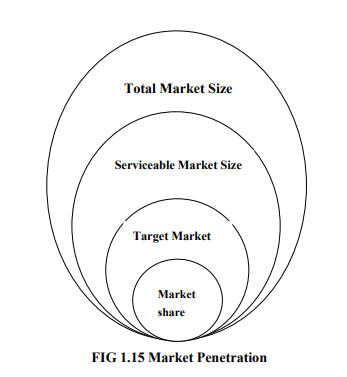

# 
 Unit 1 

# 
 <b>Introduction to Digital Marketing</b> 

## Explain in detail about the real and digital marketing.

Digital marketing is a multifaceted approach to promoting a brand, service, or product using various online channels and digital technologies. It differs from traditional marketing in that it leverages the internet and electronic devices to reach and engage with a target audience. This form of marketing has become increasingly important in the 21st century as companies aim to establish a strong online presence and connect with their customers through various digital means.

Key components of digital marketing include:

1. **Website Marketing:** The organization's website is often the central hub of digital marketing efforts. It serves as the online representation of the business and is used to showcase products or services. The website can be optimized to attract qualified traffic and encourage conversions.

2. **Email Marketing:** This involves sending marketing messages, newsletters, and promotional content via email. It is a direct and cost-effective way to engage with both current and potential customers.

3. **Search Engine Optimization (SEO):** SEO is the process of optimizing a website to improve its visibility in search engine results. By optimizing for specific keywords, businesses can attract organic traffic from search engines like Google.

4. **Pay-Per-Click (PPC) Advertising:** PPC advertising involves running paid ads on search engines and other online platforms. Advertisers pay a fee each time their ad is clicked. It's an effective way to drive targeted traffic to a website.

5. **Social Media Marketing:** This encompasses using social media platforms like Facebook, Twitter, Instagram, and LinkedIn to connect with the audience, share content, and run ad campaigns. Social media marketing fosters customer engagement and interaction.

6. **Content Marketing:** Creating and distributing valuable, relevant content is at the core of content marketing. This can include blog posts, videos, infographics, and more to attract and retain customers.

7. **Mobile Marketing:** Given the proliferation of mobile devices, marketers also focus on reaching users through mobile apps and responsive websites.

8. **Digital Advertising:** This includes various forms of online advertising, such as display ads, video ads, native ads, and affiliate marketing, all aimed at reaching a wider audience on the internet.

9. **Analytics and Data Analysis:** A significant advantage of digital marketing is the ability to track and measure campaign performance in real-time. Marketers use analytics tools to gather data on website visitors, ad clicks, email open rates, and more to refine their strategies.

10. **Customer Relationship Management (CRM):** CRM systems are used to manage customer data and interactions, helping businesses personalize their marketing efforts and improve customer retention.

Digital marketing is highly interactive and allows for two-way communication between the company and its customers. Feedback and interactions with customers on various digital platforms provide valuable insights to shape marketing strategies. It's an ever-evolving field, and the methods and channels used in digital marketing continue to expand and change as technology advances.

It's also important to distinguish digital marketing from internet marketing. While internet marketing focuses solely on advertising and promotion on the internet, digital marketing encompasses a broader range of channels and platforms, including mobile devices, social media, video games, smartphone apps, and more. This makes digital marketing a more comprehensive and adaptable approach to reaching and engaging with a modern, digitally connected audience.

## Explain in detail about website optimisation and content management on web.

Website optimization and content management are integral parts of digital marketing and web presence management. These practices aim to enhance the performance and user experience of a website.

**Website Optimization:**

Website optimization is the systematic process of improving a website's performance in various aspects to attract more traffic, increase conversions, and ultimately grow revenue. It involves several disciplines, including:

1. **SEO (Search Engine Optimization):** SEO is the process of optimizing a website to make it more visible and relevant to search engines, such as Google. This includes using relevant keywords, creating descriptive URLs, and implementing schema markup. SEO helps improve the site's ranking in search engine results.

2. **Copyright:** Copyright ensures that the content on the website is original and protected by intellectual property laws. It's crucial to avoid plagiarism and ensure that the content is unique.

3. **Analytics:** Website owners use analytics tools to track and analyze user behavior on their site. This data informs decision-making and helps in understanding how visitors interact with the site.

4. **UX Design (Frontend):** User experience (UX) design focuses on making the website user-friendly. This involves improving usability, accessibility, and creating a pleasurable experience for visitors.

5. **Web Development (Backend):** The website's backend, or the technical infrastructure, plays a critical role in performance. It should be optimized for speed, security, and functionality to ensure a seamless user experience.

6. **CRO (Conversion Rate Optimization):** CRO is about increasing the percentage of website visitors who take desired actions, such as making a purchase, filling out a contact form, or subscribing to a newsletter. It's essential for achieving business goals.

**Content Management:**

Content management is the process of creating, organizing, and maintaining digital content on a website. Effective content management ensures that the website remains a valuable resource for its audience, attracts organic traffic through search engines, and supports digital marketing efforts. It plays a vital role in building trust, engagement, and customer relationships, all of which are key goals in digital marketing and web presence management.

It involves several key elements:

1. **Content Creation:** This involves developing high-quality and relevant content, including articles, videos, images, and other media. Content should address the needs and interests of the target audience.

2. **Content Organization:** Properly structuring content is crucial for easy navigation and a positive user experience. This includes creating categories, tags, and menus to help users find the information they need.

3. **Content Publishing:** Regularly updating and publishing new content keeps the website fresh and engaging. It also helps with SEO as search engines favor sites with fresh content.

4. **Content Marketing:** Promoting content through various channels, including social media, email marketing, and backlinking, is essential to reach a wider audience.

5. **Content Quality Control:** Regularly reviewing and editing content is important to maintain accuracy, relevance, and quality. Broken links and outdated information should be addressed promptly.

6. **Content Optimization:** This includes optimizing content for search engines (on-page SEO) by using relevant keywords and following SEO best practices.

## Explain Various Digital marketing channels with at least one example of each category.

Digital marketing channels include various online methods that businesses use to promote products, interact with customers, and meet specific goals. These channels can be used individually or in combination to create a comprehensive digital marketing strategy. Here are some of the most common digital marketing channels:

1. **Search Engine Optimization (SEO):**
   - **Objective:** SEO aims to improve a website's visibility in search engine results, driving organic (unpaid) traffic. The goal is to increase the site's ranking for specific keywords, making it more accessible to users searching for related information.
   - **Example:** A company specializing in eco-friendly home products uses SEO to optimize its website so that it ranks higher in search results when users search for terms like "sustainable home goods."

2. **Pay Per Click (PPC):**
   - **Objective:** PPC advertising is about paying for ad placement on search engines and websites. The goal is to attract immediate, targeted traffic and convert users into customers.
   - **Example:** An e-commerce store running Google Ads campaigns to appear at the top of search results when users search for "best wireless headphones."

3. **Email Marketing:**
   - **Objective:** Email marketing seeks to establish a direct line of communication with subscribers and promote products or services. It aims to build brand loyalty, inform customers, and drive sales.
   - **Example:** An online fashion retailer sends personalized email newsletters to subscribers, featuring new arrivals, exclusive discounts, and style tips.

4. **Social Media Marketing:**
   - **Objective:** Social media marketing focuses on creating brand awareness, engaging with an audience, and driving website traffic through social media platforms.
   - **Example:** A restaurant uses platforms like Facebook and Instagram to post mouthwatering food photos, interact with customers, and promote daily specials to attract diners.

5. **Video Advertising:**
   - **Objective:** Video advertising aims to deliver engaging video content to viewers to inform, entertain, or persuade. It can be used for brand promotion or specific product advertising.
   - **Example:** An online learning platform creates a series of video ads showcasing the benefits of its courses, targeting individuals interested in skill development.

6. **Network Marketing:**
   - **Objective:** Network marketing harnesses the influence of social media influencers and brand advocates to extend a brand's reach and reputation. It involves leveraging relationships and associations within online communities.
   - **Example:** A beauty brand collaborates with popular beauty YouTubers and Instagram influencers to review and promote its new skincare line to their followers.

7. **Contextual Marketing:**
   - **Objective:** Contextual marketing aims to create brand recognition by placing relevant content within the context of high-traffic websites or platforms where it's most likely to be seen.
   - **Example:** A travel agency publishes sponsored blog posts on travel-related websites, offering tips and recommendations on planning a vacation, subtly promoting their travel packages.

8. **Affiliate Marketing:**
   - **Objective:** Affiliate marketing allows businesses to extend their reach by partnering with other businesses or individuals (affiliates) who promote their products or services in exchange for commissions.
   - **Example:** An e-commerce platform offers an affiliate program to bloggers and influencers, encouraging them to share unique referral links to the platform and earn a commission for every sale generated.

9. **Content Marketing:**
   - **Objective:** Content marketing focuses on creating valuable and relevant content to educate, entertain, and engage the target audience. It aims to build brand authority, generate leads, and foster trust.
   - **Example:** A software company publishes in-depth blog posts, tutorials, and case studies to educate its audience on industry trends and demonstrate its expertise in the field, ultimately attracting potential clients.

## What is Content and explain its important factors in marketing while preparing it for web usability? 

**Content** in the context of marketing refers to the textual, visual, or interactive material created and presented on a website, social media, emails, or other digital platforms with the primary goal of engaging, informing, and influencing the audience. High-quality and relevant content is vital for digital marketing, as it can attract, retain, and convert users, ultimately contributing to the success of a marketing campaign. Here are some important factors to consider when preparing content for web usability in marketing:

1. **Relevance:** Content should be closely aligned with the target audience's interests, needs, and pain points. It should address their questions and concerns and provide valuable solutions.

2. **Clarity:** Content should be clear and easy to understand. Avoid jargon and complex language. Use short sentences, bullet points, and headings to make content scannable.

3. **Consistency:** Maintain a consistent tone and style throughout your content. This consistency extends to branding, color schemes, fonts, and messaging. A uniform appearance helps in brand recognition.

4. **Search Engine Optimization (SEO):** Optimize content for search engines to improve its discoverability. This includes using relevant keywords, meta descriptions, and proper HTML tags.

5. **Visual Appeal:** Use images, videos, and graphics to enhance the visual appeal of your content. Ensure that visuals are of high quality and complement the written content.

6. **Engagement:** Encourage user interaction through comments, social media sharing, or interactive features like polls or quizzes. Engagement keeps users on your website longer.

7. **Mobile Responsiveness:** Ensure that content is accessible and readable on various devices, including smartphones and tablets. Mobile-responsive design is crucial for a positive user experience.

8. **Loading Speed:** Content should load quickly to prevent user frustration. Large images and videos can slow down a website, so optimize media files for speed.

9. **Readability:** Pay attention to typography, font size, and line spacing. Ensure that text is easy to read and doesn't strain the user's eyes.

10. **Accessibility:** Make sure your content is accessible to all users, including those with disabilities. Use alt text for images, provide text transcripts for videos, and follow accessibility standards.

11. **Call to Action (CTA):** Include clear and compelling CTAs to guide users to take desired actions, such as signing up for a newsletter, making a purchase, or contacting your business.

12. **Quality:** Content should be error-free, well-researched, and factually accurate. Poor-quality content can damage your reputation and credibility.

13. **Social Sharing:** Make it easy for users to share your content on social media by including share buttons and encouraging sharing.

14. **Analytics:** Use web analytics tools to track how users engage with your content. Analyze data to understand what's working and what needs improvement.

15. **Targeting:** Tailor content to different audience segments. Personalized content can significantly enhance the user experience and conversion rates.

16. **Testing:** A/B testing and user testing are essential to assess the effectiveness of your content. Experiment with different content elements and layouts to see what resonates best with your audience.

## Write down the history of Digital marketing.

The history of digital marketing is a fascinating journey that has been profoundly shaped by technological advancements and changes in consumer behavior. Here are some key milestones in the evolution of digital marketing:

**Early Digital Marketing:**
- The concept of digital marketing can be traced back to the early days of the internet, primarily in the 1990s. Businesses began to recognize the potential of online advertising and websites for reaching a global audience.

**The Dot-Com Boom:**
- During the late 1990s and early 2000s, the dot-com boom brought rapid growth to internet companies. Businesses started to build their online presence and experiment with banner ads, email marketing, and rudimentary search engine optimization.

**The Social Media Revolution:**
- The landscape of digital marketing underwent a seismic shift with the advent of social media platforms like Facebook, Twitter, and LinkedIn. These platforms allowed businesses to connect with their audiences in more engaging and interactive ways.

**The Impact of Broadband and Global Internet Usage:**
- The penetration of broadband internet led to increased internet speed, usage, and user expectations. With over 40 percent of the world's population now online and over 90 percent in many countries, the internet became a primary channel for marketing (Internet World Stats, 2015).

**Evolution of Analytics:**
- Analytics tools have evolved to the point where businesses can understand consumer behavior in real time. This includes not only usage statistics but also demographics and interests. This data-driven approach has revolutionized how businesses tailor their digital marketing strategies.

**The Rise of Mobile and Apps:**
- The proliferation of smartphones and tablets, equipped with touchscreens, revolutionized digital marketing. The introduction of mobile apps brought a new level of engagement and convenience for consumers. Mobile marketing became a significant focus for businesses.

**Google's Dominance:**
- Google emerged as a dominant player in the digital marketing landscape, owning search globally. Its search engine and advertising platforms have become central to digital marketing strategies.

**Smart TVs and Bluetooth Technology:**
- Television technology advanced with the introduction of smart TVs, opening up new possibilities for digital advertising and content delivery. Additionally, Bluetooth technology facilitated location-based marketing and personalized consumer interactions.

**Changing Demographics:**
- As the global population ages, there is a decreasing percentage of technophobes solely due to age. Older generations have increasingly embraced digital technology, expanding the potential audience for digital marketing efforts.

## Write down the importance of Target group analysis? How it helps promoters to getting more leads when they are working it on regular basis updates on Databases. 

**Importance of Target Group Analysis in Marketing:**

Target group analysis, also known as market analysis, is a critical component of marketing strategy. It involves assessing how a product or service aligns with a specific market and where it's most likely to find customers. Here are some key reasons why target group analysis is essential in marketing:

1. **Identifying Valuable Markets:** Target group analysis helps businesses determine which markets are worth pursuing and which are not. By focusing on the most valuable markets, companies can allocate resources more effectively.

2. **Creating Buyer Personas:** Part of the target group analysis involves creating buyer personas. This helps businesses accurately identify the specifics of their target demographic, making marketing campaigns more precise and effective.

3. **Discovering Market Gaps:** A thorough market analysis can reveal untapped areas of the market where a company's product or service can fill a need or gap. This can lead to innovative marketing strategies.

4. **Assessing Product Viability:** Market testing, often a part of target group analysis, allows businesses to assess the viability of a new product or service. Feedback from potential customers in the target market can determine how successful the product will be.

5. **Finding New Markets:** Through surveys and research, a company may discover new markets interested in their product. This expansion can lead to increased sales and growth.

6. **Improving Business Strategy:** Target group analysis provides valuable data to support business strategy decisions. By understanding the target market, companies can tailor their strategies to meet customer needs effectively.

**Components of Target Group Analysis:**

1. **Knowing the Customer and Market:** Understanding your target audience is fundamental. Market research helps identify the audience's characteristics, preferences, and behaviors.

2. **Knowing the Competition and Entry Barriers:** Recognizing competitive forces and market entry barriers is crucial for devising effective marketing strategies. High entry barriers, whether natural or artificial, can impact market entry decisions.

3. **Business Model Development:** Developing a business model involves creating a revenue generation plan and strategic implementation. Graphic presentations are often used to simplify complex issues for better understanding.

**Consumer Behavior and Market Analysis:**

Understanding consumer behavior is a key aspect of target group analysis. Consumer behavior involves the processes individuals or organizations use to select, secure, use, and dispose of products, services, or ideas to satisfy their needs. This knowledge is vital for various reasons:

- **Marketing Strategy:** Insights into consumer behavior inform marketing strategies, allowing businesses to tailor their approaches to consumer preferences and behaviors.

- **Better Marketing Campaigns:** Understanding how consumers make decisions helps create more effective marketing campaigns that resonate with the target audience.

- **Public Policy:** Consumer behavior knowledge plays a role in shaping public policy, such as regulations related to recycling, phone usage, or environmental concerns.

- **Social Media Marketing:** Social media marketing leverages an understanding of consumer behavior to effectively convey messages and engage with users.

- **Educating the Consumer:** Knowledge of consumer behavior is used to educate consumers about products, services, and social issues.

**Market Segmentation:**

Market segmentation involves dividing the consumer market into smaller, manageable segments based on various criteria. Three common segmentation approaches are:

1. **Demographics:** Identifying differences in personal attributes among consumers, such as age, gender, income, and occupation.

2. **Geographics:** Compartmentalizing the market based on geographic location, useful for businesses targeting specific regions or areas.

3. **Behavioral:** Focusing on actions and interactions of consumers with a brand's digital marketing efforts, allowing businesses to use behavior patterns to their advantage.

**Market Penetration:**

Market penetration is the measurement of how much a product is being sold relative to the total estimated market for that product, expressed as a percentage. It is a vital metric for assessing a product's success and determining its growth potential in the market. Market penetration rates help companies understand their position in the market and plan marketing strategies accordingly.

## What is Initial Digital marketing plan? Why we need a such plan for business and how to get it improve by the time it get implemented for the organizations. 

**What Is an Initial Digital Marketing Plan and Why Is It Essential for Business?**

An initial digital marketing plan is a strategic blueprint outlining how a business will use digital channels and tactics to achieve its short, medium, and long-term goals. This plan is essential because it provides a structured approach to harnessing the power of digital marketing. The importance of an initial digital marketing plan for business cannot be overstated. Here are some key benefits:

1. **Goal Alignment:** The plan aligns digital marketing efforts with business objectives. It ensures that every action is purpose-driven, contributing to the attainment of specific goals.

2. **Efficiency:** By defining strategies and tactics in advance, a digital marketing plan streamlines efforts and prevents ad-hoc, uncoordinated activities.

3. **Resource Allocation:** It helps allocate budget and resources effectively by prioritizing key strategies that have the most significant impact on business success.

4. **Consistency:** The plan establishes a consistent brand presence and message across digital channels, enhancing brand recognition.

5. **Analysis:** It incorporates key performance indicators (KPIs) for measuring and analyzing results. This data-driven approach allows for continuous improvement.

**How to Improve Your Initial Digital Marketing Plan Over Time:**

To ensure your initial digital marketing plan evolves and stays effective, follow these steps:

**1. Step 1: Situational Analysis**
   - Continuously monitor the internal and external business environment.
   - Keep a close eye on evolving digital habits, intermediaries, and influencers.
   - Implement benchmarking techniques to adapt best practices from your industry.
   - SWOT analysis (Strengths, Weaknesses, Opportunities, Threats) can help identify areas for improvement. 

**2. Step 2: Establish Digital Marketing Goals**
   - Regularly review and refine your goals to align with changing business needs.
   - Use the SMART (Specific, Measurable, Attainable, Relevant, Timely) framework to ensure your goals are precise and achievable.

**3. Step 3: Define the Marketing Strategy**
   - Stay updated on digital marketing trends, especially in personalization.
   - Continuously segment your target audience and update buyer personas as needed.
   - Evolve your content strategy to remain relevant and engaging.
   - Utilize tools like keyword research, content calendars, and social posting to adapt to changing user behavior.

**4. Step 4: Digital Strategies and Tactics**
   - Regularly assess your strategies for attraction, conversion, and loyalty.
   - Keep pace with new channels and information about customers to refine your approach.
   - Utilize marketing automation tools to streamline campaigns and personalize messages.
   - Leverage technology for maximum efficiency.

**5. Step 5: Measuring Results & KPIs**
   - Continuously monitor results using Key Performance Indicators (KPIs).
   - Analyze the effectiveness of implemented strategies and activities.
   - Utilize tools that compile, process, and extract valuable data.
   - Invest in real-time data visualization for instant insights.
   - Adapt your strategy based on performance data.

## What is web design and importance of web design? What are the various factor you keep into the consideration to get DM features bound web designs?

**What Is Web Design and Its Importance in Digital Marketing?**

**Web design** refers to the process of creating websites, encompassing various elements like layout, color choice, fonts, graphics, and content production. It's essential because your website is often the first point of contact for potential customers and plays a pivotal role in shaping their perception of your business.

**Importance of Web Design in Digital Marketing:**

1. **Professionalism and Credibility:** A well-designed website showcases your business's professionalism and expertise, building credibility and trust with visitors.

2. **Brand Representation:** Your website reflects your brand's identity and values, ensuring that the online experience aligns with your brand image.

3. **User Interaction:** User experience (UX) is crucial, and web design focuses on making the user's interaction with your website seamless and intuitive.

4. **Conversion Rate:** Effective web design can lead to higher conversion rates, ensuring that your website turns visitors into customers.

5. **SEO:** Web design can impact your search engine ranking, and an SEO-friendly design can help your site perform better in search results.

6. **Responsiveness:** A responsive design ensures that your website functions well on various devices, catering to a broader audience.

7. **Site Speed:** Fast-loading pages enhance the user experience and positively affect SEO.

**Factors to Consider for DM-Focused Web Design:**

When designing your website for digital marketing, consider these factors:

1. **Conversion Rate:** Design with the goal of converting visitors into leads or customers in mind.

2. **Competition:** Analyze your competitors and ensure your website outperforms them.

3. **Branding:** Your website design should be consistent with your brand's identity.

4. **SEO:** Optimize your site for search engines, including keyword research and on-page SEO.

5. **Responsiveness:** Ensure your website is accessible and user-friendly on all devices.

6. **Site Speed:** Fast-loading pages are crucial for both user experience and SEO.

7. **User Experience:** Focus on providing an excellent user experience through intuitive navigation and user-centered design.

8. **Information Architecture:** Plan the structure of your website before diving into visual design.

9. **Wireframes:** Create wireframes to outline the content and features' organization without getting into visual details.

10. **Mockups:** Design mockups with visual elements to represent the final look and feel of the site.

# 
 Unit 2 

# 
 <b>Search Engine Optimization</b> 

## Explain about google ad sense and ad-word with an example.

**Google AdSense:**
Google AdSense is a program that allows website publishers to earn money from their online content by displaying ads on their websites. These ads are provided by advertisers who want to promote their products or services. Google AdSense matches ads to a website's content and visitors, and publishers earn money based on various factors, including the ads' performance.

**How AdSense Works:**
1. *Ad Space Availability:* As a website publisher, you make space available for ads on your site.
2. *Ad Auction:* Advertisers submit and manage their ads through Google AdWords. AdWords allows them to specify criteria for ad placement, including demographics, topics, and more.
3. *Display Ads:* AdSense displays relevant ads on your website based on your site's content and the advertisers' targeting criteria.
4. *Earnings:* You earn money based on the performance of these ads, such as clicks or impressions.

**Example:** Let's say you run a popular recipe blog. Google AdSense matches ads related to cooking equipment, food ingredients, and cooking classes to your blog posts. When your visitors click on these ads or view them, you earn a portion of the advertising revenue.

**Google AdWords:**
Google AdWords is a platform for advertisers to create and manage their ads. Advertisers bid on specific keywords and create ads for their products or services. These ads are displayed on Google's search results pages and on websites that participate in the Google AdSense program. Advertisers pay for clicks on their ads (Pay-Per-Click or PPC) or based on ad impressions.

**Example:** Imagine you own an online store that sells running shoes. To reach potential customers, you create an AdWords campaign targeting keywords like "best running shoes" and "buy running shoes online." When users search for these keywords on Google, your ads appear at the top or bottom of the search results. You only pay when someone clicks on your ad, and they are directed to your website to make a purchase.

In this example, the website displaying your ad (e.g., a blog about fitness) is part of the Google AdSense network, and the website owner earns revenue when users click on your ad.

**In Summary:**
Google AdSense and AdWords work together to create a symbiotic relationship between advertisers and website publishers. Advertisers use AdWords to create and manage their ads and bid on relevant keywords. AdSense publishers offer ad space on their websites, and Google matches ads to the content of those sites. Advertisers pay for the ads, and publishers earn money from the generated revenue. This system enables advertisers to reach their target audience effectively while allowing website owners to monetize their content.