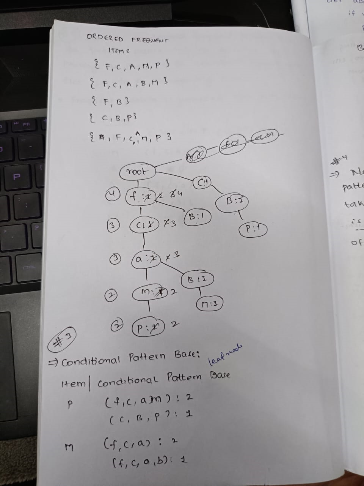

# 
 Unit 1 

# 
 <b> Introduction to Data Mining</b> 

## Data mining and Kinds of Data

**Data Mining:**

Data mining is the process of extracting valuable information and patterns from a given dataset. It involves the use of complex algorithms to identify trends and insights within large datasets. Data mining is typically used in conjunction with predictive analysis to make data-supported decisions. Here are the key aspects and types of data mining mentioned in the provided information:

**Purpose of Data Mining:**

Data mining serves the purpose of recognizing patterns within datasets that are specific to a particular domain. It involves the use of sophisticated algorithms and can be coupled with machine learning to automate problem-solving processes. The ultimate goal is to make data-driven decisions and predictions.

**Types of Data Mining:**

Data mining encompasses several types:

- **Pictorial Data Mining:** This involves the analysis of image data to extract patterns.
- **Text Mining:** Text mining is the process of extracting valuable information from textual data.
- **Social Media Mining:** It involves the analysis of social media data for trends and insights.
- **Web Mining:** This type focuses on extracting data and insights from web sources.
- **Audio and Video Mining:** It deals with the analysis of audio and video data for patterns and trends.

**Advantages of Data Mining:**

- Discovers hidden patterns and insights in data.
- Improves decision-making and business efficiency.
- Provides valuable customer insights for targeted marketing.
- Enables predictive analysis for future trend forecasting.
- Offers automation for data analysis processes.

**Disadvantages of Data Mining:**

- Raises concern about data privacy and security.
- Requires expertise to develop and apply complex algorithms.
- Relies on the quality and accuracy of input data.
- Demands significant computational resources.

**Types of Data Suitable for Data Mining:**

Data mining can be applied to various types of data, including:

- **Data Stored in the Database:** This includes data managed by a Database Management System (DBMS), often in a relational database with tables, attributes, and unique keys.

- **Data Warehouse:** Data warehouses collect and store data from various sources in a unified format, often after undergoing cleaning, integration, and organization.

- **Transactional Data:** Transactional databases are collections of data that are generated by day-to-day business operations, such as sales, purchases, and payments.

- **Other Types of Data:** Data mining can be applied to various other data types, such as data streams, engineering design data, sequence data, graph data, spatial data, multimedia data, and more.

## Types of Data (Descriptive version)

**Types of Data Suitable for Data Mining:**

Data mining is a versatile process that can be applied to various types of data, making it a valuable tool in extracting insights from different domains. Here's a closer look at the types of data suitable for data mining:

**1. Data Stored in the Database:**
   - This category includes data managed by a Database Management System (DBMS).
   - Typically, this data is organized within a relational database, which uses tables to store information.
   - Each table comprises attributes and unique keys that facilitate data retrieval and organization.
   - **Example:** In a retail database, this could encompass customer information (e.g., name, address, and purchase history) or product data (e.g., product IDs, prices, and stock levels).

**2. Data Warehouse:**

   - Data warehouses serve as a centralized repository that accumulates and stores data from various sources.
   - Data in a warehouse is organized into a unified format, making it more accessible for analysis.
   - Data within a warehouse is often subjected to cleaning, integration, and organization procedures to ensure consistency.
   - **Example:** In a business setting, a data warehouse may contain sales data, customer data, and inventory data from multiple sources, enabling comprehensive business analytics.

**3. Transactional Data:**  

    

   - Transactional databases store records related to specific transactions.
   - These transactions encompass a wide range of activities, such as customer purchases, flight reservations, online clicks, and more.
   - Each transaction record typically has a unique identifier and lists the items or actions involved in the transaction.
   - **Example:** In the context of an e-commerce website, transactional data would include individual customer orders, each listing the items purchased, their quantities, and the total amount spent.

**4. Other Types of Data:**
   - Data mining is not limited to traditional databases and data warehouses. It can be applied to a wide array of data types, each with its unique characteristics.
   - Other data types include:
      - **Data Streams:** Real-time, continuously flowing data, such as social media posts, sensor data, or financial market updates.
      - **Engineering Design Data:** Data generated during the design and development of products, often structured around specifications and configurations.
      - **Sequence Data:** Data organized as sequences, like DNA sequences in genomics, clickstream sequences in web analytics, or time-series data in financial analysis.
      - **Graph Data:** Data that represents relationships and connections, commonly used in social network analysis, network infrastructure, and recommendation systems.
      - **Spatial Data:** Geospatial information that includes coordinates, maps, and geographical features, often used in GIS (Geographic Information Systems).
      - **Multimedia Data:** Rich and diverse data types, including images, audio, video, and other non-textual content.

## Data Mining Tasks and Functionalities

**Data Mining Tasks and Functionalities:**

Data mining activities can be categorized into various tasks and functionalities. These include:

- **Descriptive Data Mining:** This involves the characterization and summarization of general data properties, such as class distribution, central tendency, and correlation between attributes.

- **Predictive Data Mining:** This involves the use of models to predict the value of a target attribute based on the values of other attributes.

Data mining involves various tasks and functionalities aimed at extracting valuable insights from large datasets. It can be broadly categorized into the following functions:

**1. Class/Concept Descriptions:**
   - Data Characterization: Summarizing the general characteristics of a class or concept, resulting in specific rules defining a target class.
   - Data Discrimination: Separating data sets based on attribute disparities, comparing features of a class with those of contrasting classes.

**2. Mining Frequent Patterns:**
   - Discovering frequent patterns in data, including frequent item sets, frequent substructures, and frequent subsequences.

**3. Association Analysis:**
   - Analyzing sets of items that often occur together in transactional datasets, such as Market Basket Analysis in retail.
   - Determining association rules based on support (identifying common item sets) and confidence (conditional probability of item occurrence).

**4. Classification:**
   - Categorizing items into predefined classes using techniques like if-then rules, decision trees, or neural networks.
   - Training the system with a known dataset to predict the class of items in an unknown dataset.

**5. Prediction:**
   - Forecasting data values or trends, including numeric predictions (e.g., linear regression for future events) and class predictions (filling in missing class information).

**6. Cluster Analysis:**
   - Grouping similar data based on attributes, where class labels are not predefined.
   - Clustering algorithms group data based on similar features and dissimilarities.

**7. Outlier Analysis:**
   - Identifying and analyzing data outliers, which can impact data quality and pattern recognition.

**8. Evolution and Deviation Analysis:**
   - Analyzing data sets that change over time to capture evolutionary trends.
   - Characterizing, classifying, clustering, or discriminating time-related data.

**9. Correlation Analysis:**
   - Determining the strength and nature of relationships between two attributes.
   - Assessing the correlation between continuous variables, helping researchers identify possible links between variables in their study.

## Task Primitives

**Data Mining Task Primitives:**

Data mining tasks are defined through a set of data mining query primitives, allowing users to interact with the data mining system, guide the mining process, and examine findings in a flexible and interactive manner. These primitives encompass the following aspects:

**1. Set of Task-Relevant Data:**
   - This primitive specifies the specific data subset of interest within a database or dataset. It identifies the relevant attributes or dimensions.
   - Example: In an e-commerce database, task-relevant data might include customer purchase history and product information.

**2. Kind of Knowledge to be Mined:**
   - It defines the data mining functions to be performed, such as characterization, discrimination, association, classification, prediction, clustering, outlier analysis, or evolution analysis.
   - Example: In healthcare, the kind of knowledge may involve predicting disease outbreaks based on historical data.

**3. Background Knowledge:**
   - This encompasses domain-specific knowledge that guides the data mining process and assists in pattern evaluation.
   - Example: Concept hierarchies can provide background knowledge, helping to mine data at multiple levels of abstraction.

**4. Interestingness Measures and Thresholds**

Data mining patterns aren't all equally valuable, and interestingness measures help assess their significance. Here are key factors in pattern evaluation:

  - **Simplicity:** Simplicity adds to a pattern's interest. Simple patterns, easy for humans to grasp, are more interesting. Complex structures, based on pattern size or the number of attributes, may be less appealing.

  - **Certainty (Confidence):** Patterns need a measure of certainty. Confidence is vital for association rules like "A => B." It's calculated as:

    - Confidence (A => B) = (Number of tuples containing both A and B) / (Number of tuples containing A)

    Higher confidence signifies stronger associations, increasing interest.

  - **Utility (Support):** A pattern's usefulness is critical. Support, a utility measure, indicates how often a pattern applies. Higher support means a more interesting pattern.

    - Support (A => B) = (Number of tuples containing both A and B) / (Total number of tuples)

  - **Novelty:** Novel patterns provide fresh insights. They may represent data exceptions. Removing redundant patterns can uncover novelty, focusing on unique information. 

**5. Representation for Visualizing Patterns:**
   - This primitive dictates how the discovered patterns will be displayed, whether as rules, tables, charts, graphs, decision trees, or other visual representations.
   - Example: Visualizing customer segmentation through pie charts or displaying decision trees for product recommendations.

## Data Preprocessing

Data Preprocessing is a critical step in data mining, involving cleaning, transforming, and organizing data to prepare it for analysis. The primary objective is to enhance data quality and make it suitable for the specific data mining task. Below are the steps involved in data preprocessing:

1. **Data Cleaning:**
   - **Missing Data:** This deals with handling data points that are missing. Options include ignoring the entire tuple or filling in missing values, either manually or through methods like using attribute mean or most probable value.
   - **Noisy Data:** Noisy data is meaningless and can result from errors in data collection. Techniques to handle noisy data include binning, regression, and clustering.

2. **Data Integration:**

    - Data integration involves combining data from different sources, often stored in different formats or locations. It ensures that data is consistent and can be used cohesively in the subsequent steps of the data mining process.

3. **Data Transformation:**
   - **Normalization:** Scaling data values to a specific range (e.g., -1.0 to 1.0 or 0.0 to 1.0).
   - **Attribute Selection:** Constructing new attributes from existing ones to aid in the mining process.
   - **Discretization:** Replacing raw numeric values with intervals or conceptual levels.
   - **Concept Hierarchy Generation:** Converting attributes from lower to higher levels in a hierarchy.

4. **Data Reduction:**
   - **Feature Selection:** Choosing a subset of relevant features, eliminating irrelevant or redundant ones, using techniques like correlation analysis, mutual information, or PCA.
   - **Feature Extraction:** Transforming data into a lower-dimensional space while preserving critical information, suitable for high-dimensional and complex data.
   - **Sampling:** Selecting a subset of data points to reduce dataset size while retaining essential information.
   - **Clustering:** Grouping similar data points into clusters, replacing them with representative centroids.
   - **Compression:** Compressing the dataset while preserving important information, commonly used for storage and transmission.

## KDD Process

**Knowledge Discovery in Data (KDD) Process:**

The Knowledge Discovery in Data (KDD) process is a comprehensive approach to extracting valuable knowledge and insights from large datasets. Developed by Usama Fayyad, Gregory Piatetsky-Shapiro, and Padhraic Smyth in 1996, it has become a fundamental framework for data mining and knowledge discovery. The KDD process comprises five distinct stages, each serving a specific purpose:

1. **Selection:**
   - This initial stage involves creating a target dataset from the available data sources. It includes activities like choosing the relevant attributes and conducting data sampling to reduce the number of records used in subsequent stages.
   - The selection stage sets the foundation for the rest of the KDD process, focusing on the data that is most pertinent to the business problem at hand.

2. **Preprocessing:**
   - In this stage, the data is prepared for data mining. It encompasses cleaning and refining the dataset, addressing issues such as noise, missing data, inconsistencies, and outliers.
   - Data preprocessing ensures that the data is of high quality and free from irregularities that might adversely affect the results of data mining algorithms.

3. **Transformation:**
   - Transformation activities involve identifying and implementing necessary data transformations. This can include techniques like binning and aggregation to modify the data and reduce its dimensionality.
   - The goal of this stage is to make the data suitable for the specific data mining algorithms that will be applied in the next step.

4. **Data Mining:**
   - In this critical stage, data mining algorithms are selected based on the business problem and the dataset at hand. These algorithms are used to search for patterns and hidden insights within the data.
   - Parameter settings are adjusted to ensure that the algorithms operate optimally and produce valuable results. This is where the core analysis and knowledge discovery occur.

5. **Interpretation/Evaluation:**
   - The final stage involves reviewing the results and outputs generated by the data mining algorithms. It is essential to assess whether the patterns discovered are meaningful and can be applied to the business problem.
   - Evaluation techniques include visualization and statistical tests to validate the quality and significance of the discovered knowledge.

## Data Mining Issues

# 
 Unit 2 

# 
 <b> Mining Frequent Associations and Correlations</b> 

## Apriori Algorithm

## FP-Growth Algorithm

## Improving the Efficiency of Apriori

**Apriori Algorithm**

The Apriori algorithm is a classic algorithm in data mining that is used for discovering interesting associations between variables in large datasets. It's primarily applied in market basket analysis, where it helps identify relationships between products that are frequently purchased together. The algorithm works by identifying frequent itemsets in a database and generating association rules based on these itemsets.

**Methods To Improve Apriori Efficiency**

The Apriori algorithm can be quite computationally intensive, especially when dealing with large datasets. To improve its efficiency, several methods and techniques can be applied:

1. **Hash-Based Technique:** This method utilizes a hash-based data structure called a hash table. The hash table is used for generating k-itemsets (sets of k items) and counting their occurrences in the database. A hash function is employed to efficiently generate and manage the hash table. This can significantly speed up the process of identifying frequent itemsets.

2. **Transaction Reduction:** In this method, transactions that do not contain any frequent items are marked or removed from consideration. This reduces the number of transactions that need to be scanned in subsequent iterations. By eliminating irrelevant transactions, the algorithm can focus on those that are more likely to contain frequent itemsets.

3. **Partitioning:** Partitioning involves dividing the database into smaller partitions. The key idea is that if an itemset is frequent in the database, it should be frequent in at least one of its partitions. By scanning each partition separately, the number of scans needed is reduced. This can significantly improve efficiency, especially for databases with a wide range of itemsets.

4. **Sampling:** The sampling method involves selecting a random sample, denoted as S, from the entire database D. The algorithm searches for frequent itemsets within this sample. While this approach can lead to the possibility of missing some global frequent itemsets, it can be mitigated by adjusting the minimum support threshold (min_sup) or increasing the sample size. Sampling is particularly useful when working with extremely large datasets.

5. **Dynamic Itemset Counting:** In this technique, the Apriori algorithm is modified to add new candidate itemsets dynamically during the database scan. Instead of generating all candidate itemsets in advance, new candidates can be created on the fly as the database is scanned. This can help reduce the memory requirements and overall execution time.

# 
 Unit 3 

# 
 <b>Classification and Clustering</b> 

## Multilayer Feedforward Neural Networks

A **Multilayer Feed-forward Neural Network**, commonly known as a **Feedforward Neural Network** or a **Multi-Layer Perceptron (MLP)**, is a type of artificial neural network in which the connections between the nodes, or neurons, do not form any cycles. It's a simple and widely used type of neural network for various machine learning tasks, including classification and regression. MLP consists of an input layer, one or more hidden layers, and an output layer.

**Key Features of a Multilayer Feed-forward Neural Network**:

1. **Feed-Forward:** The network's information flows in one direction, from the input layer to the output layer. There are no feedback loops or cycles in the network.

2. **Layered Structure:** It consists of multiple layers of neurons. Typically, there is an input layer, one or more hidden layers, and an output layer. The input layer receives the raw data, while the output layer produces the network's final output. The hidden layers process and transform the input data.

3. **Each Neuron Performs a Weighted Sum and Activation:** Each neuron in the network receives inputs from the neurons in the previous layer, computes a weighted sum of these inputs, applies an activation function to the sum, and passes the result to the neurons in the subsequent layer.

    

4. **Nonlinear Activation Functions:** Typically, nonlinear activation functions like the sigmoid, hyperbolic tangent (tanh), or rectified linear unit (ReLU) are used in hidden layers to introduce nonlinearity into the network, allowing it to model complex relationships.

**Example of a Multilayer Feed-forward Neural Network**:

Let's consider a simple example of an MLP for binary classification, such as predicting whether an email is spam or not based on two features: the number of words in the email and the number of exclamation marks.

- **Input Layer:** The input layer has two neurons, one for each feature. The values of these neurons represent the number of words and the number of exclamation marks in the email.

- **Hidden Layer:** There is one hidden layer in this example with two neurons. Each neuron in the hidden layer receives inputs from both input neurons, computes a weighted sum, applies a sigmoid activation function, and passes the result to the output layer.

- **Output Layer:** The output layer consists of a single neuron, which produces the network's output. In this binary classification task, the output represents the probability that the email is spam.

- **Weights and Biases:** Each connection between neurons has a weight associated with it, and each neuron has a bias. These weights and biases are learned during the training process to optimize the network's performance.

The network's training involves adjusting the weights and biases to minimize the error between the predicted outputs and the actual labels of a training dataset. Once trained, the network can be used to classify new emails as spam or not based on the number of words and exclamation marks.

## Decision Tree Induction

**Decision Tree Algorithm**

A decision tree is a supervised machine learning algorithm used for both classification and regression tasks. It is a tree-like model that makes decisions or predictions by following a series of rules, starting from the root node and moving to leaf nodes. Each internal node in the tree represents a decision or a test on a feature attribute, and each branch represents the outcome of that test. The leaf nodes represent the final decision or prediction.

The decision tree induction process aims to create a tree that best represents the patterns or relationships in the training data. The basic algorithm for inducing a decision tree from training data can be outlined as follows:

**Terminology:**

1. Create a root node, N.
2. If all the tuples in the current data partition, D, belong to the same class, C, label node N as a leaf node with class C.
3. If the attribute list is empty (no more attributes to split on), label node N as a leaf node with the majority class in D.
4. Apply an attribute selection method (e.g., information gain or Gini impurity) to determine the "best" splitting criterion.
5. Label node N with the selected splitting criterion.
6. If the splitting attribute is discrete-valued and allows multiway splits, create branches for each known value of the attribute. For each outcome j, create a subset Dj of data tuples in D that satisfies outcome j.
7. If the splitting attribute is continuous-valued, create two branches corresponding to A ≤ split point and A > split point, where the split point is determined by the attribute selection method.
8. If the splitting attribute is discrete-valued and a binary tree is required, the test is of the form "A ∈ SA?," where SA is a subset of known values of A. Create branches labeled "yes" and "no" based on whether the test is satisfied or not.
9. Recursively apply the same decision tree induction process to each partition Dj.

The algorithm continues to partition and grow the tree until one of the terminating conditions is met:

- All tuples in the current partition belong to the same class.
- No attributes are left to split on.
- A partition is empty (no tuples).

The resulting tree is a representation of the patterns and decisions in the training data. It can be used for classification, where new data is passed through the tree to make predictions based on the rules learned during training.

## Decision Tree Induction: My interpretation

**Decision Tree Algorithm**:

A decision tree is a supervised machine learning algorithm used for both classification and regression tasks. The primary objective of a decision tree is to create a model that predicts the value of a target variable based on several input features. The algorithm can be explained through the following steps:

**Step 1 - Initialization**:
- The decision tree algorithm starts with the entire dataset, often referred to as the root node.

**Step 2 - Check for Termination**:
- It checks if the termination conditions are met. The termination conditions are:
  1. All tuples in the dataset belong to the same class: In this case, a leaf node is created, and it's labeled with the class.
  2. There are no remaining attributes to split on: In this case, a leaf node is created, and it's labeled with the majority class in the dataset.

**Step 3 - Attribute Selection**:
- If the termination conditions are not met, the algorithm calls the attribute selection method to determine the best attribute to split the data.
- The attribute selection method identifies the "best" attribute for splitting the data into distinct classes.
- The "best" attribute is determined to maximize the purity of the resulting partitions, aiming for each partition to be as pure as possible.
- The "best" attribute is selected based on a measure of impurity, such as information gain or Gini index.

**Step 4 - Splitting**:
- Based on the attribute selected in the previous step, the algorithm creates branches from the current node.
- The data is partitioned into subsets according to the outcomes of the selected attribute's values.
- There are three scenarios for partitioning:
  1. If the attribute is discrete-valued, a branch is created for each known value of the attribute.
  2. If the attribute is continuous-valued, two branches are created: one for values less than or equal to the split point and another for values greater than the split point.
  3. If the attribute is discrete-valued and a binary tree is required, a test "$A ∈ S_{A}$?" is used, where $S_{A}$ is the splitting subset. Two branches are created, one for "yes" and another for "no."

> **Note:** Discrete-valued attributes are those that have a finite or countably infinite set of values, while continuous-valued attributes are those that can take any real value within a specified range.

**Step 5 - Recursion**:
- The algorithm is applied recursively to each subset created in the previous step.
- The recursion process continues until termination conditions are met.

**Step 6 - Output**:
- The final output is a decision tree. Each internal node represents a test on an attribute, and each leaf node represents a class label.