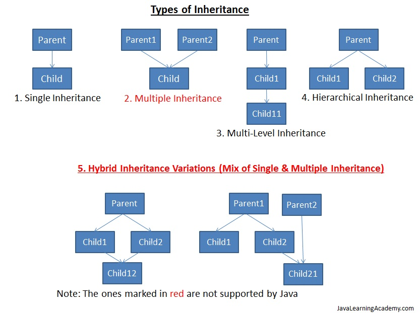
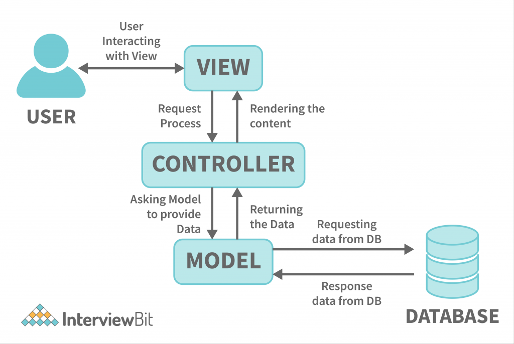
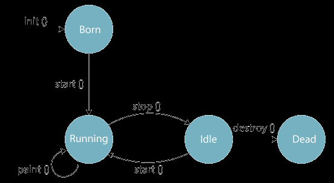

# <p align=center>Unit 1</p>

## History of Java

- Java: An Object-Oriented programming language.
- Developed by James Gosling in the early 1990s.
- Project initiated for digital devices like set-top boxes, television, etc.
- Considered using C++, but rejected due to memory constraints.
- Gosling aimed to alter and expand C++, leading to the creation of "Green."
- Project initially named "Greentalk" with file extension .gt.
- Evolved into "OAK" over time.
- Java's history rooted in addressing limitations of existing languages.


## Java Buzzwords

1. **Simple**: Java was designed with simplicity in mind, offering a clear and straightforward syntax that is easy to understand and use. Unnecessary complexities, such as explicit memory management and pointer arithmetic, were removed, making Java more user-friendly for developers.

2. **Object-Oriented**: Java follows the object-oriented programming paradigm, allowing developers to structure their code around objects, which are instances of classes. This promotes modularity, reusability, and easier maintenance by encapsulating data and behavior together.

3. **Platform Independent**: Java's "Write Once, Run Anywhere" philosophy stems from its platform independence. Java code is compiled into an intermediate bytecode, which is executed by the Java Virtual Machine (JVM). This bytecode can run on any platform with a compatible JVM, ensuring cross-platform compatibility.

4. **Secured**: Java incorporates built-in security mechanisms to protect against unauthorized access, viruses, and other security threats. Features like class loaders, bytecode verification, and runtime security checks ensure that Java applications run securely in a controlled environment.

5. **Robust**: Java's robustness is reflected in its strong compile-time type checking, runtime checking, and exception handling. This helps prevent errors and enhances reliability by catching potential issues early and handling them gracefully.

6. **Architecture Neutral**: Java's architecture-neutral nature means that compiled Java code (bytecode) can run on any platform with a corresponding Java Virtual Machine (JVM). The JVM interprets the bytecode and translates it into machine code, making the application architecture-neutral.

7. **Portable**: The combination of platform independence and architecture neutrality makes Java highly portable. Once compiled, Java applications can be moved and executed across different systems without modification.

8. **High Performance**: Java offers a balance between interpreted and compiled execution. While it's not as fast as natively compiled languages like C++, modern JVMs employ Just-In-Time (JIT) compilation techniques that optimize bytecode into machine code at runtime, providing good performance.

9. **Distributed**: Java's built-in networking capabilities make it well-suited for creating distributed and networked applications. Java's Remote Method Invocation (RMI) and networking libraries simplify the development of applications that interact across networks.

10. **Multithreaded**: Java's multithreading support allows developers to create programs that can execute multiple threads concurrently. This enhances efficiency and responsiveness, making Java suitable for applications requiring simultaneous execution of tasks.

11. **Dynamic**: Java supports dynamic linking and loading of classes at runtime, enabling the extension of applications without recompilation. Reflection and dynamic proxies allow developers to create flexible and adaptable software.

12. **Interpreted**: While Java code is compiled into bytecode, it is not compiled to native machine code like some other languages. Instead, the JVM interprets the bytecode at runtime, allowing Java applications to be more flexible and portable. However, modern JVMs use JIT compilation for improved performance.


## Scope and Lifetime of Variables

Scope refers to the region in a program where a variable can be accessed and manipulated. The lifetime of a variable indicates the duration for which it exists in memory.

- **Scope of Variables**: Variables can be declared at different levels such as class, method, or block. Their scope defines where they can be accessed:
  - **Member Variables (Class Level Scope)**: These variables are declared within a class but outside any method. They are accessible throughout the class and can be used by different methods.
  - **Local Variables (Method/Block Level Scope)**: These variables are declared inside a method or a block (like a loop or conditional statement). They are limited in scope to the method or block where they are declared.

- **Lifetime of Variables**: The lifetime of a variable is determined by the duration for which it remains in memory:
  - **Member Variables**: They exist as long as the object of the class exists. They are initialized when the object is created and stay in memory until the object is garbage-collected.
  - **Local Variables**: They are created when the method or block is entered and are destroyed when the method or block exits. They exist only within their scope.

Example:
```java
public class VariableScope {
    // Member variable
    String name = "Jang's Mama";
    static double height = 5.9;

    public static void main(String[] args) {
        // Local variable
        int marks = 72;

        System.out.println("Name: " + name);   // Compilation error, name is not accessible
        System.out.println("Height: " + height); // Accessible as it's a member variable
        System.out.println("Marks: " + marks); // Accessible as it's in the same scope
    }
}
```

## Constructor and its types

A constructor in Java is a special method that gets called when an object of a class is created. It's used to initialize the instance variables and set up the initial state of the object.

Here's a simple example of a constructor and its types:

```java
// Example of Constructor
class Student {
    String name;

    // Default Constructor
    Student() {
        name = "John Doe";
    }

    // Parameterized Constructor
    Student(String n) {
        name = n;
    }

    void display() {
        System.out.println("Student Name: " + name);
    }
}

public class Main {
    public static void main(String[] args) {
        Student student1 = new Student();
        Student student2 = new Student("Alice");

        student1.display();
        student2.display();
    }
}
```
In the example above:
- `Student()` is a default constructor that initializes `name` to "John Doe" when an object is created without any arguments.
- `Student(String n)` is a parameterized constructor that initializes `name` to the value passed as an argument when an object is created with an argument.
- `student1` and `student2` are objects created using different constructors.


Types of Constructors:
1. **Default Constructor**: It's a constructor with no parameters. If you don't provide any constructor in your class, the Java compiler adds a default constructor automatically.
2. **Parameterized Constructor**: It's a constructor with parameters. You can define your own constructors with parameters to initialize instance variables based on user input.
3. **Copy Constructor**: It's used to create a new object as a copy of an existing object. Java doesn't have built-in copy constructors, but you can implement them.

**Properties of Constructor:**

1. **Name and Class Match**: Constructors must share the same name as the class they belong to. This name congruence allows Java to associate the constructor with its respective class.

2. **No Return Type**: Unlike methods, constructors do not have a return type, not even "void". This is because their primary purpose is to initialize object properties, not to produce a return value.

3. **Initialization at Object Creation**: Constructors are automatically invoked when an object is instantiated using the `new` keyword. This ensures that object properties are properly set up at the very beginning of the object's life cycle.

4. **Default Constructor**: If a class does not explicitly define any constructors, Java provides a default constructor. This constructor doesn't accept any arguments and initializes object properties to default values (e.g., numerical properties to 0, object references to null).


## Recursion

Recursion in Java is a programming technique where a method calls itself to solve a problem. It's like a function solving a smaller instance of the same problem, and then combining the result to solve the original problem. Recursion is used to solve problems that can be broken down into smaller sub-problems of the same nature.

Here's an example of using recursion to calculate the factorial of a number:

```java
public class FactorialUsingRecursion {
    // Recursive method to calculate factorial
    static int factorial(int n) {
        // Base case: factorial of 0 is 1
        if (n == 0) {
            return 1;
        }
        // Recursive case: n! = n * (n-1)!
        else {
            return n * factorial(n - 1);
        }
    }

    public static void main(String[] args) {
        int num = 5;
        int result = factorial(num);
        
        System.out.println("Factorial of " + num + " is " + result);
    }
}
```
> Output:
> ```
> Factorial of 5 is 120
> ```

Recursion works by breaking down a complex problem into smaller, simpler instances of the same problem. In this factorial example, when `factorial(5)` is called, it becomes `5 * factorial(4)`, and so on until reaching the base case of `factorial(0)` which is 1. The results of the sub-problems are then combined to get the final result.

However, there are a few drawbacks to using recursion:
- Recursion can be inefficient, as it involves repeated function calls and memory allocation.
- Recursive functions can be difficult to debug and understand.
- Recursive functions can cause stack overflow if the number of recursive calls exceeds the maximum stack size.
- Recursive functions can be slower than iterative solutions.


## POP vs OOP (Procedural vs Object Oriented Programming)

Sure, here's a comparison between procedural-oriented programming and object-oriented programming paradigms in Java:

| Aspect                          | Procedural Programming       | Object-Oriented Programming    |
|---------------------------------|------------------------------|--------------------------------|
| Approach                        | Focuses on functions and procedures. | Focuses on objects and classes. |
| Data Handling                   | Uses data structures like arrays and records. | Uses objects to encapsulate data and behavior. |
| Code Organization               | Organizes code around procedures/functions. | Organizes code around objects and classes. |
| Reusability                    | Limited reusability, as functions are tightly coupled with data. | High reusability, as objects can be reused in different contexts. |
| Modularity                      | Low modularity, functions operate on global data. | High modularity, objects encapsulate their own data and behavior. |
| Data Security                  | Less secure due to global data access. | More secure as data is encapsulated within objects. |
| Code Maintenance               | Code maintenance can be challenging. | Easier code maintenance due to encapsulation and modularity. |

Procedural-Oriented Example:
```java
// Procedural approach
public class ProceduralExample {
    public static void main(String[] args) {
        int radius = 5;
        double area = calculateCircleArea(radius); // Function call
        System.out.println("Circle Area: " + area);
    }

    // Function to calculate circle area
    static double calculateCircleArea(int r) {
        return 3.14 * r * r;
    }
}
```
> Output:
> ```Circle Area: 78.5```

Object-Oriented Example:
```java
// Object-oriented approach
class Circle {
    private int radius; // Encapsulated data

    public Circle(int r) {
        radius = r;
    }
    // Method to calculate circle area
    public double calculateArea() {
        return 3.14 * radius * radius;
    }
}

public class OOPExample {
    public static void main(String[] args) {
        Circle circle = new Circle(5); // Object creation
        double area = circle.calculateArea(); // Method call using object
        System.out.println("Circle Area: " + area);
    }
}
```
> Output:
> ```Circle Area: 78.5```

## OOP Concepts

Object-Oriented Programming (OOP) is a programming paradigm that organizes code around the concept of objects, which are instances of classes. Java is an object-oriented programming language that embraces the following core OOP concepts:

1. **Class and Object**:
   - A class is a blueprint or template that defines the structure and behavior of objects.
   - An object is an instance of a class, representing a real-world entity with attributes (data) and methods (behavior).

```java
// Example of Class and Object
class Car {
    String brand;
    void start() {
        System.out.println("Car is starting...");
    }
}

public class Main {
    public static void main(String[] args) {
        Car myCar = new Car(); // Creating an object
        myCar.brand = "Toyota";
        myCar.start(); // Calling a method
    }
}
```
> Output:
> ```Car is starting...```

2. **Encapsulation**:
   - Encapsulation is the concept of bundling data (attributes) and methods (functions) that operate on the data into a single unit, known as a class.
   - Access to the internal data of an object is controlled through methods, allowing for data protection and security.
  
```java
// Example of Encapsulation
class BankAccount {
    private double balance; // Encapsulated private attribute
    // Method to deposit money into the account
    public void deposit(double amount) {
        if (amount > 0) {
            balance += amount; // Updating the balance attribute
            System.out.println("Deposit successful");
        }
    }
    // Method to get the current balance of the account
    public double getBalance() {
        return balance; // Returning the balance attribute
    }
}

public class Main {
    public static void main(String[] args) {
        BankAccount account = new BankAccount(); // Creating a new BankAccount object
        account.deposit(1000); // Depositing 1000 into the account
        System.out.println("Balance: " + account.getBalance()); // Printing the current balance of the account
    }
}
```
> Output:
> ```Balance: 1000.0```

3. **Inheritance**:
   - Inheritance allows a class (subclass or derived class) to inherit properties and methods from another class (superclass or base class).
   - It promotes code reusability and enables the creation of a more specialized class from a general class.

```java
// Example of Inheritance
class Animal {
    void makeSound() {
        System.out.println("Some sound");
    }
}
class Dog extends Animal { // Inheriting from Animal class
    void makeSound() {
        System.out.println("Woof woof");
    }
}
public class Main {
    public static void main(String[] args) {
        Dog myDog = new Dog();
        myDog.makeSound(); // Polymorphism in action
    }
}
```
> Output:
> ```Woof woof```

4. **Polymorphism**:
   - Polymorphism means "many forms" and refers to the ability of different classes to be treated as instances of the same class through inheritance.
   - Method overriding and method overloading are examples of polymorphism in Java.

```java
// Example of Polymorphism
class MathOperations {
    // Method overloading with different parameter types
    int add(int a, int b) {
        return a + b;
    }
    double add(double a, double b) {
        return a + b;
    }
}
public class Main {
    public static void main(String[] args) {
        MathOperations math = new MathOperations();
        // Calling the add method with integer parameters
        System.out.println(math.add(2, 3));
        // Calling the add method with double parameters
        System.out.println(math.add(2.5, 3.7));
    }
}
```
> Output:
> ```
> 5
> 6.2
> ```

5. **Abstraction**:
   - Abstraction focuses on providing a simplified view of an object, by hiding complex implementation details and showing only relevant features.
   - Abstract classes and interfaces help achieve abstraction in Java.

```java
// Example of Abstraction
// Abstract class Shape with an abstract method calculateArea()
abstract class Shape {
    abstract double calculateArea();
}

// Circle class extends Shape class and implements calculateArea() method
class Circle extends Shape {
    double radius;
    // Constructor to initialize radius
    Circle(double r) {
        radius = r;
    }
    // Implementing calculateArea() method from Shape class
    double calculateArea() {
        return Math.PI * radius * radius;
    }
}

public class Main {
    public static void main(String[] args) {
        // Creating an object of Circle class
        Circle myCircle = new Circle(5);
        System.out.println("Circle Area: " + myCircle.calculateArea());
    }
}
```
> Output:
> ```
> Circle Area: 78.53981633974483
> ```

## Method Overloading 

Method overloading in Java refers to the ability to define multiple methods in the same class with the same name but different parameter lists. This allows developers to create methods that perform similar tasks but with varying input parameters. Java determines which overloaded method to invoke based on the number and types of arguments passed during method calls.

Example:

```java
public class MethodOverloadingDemo {

    // Method to add two integers
    public int add(int a, int b) {
        return a + b;
    }

    // Method to add three integers
    public int add(int a, int b, int c) {
        return a + b + c;
    }

    // Method to concatenate two strings
    public String add(String s1, String s2) {
        return s1 + s2;
    }

    public static void main(String[] args) {
        MethodOverloadingDemo demo = new MethodOverloadingDemo();

        int sum1 = demo.add(5, 10); // Call method add(int a, int b) with two arguments
        int sum2 = demo.add(5, 10, 15); // Call method add(int a, int b, int c) with three arguments
        String combinedStrings = demo.add("Hello, ", "Java!");  // Call method add(String s1, String s2) with two arguments of type String

        System.out.println("Sum of integers: " + sum1); 
        System.out.println("Sum of three integers: " + sum2);
        System.out.println("Concatenated strings: " + combinedStrings);
    }
}
```
> Output:
> ```
> Sum of integers: 15
> Sum of three integers: 30
> Concatenated strings: Hello, Java!
> ```

In this example:

1. The `add(int a, int b)` method takes two integer arguments and returns their sum.
2. The `add(int a, int b, int c)` method takes three integer arguments and returns their sum.
3. The `add(String s1, String s2)` method takes two string arguments and returns their concatenation.

When calling the methods, Java uses the number and types of arguments to determine which method to execute. This is known as compile-time polymorphism or method overloading.


## Method Overriding

Method overriding in Java is a concept in object-oriented programming where a subclass provides a specific implementation of a method that is already defined in its superclass. This allows a subclass to provide its own version of a method that has the same name, return type, and parameters as a method in its superclass.

In simple terms, method overriding means replacing a method in the superclass with a different implementation in the subclass.

Key points about method overriding:

1. **Inheritance Required:** Method overriding occurs in a subclass that inherits from a superclass. The overridden method in the subclass should have the same method signature (name, return type, and parameters) as the method in the superclass.

2. **Runtime Polymorphism:** Method overriding is a form of runtime polymorphism. When a subclass object is used to call an overridden method, Java dynamically determines which version of the method to execute based on the actual type of the object.

3. **@Override Annotation:** In Java, the `@Override` annotation is used to indicate that a method is intended to override a method in the superclass. In simpler terms the developer is telling the compiler that the method is overriding the superclass method. It is a good practice to use this annotation to avoid accidental method overloading.

Example:

```java
class Animal {
    void makeSound() {
        System.out.println("Animal makes a sound");
    }
}

class Dog extends Animal {
    @Override
    void makeSound() {
        System.out.println("Dog barks");
    }
}

public class MethodOverridingDemo {
    public static void main(String[] args) {
        Animal animal = new Animal();
        Animal dog = new Dog();
        
        animal.makeSound(); // Animal makes a sound
        dog.makeSound();    // Dog barks
    }
}
```
> Output:
> ```
> Animal makes a sound
> Dog barks
> ```


In this example:

1. The `Animal` class has a method named `makeSound()` with a generic implementation.
2. The `Dog` class extends `Animal` and overrides the `makeSound()` method with a specific implementation for dogs.
3. When an object of the `Dog` class is created and used to call `makeSound()`, the overridden method in the `Dog` class is executed instead of the one in the `Animal` class.


# <p align=center>Unit 2</p>

## Bytecode and JVM

Bytecode in Java refers to the intermediate representation of a Java program that is generated by the Java compiler. It's a low-level set of instructions that can be executed by the Java Virtual Machine (JVM). Bytecode is not machine code specific to any particular computer architecture but is instead designed to be interpreted and executed by the JVM.

Java's platform independence is achieved through the combination of compilation and interpretation:

1. Compilation: When you write a Java program, it's first compiled by the Java compiler (javac) into bytecode. This bytecode is not specific to any particular operating system or hardware architecture.

2. JVM: The Java Virtual Machine (JVM) is a software component that interprets and executes the bytecode. Since the JVM is available for various operating systems and platforms, it serves as a bridge between the bytecode and the underlying system.

When you run a Java program, the JVM reads the bytecode and translates it into machine-specific instructions. This translation is done at runtime, which is why Java is often referred to as a "write once, run anywhere" language. As long as a JVM is available for a specific platform, you can run your Java program on that platform without modifications.

JVM (Java Virtual Machine) is a crucial component in the Java platform. It provides an environment for executing Java bytecode. It comes along with the JRE (Java Runtime Environment).

Some key features of JVM are:

- **Interpretation and Compilation**: JVM can either interpret the bytecode line by line or compile the entire bytecode into native machine code for execution, optimizing performance.

- **Platform Independence**: JVM abstracts the underlying hardware and operating system, allowing Java programs to be executed on different platforms without modification.

- **Memory Management**: JVM manages memory allocation and garbage collection, ensuring efficient memory usage and preventing memory leaks.

- **Security**: JVM provides security features like bytecode verification to ensure that the code doesn't violate Java's safety rules.

- **Class Loading**: JVM loads classes as needed, allowing dynamic loading of classes during runtime.

- **Execution of Bytecode**: JVM executes the bytecode and handles exceptions, ensuring consistent behavior across platforms.


## Inheritance

Inheritance in Java is a fundamental concept of Object-Oriented Programming (OOP) that allows a new class (subclass or derived class) to inherit properties and behaviors (methods and fields) from an existing class (superclass or base class). The subclass can reuse and extend the functionalities of the superclass.

Benefits of Inheritance:

1. **Code Reuse**: Inheritance facilitates code reuse by allowing a subclass to inherit the methods and fields of its superclass. This reduces redundancy and promotes efficient use of code.

2. **Time and Effort Savings**: Inherited methods and fields can be used without re-writing them in the subclass, saving development time and effort.

3. **Clear Model Structure**: Inheritance provides a clear hierarchical structure in which classes are organized based on their relationships. This makes the codebase easier to understand and manage.

4. **Method Overriding**: Subclasses can override methods from the superclass to provide specialized implementations. This allows customization of behavior in derived classes.

5. **Less Development and Maintenance Costs**: By reusing existing code, the need to write and maintain new code is reduced, leading to lower development and maintenance costs.

6. **Encapsulation and Accessibility**: The base class can control the access to its methods and fields, allowing encapsulation and data hiding in the derived class.

Costs of Inheritance:

1. **Execution Speed**: Inheritance may decrease execution speed due to the additional time and effort required for the program to navigate through the levels of inheritance.

2. **Tight Coupling**: Inheritance can result in tight coupling between classes, where changes in the base class might impact the behavior of the derived class and vice versa.

3. **Limited Independence**: Subclasses are dependent on the structure and behavior of their superclasses, limiting their independence and reusability.

4. **Complexity**: Overuse of inheritance can lead to complex class hierarchies, making the code harder to understand and maintain.

Preventing a Class from Inheritance:

In Java, you can prevent a class from being inherited (subclassed) by using the `final` keyword. When a class is declared as `final`, it cannot be extended by any other class. Here's an example:

```java
final class FinalClass {
    // Class members and methods
}

// The following line would result in a compilation error
class SubClass extends FinalClass {
    // Error: Cannot inherit from final class
}
```


## Types of Inheritance

There are five types of inheritance: 
- Single Inheritance 
- Multiple Inheritance  [x]
- Multilevel Inheritance
- Hierarchical Inheritance 
- Hybrid Inheritance    [x]



1. **Single Inheritance**:
Single inheritance involves one class inheriting from only one superclass. It forms a linear hierarchy of classes.

```java
// Superclass
class Animal {
    void eat() {
        System.out.println("Animal is eating");
    }
}

// Subclass inheriting from Animal
class Dog extends Animal {
    void bark() {
        System.out.println("Dog is barking");
    }
}

public class SingleInheritanceExample {
    public static void main(String[] args) {
        Dog dog = new Dog();
        dog.eat();  // Call inherited method
        dog.bark(); // Call subclass method
    }
}
```

2. **Multiple Inheritance**:
Multiple inheritance involves a subclass inheriting from more than one super class. Java does not support multiple inheritance directly, but it can be achieved using interfaces.

```java
// First superclass
class Animal {
    void eat() {
        System.out.println("Animal is eating");
    }
}

// Second superclass
interface Pet {
    void play();
}

// Subclass inheriting from Animal and implementing Pet
class Dog extends Animal implements Pet {
    void bark() {
        System.out.println("Dog is barking");
    }
    public void play() {
        System.out.println("Dog is playing");
    }
}

public class MultipleInheritanceExample {
    public static void main(String[] args) {
        Dog dog = new Dog();
        dog.eat();  // Call inherited method
        dog.bark(); // Call subclass method
        dog.play(); // Call implemented interface method
    }
}
```

3. **Multilevel Inheritance**:
Multilevel inheritance involves a chain of inheritance where a subclass becomes the super class for another subclass.

```java
// Grandparent class
class Animal {
    void eat() {
        System.out.println("Animal is eating");
    }
}

// Parent class inheriting from Animal
class Dog extends Animal {
    void bark() {
        System.out.println("Dog is barking");
    }
}

// Subclass inheriting from Dog
class Puppy extends Dog {
    void play() {
        System.out.println("Puppy is playing");
    }
}

public class MultilevelInheritanceExample {
    public static void main(String[] args) {
        Puppy puppy = new Puppy();
        puppy.eat();  // Call grandparent's method
        puppy.bark(); // Call parent's method
        puppy.play(); // Call subclass method
    }
}
```

4. **Hierarchical Inheritance**:
Hierarchical inheritance involves multiple subclasses inheriting from a single super class.

```java
// Superclass
class Animal {
    void eat() {
        System.out.println("Animal is eating");
    }
}

// Subclass inheriting from Animal
class Dog extends Animal {
    void bark() {
        System.out.println("Dog is barking");
    }
}

// Another subclass inheriting from Animal
class Cat extends Animal {
    void meow() {
        System.out.println("Cat is meowing");
    }
}

public class HierarchicalInheritanceExample {
    public static void main(String[] args) {
        Dog dog = new Dog();
        dog.eat();  // Call inherited method
        dog.bark(); // Call subclass method
        
        Cat cat = new Cat();
        cat.eat();  // Call inherited method
        cat.meow(); // Call subclass method
    }
}
```

5. **Hybrid Inheritance**:
Hybrid inheritance is a combination of the above types. It's a complex form of inheritance that involves multiple inheritance paths.

Due to the complexity and potential ambiguity associated with multiple inheritance, Java avoids direct support for it. Instead, it provides interfaces and other mechanisms to achieve similar functionality while maintaining code clarity and avoiding conflicts.


## Polymorphism

Polymorphism is the ability of an object to take on many forms. The most common use of polymorphism in OOP occurs when a parent class reference is used to refer to a child class object.

Polymorphism in Java is a powerful concept that allows an object to take on different forms, depending on the context in which it's used. It enables us to write more flexible and reusable code. 

There are two main types of polymorphism: 
- compile-time polymorphism 
- runtime polymorphism. 

Compile-time polymorphism is achieved through method overloading, where multiple methods with the same name, but different parameter lists are defined within a class. 

```java
class Calculator {
    int add(int a, int b) {
        return a + b;
    }
    
    double add(double a, double b) {
        return a + b;
    }
}

public class CompileTimePolymorphismExample {
    public static void main(String[] args) {
        Calculator calc = new Calculator();
        System.out.println(calc.add(5, 10));          // Invokes int add method
        System.out.println(calc.add(3.5, 7.2));       // Invokes double add method
    }
}
```
> Output:
> ```
> 15
> 10.7
> ```


Runtime polymorphism, also known as dynamic method dispatch, involves method overriding, where a subclass provides a specific implementation for a method defined in its superclass.

```java
class Animal {
    void makeSound() {
        System.out.println("Animal makes a sound");
    }
}

class Cat extends Animal {
    void makeSound() {
        System.out.println("Cat meows");
    }
}

class Dog extends Animal {
    void makeSound() {
        System.out.println("Dog barks");
    }
}

public class RuntimePolymorphismExample {
    public static void main(String[] args) {
        Animal animal1 = new Cat(); // Upcasting
        Animal animal2 = new Dog(); // Upcasting
        
        animal1.makeSound(); // Calls Cat's makeSound method
        animal2.makeSound(); // Calls Dog's makeSound method
    }
}
```
> Output:
> ```
> Cat meows
> Dog barks
> ```

> **Upscasting:** Converting a subclass reference to a superclass reference is known as upcasting. It's done implicitly, and therefore, it doesn't require any special syntax. In simple terms, upcasting is casting a variable to a superclass type.


## Access Modifiers (public, private, protected)

Access specifiers (public, protected, and private) play a crucial role in inheritance by determining the visibility and accessibility of members (fields, methods, nested classes) of a class in its subclasses. They control how these members are inherited and accessed from subclasses.

1. **Public Access Specifier**: Members with the `public` access specifier are accessible from any class, whether it's in the same package or a different package. They can be inherited and accessed without restrictions.

```java
// Base class
public class Vehicle {
    public String brand = "Generic";

    public void honk() {
        System.out.println("Honk!");
    }
}

// Subclass inheriting from Vehicle
public class Car extends Vehicle {
    public void displayBrand() {
        System.out.println("Car brand: " + brand); // Public member inherited and accessed
    }
}
```

2. **Protected Access Specifier**: Members with the `protected` access specifier are accessible within the same package and also in subclasses, even if they are in a different package.

```java
// Base class
public class Animal {
    protected String sound = "Generic sound";

    protected void makeSound() {
        System.out.println(sound);
    }
}

// Subclass inheriting from Animal
public class Dog extends Animal {
    public void bark() {
        System.out.println("Barking: " + sound); // Protected member inherited and accessed
    }
}
```

3. **Private Access Specifier**: Members with the `private` access specifier are only accessible within the same class. They cannot be accessed or inherited by subclasses.

```java
// Base class
public class Employee {
    private int salary = 50000;

    private void showSalary() {
        System.out.println("Salary: " + salary);
    }
}

// Subclass attempting to access private members (compilation error)
public class Manager extends Employee {
    public void displaySalary() {
        // Private members cannot be accessed in subclasses
        // System.out.println("Manager's salary: " + salary); // Compilation error
        // showSalary(); // Compilation error
    }
}   
```

Where they can be used | `public` | `protected` | `private`
--- | --- | --- | ---
Same class | Yes | Yes | Yes
Same package | Yes | Yes | No
Subclass in different package | Yes | Yes | No
Non-subclass in different package | Yes | No | No

**Summarized:**

- `public` members are accessible everywhere, including subclasses.
- `protected` members are accessible within the same package and subclasses, even in different packages. Not accessible in unrelated classes outside the package
- `private` members are only accessible within the same class and cannot be inherited by subclasses i.e. not accessible anywhere outside the declaring class.

## Abstract Classes and Interfaces

**Abstract Classes:**
An abstract class in Java is a class that cannot be instantiated directly but can be used as a base for other classes. It can have both abstract (without implementation) and concrete methods. Abstract classes are often used to define a common structure for subclasses.

Example:

```java
// Abstract class
abstract class Shape {
    // Abstract method (no implementation)
    abstract void draw();
    
    // Concrete method
    void printInfo() {
        System.out.println("This is a shape.");
    }
}

// Concrete subclass
class Circle extends Shape {
    // Implementing the abstract method
    void draw() {
        System.out.println("Drawing a circle.");
    }
}

public class Main {
    public static void main(String[] args) {
        Shape shape = new Circle(); // Upcasting
        shape.draw(); // Polymorphic call
        shape.printInfo();
    }
}
```

**Interfaces:**
An interface in Java is a collection of abstract methods. It defines a contract that implementing classes must adhere to. An interface can't have instance variables but can have constants. A class can implement multiple interfaces.

Example:

```java
// Interface
interface Drawable {
    // Abstract method
    void draw();
    
    // Constant (implicitly public, static, and final)
    int WIDTH = 800;
    int HEIGHT = 600;
}

// Class implementing the interface
class Circle implements Drawable {
    // Implementing the abstract method
    public void draw() {
        System.out.println("Drawing a circle.");
    }
}

public class Main {
    public static void main(String[] args) {
        Drawable drawable = new Circle();
        drawable.draw(); // Polymorphic call
        System.out.println("Width: " + Drawable.WIDTH + ", Height: " + Drawable.HEIGHT);
    }
}
```

**Note:** In the above examples, the `Circle` class implements the `Shape` abstract class and the `Drawable` interface, respectively. The `draw` method is implemented to fulfill the contract defined by the abstract class and the interface.


## Final Keyword in Java:

In Java, the `final` keyword is used to restrict the modification of classes, methods, and variables. Once something is marked as `final`, it cannot be changed or overridden.

**Final in Inheritance:**
The `final` keyword can be used with classes, methods, and variables. When used with classes, it prevents the class from being extended. When used with methods, it prevents the method from being overridden. When used with variables, it prevents the variable from being reassigned.

**1. Final Classes:**
A final class is a class that cannot be extended or subclassed. It's used to prevent further inheritance and modification of the class's behavior.

Example:

```java
final class Shape {
    // Class code
}

// Cannot create a subclass of Shape
// class Circle extends Shape { // Error: Cannot extend final class
// }
```

**2. Final Methods:**
A final method is a method that cannot be overridden by subclasses. It's used to prevent subclasses from altering the behavior of the method defined in the parent class.

Example:

```java
class Vehicle {
    final void start() {
        System.out.println("Vehicle started.");
    }
}

class Car extends Vehicle {
    // Cannot override final method
    // void start() { // Error: Cannot override final method
    //     System.out.println("Car started.");
    // }
}
```

**3. Final Variables:**
A final variable is a constant variable whose value cannot be changed after initialization. It must be assigned a value when declared or in the constructor.

Example:

```java
class MathUtil {
    final double PI = 3.14159;
    // Cannot reassign PI
    // void changePI() { // Error: Cannot assign a value to final variable
    //     PI = 3.14;
    // }
}
```


**Usage Considerations:**
- Use final classes when you want to prevent further subclassing for security or design reasons.
- Use final methods when you want to ensure that a method's behavior remains consistent across subclasses.
- Use final variables for constants or values that should not be changed after initialization.

**Characteristics:**

The final keyword in Java is employed to signify immutability and restriction. It is used with variables, methods, and classes. Here are its key attributes:

1. **Final Variables:** Once declared as final, a variable's value cannot be altered after initialization. This property is beneficial for creating constants or maintaining unmodifiable values.

2. **Final Methods:** A final method cannot be overridden by subclasses. This feature is advantageous for maintaining consistent behavior in methods that form part of a class's public interface.

3. **Final Classes:** Declaring a class as final prevents it from being extended by subclasses. This characteristic ensures the class's integrity and usage as intended.

4. **Initialization:** Final variables must be assigned a value during declaration or within the constructor. This enforces that their values remain fixed.

5. **Performance:** The use of final can lead to performance improvements since the compiler can optimize code more effectively, knowing that certain elements are unchangeable.

6. **Security:** Final contributes to security by thwarting malicious code from tampering with crucial data or behavior, adding a layer of protection.


## Super Keyword in Java:

In Java, the `super` keyword is used to refer to the superclass, which is the class that is extended by a subclass. It is used to access members (fields, methods, and constructors) of the superclass from within the subclass. The `super` keyword is especially useful when there is a name conflict between the members of the superclass and the subclass.

**Usage of `super` keyword:**

1. **Accessing superclass members:** If a subclass has a member with the same name as a member in its superclass, you can use the `super` keyword to explicitly refer to the superclass member.

2. **Calling superclass constructor:** When creating an object of a subclass, the constructor of the superclass is implicitly called. However, you can use the `super` keyword to call a specific constructor of the superclass with required arguments.

**Example:**

```java
class Animal {
    String name = "Animal";

    void eat() {
        System.out.println("Animal is eating.");
    }
}

class Dog extends Animal {
    String name = "Dog";

    void display() {
        System.out.println("Name: " + name); // Accessing subclass name
        System.out.println("Superclass Name: " + super.name); // Accessing superclass name
    }

    void eat() {
        super.eat(); // Calling superclass method
        System.out.println("Dog is eating.");
    }
}

public class Main {
    public static void main(String[] args) {
        Dog dog = new Dog();
        dog.display(); // Calls the display method in Dog class
        dog.eat(); // Calls the overridden eat method in Dog class
    }
}
```
> Output:
> ```
> Name: Dog
> Superclass Name: Animal
> Animal is eating.
> Dog is eating.
> ```

In this example, the `super` keyword is used in the `display()` method of the `Dog` class to differentiate between the subclass and superclass `name` members. The `super` keyword is also used in the `eat()` method to call the `eat()` method of the superclass (`Animal`) before executing the subclass code.

**Note:** The `super` keyword can only be used in non-static methods and constructors.


## Packages in Java:

A package in Java is a way to organize related classes, interfaces, and sub-packages. It provides a hierarchical structure that helps in managing and categorizing code components. Packages also allow access control through the use of access modifiers.
 
**Usage:**
Packages are used to group related classes, interfaces, and sub-packages. They provide a way to organize code components and prevent naming conflicts. They also allow access control through the use of access modifiers.

**Benefits:**
- **Organization:** Packages provide a way to organize code components into a hierarchical structure.
- **Access Control:** Packages allow access control through the use of access modifiers.
- **Naming Conflicts:** Packages prevent naming conflicts by grouping related classes, interfaces, and sub-packages.
- **Reusability:** Packages allow code to be reused across multiple projects.

**Creating a Package:**
To create a package, you need to follow these steps:

1. Organize your classes into a directory structure that corresponds to the package hierarchy.
2. Add the package declaration at the beginning of each Java source file, indicating the package name.
3. Compile the Java files using the `javac` command.

For example, if you want to create a package named "myPackage" with a class named "MyClass" inside it:

```java
// MyClass.java
package myPackage;

public class MyClass {
    // class implementation
}
```

**Note:** The package declaration must be the first line in the Java source file.

**Accessing a Package:**
To access a package, you need to follow these steps:

1. Import the package using the `import` keyword.
2. To access a class or interface in the package, use the fully qualified name.

For example, if you want to access the "myPackage" package and the "MyClass" class inside it:

```java
// Main.java
import myPackage.MyClass;

public class Main {
    public static void main(String[] args) {
        MyClass myClass = new MyClass();
        // use myClass
    }
}
```

**Importing a Java Package:**

The JRE (Java Runtime Environment) comes with a set of standard packages that are automatically imported into every Java program. These packages are known as the Java API (Application Programming Interface) and contain classes for performing common tasks such as input/output operations, networking, and database access.

To use these packages, you need to import them into your program using the `import` keyword. For example, if you want to use the `java.util` package:

```java
import java.util.*;
```

**Note:** The asterisk (*) is a wildcard that imports all classes in the package.


## Distinguish Multithreading and Multitasking.

Multi-tasking and multi-threading are two techniques used in operating systems. Multi-tasking allows the CPU to execute multiple independent processes or tasks concurrently, sharing the same processor and resources. On the other hand, multi-threading involves dividing a single process into multiple threads that can execute concurrently, sharing the same memory space and resources of the parent process.

| S.NO | Multitasking                                                 | Multithreading                                                      |
|------|-------------------------------------------------------------|---------------------------------------------------------------------|
| 1.   | Users can perform many tasks by CPU.                        | Many threads are created from a process, increasing computer power. |
| 2.   | Involves often CPU switching between tasks.                 | Involves often CPU switching between threads.                       |
| 3.   | Processes share separate memory.                            | Processes are allocated the same memory.                            |
| 4.   | Involves multiprocessing.                                   | Does not involve multiprocessing.                                   |
| 5.   | CPU executes many tasks at a time.                          | CPU executes many threads from a process at a time.                 |
| 6.   | Each process has separate resources.                        | Each process shares the same resources.                             |
| 7.   | Slower compared to multithreading.                          | Faster than multitasking.                                           |
| 8.   | Termination of a process takes more time.                   | Termination of a thread takes less time.                            |
| 9.   | Isolation and memory protection exist.                      | Isolation and memory protection do not exist.                       |
| 10.  | Helps in developing efficient programs.                     | Helps in developing efficient operating systems.                    |
| 11.  | Involves running multiple independent processes or tasks.   | Involves dividing a single process into multiple threads.           |
| 12.  | Multiple processes or tasks run simultaneously.             | Multiple threads within a single process run concurrently.          |
| 13.  | Each process has its memory space and resources.            | Threads share the memory space and resources of the parent process. |
| 14.  | Used to manage multiple processes and improve efficiency.   | Used to manage multiple processes and improve efficiency.           |
| 15.  | Examples: running multiple applications, servers on a network. | Examples: splitting a video encoding task, responsive UI in an app. |

## How do you handle the mouse events using java AWT. Explain.

In Java AWT (Abstract Window Toolkit), mouse events can be handled using two interfaces:

**1. MouseListener:** This interface is used to handle basic mouse events like mouse clicks, mouse enters (when the mouse cursor enters a component's area), mouse exits (when the mouse cursor exits a component's area), and mouse button releases.

**2. MouseMotionListener:** This interface is used to handle mouse motion events, such as mouse dragging (when the mouse is moved with a button pressed) and mouse movement (when the mouse is moved without any button pressed).

To use these interfaces, you need to implement their methods and attach the listener to the component you want to monitor for mouse events.

Here's a minimal example program that demonstrates how to handle mouse events using Java AWT:

```java
import java.awt.*;
import java.awt.event.*;

public class MouseEventsExample extends Frame implements MouseListener, MouseMotionListener {

    public MouseEventsExample() {
        addMouseListener(this);
        addMouseMotionListener(this);
        setSize(300, 200);
        setTitle("Mouse Events Example");
        setVisible(true);
    }

    public void mouseClicked(MouseEvent e) {
        System.out.println("Mouse Clicked at (" + e.getX() + ", " + e.getY() + ")");
    }

    public void mouseEntered(MouseEvent e) {
        System.out.println("Mouse Entered at (" + e.getX() + ", " + e.getY() + ")");
    }

    public void mouseExited(MouseEvent e) {
        System.out.println("Mouse Exited at (" + e.getX() + ", " + e.getY() + ")");
    }

    public void mousePressed(MouseEvent e) {
        System.out.println("Mouse Pressed at (" + e.getX() + ", " + e.getY() + ")");
    }

    public void mouseReleased(MouseEvent e) {
        System.out.println("Mouse Released at (" + e.getX() + ", " + e.getY() + ")");
    }

    public void mouseDragged(MouseEvent e) {
        System.out.println("Mouse Dragged at (" + e.getX() + ", " + e.getY() + ")");
    }

    public void mouseMoved(MouseEvent e) {
        System.out.println("Mouse Moved at (" + e.getX() + ", " + e.getY() + ")");
    }

    public static void main(String[] args) {
        new MouseEventsExample();
    }
}
```

In this example, we create a simple Java AWT Frame and implement both MouseListener and MouseMotionListener interfaces. We override their respective methods to print messages when various mouse events occur. The `main` method creates an instance of our custom class `MouseEventsExample`, and the program displays the frame. When you run the program and interact with the window using the mouse, you will see the corresponding messages in the console.

## Differentiate applets from application programs.
| Parameters                  | Java Application                             | Java Applet                                     |
|-----------------------------|--------------------------------------------|-----------------------------------------------|
| Meaning                     | A stand-alone program that runs on the underlying OS.    | A small program embedded in a web page and runs on the client-side.   |
| Requirement of main( ) method | Execution starts with the main( ) method, which is mandatory. | Initialization occurs through the init( ) method, and main( ) is not required. |
| Execution                  | Requires Java Runtime Environment (JRE) to run.         | Runs on a Java-based web browser with APIs like Web API.     |
| Installation               | Needs to be installed on the local computer before execution. | No pre-installation is required.                       |
| Connectivity with server   | Can establish connections with other servers.            | Cannot establish connections to other servers.             |
| Operation                  | Can perform read and write tasks on local files.          | Limited access to browser-specific services, no local system operations. |
| File access                | Can easily access files on the local computer.            | Cannot access files on the local system or computer.      |
| Security                   | Generally trusted and comes with no security concerns.    | Considered less reliable and needs to be secured.         |
| User Interface             | Often uses Graphical User Interface (GUI) to interact with users. | Provides user interaction through the web page containing the applet.    |
| Portability                | Platform-dependent; may have platform-specific code.          | Platform-independent; runs on any browser with Java support.      |
| Accessibility              | Needs to be installed on each user's computer separately.     | Accessed over the internet through a web browser without installation. |
| Deployment                 | Deployed as executable files on the user's computer.         | Deployed as part of web pages and loaded dynamically in the browser.   |
| Interaction                | Requires direct interaction with the operating system and hardware. | Interacts with the browser's APIs and restricted to browser capabilities. |
| Resource Consumption       | May consume more resources as it runs directly on the OS.    | Consumes fewer resources as it runs within the browser sandbox.       |
| Initialization             | Initialization parameters are set within the application.   | Initialization parameters are passed from the HTML code to the applet. |
| Integration                | Can easily integrate with other applications on the system.   | Integrated with HTML and can interact with other web elements.        |
| Update and Maintenance     | Requires updates and maintenance to the application files.   | Updates can be made to the applet on the server without user action.   |
| Offline Availability       | Can be used offline once installed on the user's computer.    | Requires an internet connection to load and execute the applet.       |


## Sketch the MVC architecture and also explain each and every component in it.

The Model-View-Controller (MVC) is a widely-used design pattern in web development to organize code effectively. It emphasizes the separation of concerns, dividing a program or application into three distinct components: Model, View, and Controller.



#### Components of MVC Architecture:

1. **Model**: The Model represents the business logic and data of the application. It is an object that carries data and can also contain the logic to update the Controller if the data changes. In simple terms, it handles the data and its manipulation.

2. **View**: The View represents the presentation layer of the application. It is responsible for visualizing the data present in the Model. The View is used to display information to the user in a format that is understandable and user-friendly.

3. **Controller**: The Controller acts as an intermediary between the Model and the View. It manages the flow of the application, handling user requests, and updating the View whenever there is a change in data. The Controller serves as the backbone of the MVC pattern.

#### How MVC Works in Java:

The process of interaction in MVC can be summarized as follows:

1. A user/client (e.g., a web browser) sends a request to the Controller on the server side, requesting a specific page or action.

2. The Controller then calls the Model to gather the required data.

3. Once the data is retrieved, the Controller transfers it to the View layer for presentation.

4. The View processes the data and generates the final output, which is sent back to the user/client (browser) for display.

#### Advantages of MVC Architecture:

MVC architecture offers several advantages, making it a popular choice for organizing web applications:

1. **Scalability**: MVC supports application growth as the components can be easily extended and modified without affecting other parts.

2. **Easy Maintenance**: The separation of concerns in MVC reduces dependencies between components, making them easier to maintain and update.

3. **Reusability**: The Model can be reused by multiple Views, leading to code reusability and saving development time.

4. **Concurrent Development**: Developers can work simultaneously on different layers (Model, View, and Controller) without interfering with each other's code.

5. **Clarity and Understandability**: MVC enhances application readability and understandability by dividing it into three distinct parts, making it easier for developers to comprehend and work with the codebase.

6. **Simplified Codebase**: Since each layer is maintained separately, developers do not have to deal with massive code files, reducing complexity.

7. **Easier Extension and Testing**: The modularity of MVC makes it easier to extend the application's functionality and perform unit testing on individual components.

In conclusion, the MVC architecture in Java separates concerns and improves maintainability, reusability, and scalability of web applications. By dividing the application into Model, View, and Controller, developers can work efficiently and create more organized and manageable codebases.

## Demonstrate the usage of inter-thread communication in Java with a suitable example.

Inter-thread communication or cooperation is a mechanism that allows synchronized threads in Java to communicate with each other. It involves pausing a thread in its critical section and allowing another thread to enter the same critical section for execution. This is implemented using the following methods of the Object class: wait(), notify(), and notifyAll().

1. **wait() method**: The wait() method causes the current thread to release the lock and wait until either another thread invokes the notify() method or notifyAll() method for this object, or a specified amount of time has elapsed. It must be called from a synchronized method, otherwise, it will throw an exception.

2. **notify() method**: The notify() method wakes up a single waiting thread that is waiting on this object's monitor. If multiple threads are waiting, one of them is chosen arbitrarily and awakened.

3. **notifyAll() method**: The notifyAll() method wakes up all threads that are waiting on this object's monitor.

**Example of Inter Thread Communication in Java**:

Let's see a simple example of inter-thread communication:

```java
class Customer {    
    int amount = 10000;    
    
    synchronized void withdraw(int amount) {    
        System.out.println("going to withdraw...");    
        if (this.amount < amount) {    
            System.out.println("Less balance; waiting for deposit...");    
            try { wait(); } catch (Exception e) {}    
        }    
        this.amount -= amount;    
        System.out.println("withdraw completed...");    
    }    
    
    synchronized void deposit(int amount) {    
        System.out.println("going to deposit...");    
        this.amount += amount;    
        System.out.println("deposit completed... ");    
        notify();    
    }    
}    
    
class Test {    
    public static void main(String args[]) {    
        final Customer c = new Customer();    
        
        // Thread to withdraw
        new Thread() {    
            public void run() { c.withdraw(15000); }    
        }.start();    
        
        // Thread to deposit
        new Thread() {    
            public void run() { c.deposit(10000); }    
        }.start();    
    }    
}
```

In this example, we have a `Customer` class with two synchronized methods `withdraw` and `deposit`. When the `withdraw` method is called, it checks if the amount to be withdrawn is greater than the current balance. If so, it waits for a `notify` signal. Meanwhile, the `deposit` method is called from another thread, which deposits money into the account and then sends a `notify` signal to wake up the waiting thread. This way, the `withdraw` and `deposit` methods are synchronized and communicate with each other to manage the customer's balance.


## Explain about Event classes, Event sources, Event listeners and the relationship among them.

Event classes, event sources, and event listeners are essential concepts in programming that allow different parts of a program to communicate with each other when certain actions or events happen. Let's understand each concept in simpler terms:

1. **Event Sources**:
An event source is like a signal sender in a program. It generates signals or events when something important happens. Imagine it as a button that you press, and it tells other parts of the program that the button was pressed. These events can be things like clicking a button, pressing a key, or moving the mouse.

2. **Event Listeners**:
An event listener is like a signal receiver in a program. It waits and listens for specific events from the event source. It's like an attentive person who keeps an eye on the button and reacts when it is pressed. When an event occurs, the listener does something in response to that event. For example, if the button is clicked, the listener may perform a particular action, like opening a new window.

3. **Event Classes**:
An event class is like a message that carries information about the event. It helps the event listener to understand what exactly happened. For example, the event class might say, "ButtonClickedEvent" or "KeyPressedEvent," so the listener knows which event occurred and can respond accordingly.

**Relationship among them**:
The event source and event listener work together to make a program interactive. Here's how it works:
1. The event source generates an event when something happens, like a button being clicked.
2. The event class describes the event, saying it's a button click event.
3. The event source sends this event to the event listener.
4. The event listener receives the event and knows what kind of event it is.
5. The event listener performs a specific action based on the event, like displaying a message when the button is clicked.

By using event sources, event listeners, and event classes, programs can respond to user actions and external events in a flexible and organized way. This allows for more interactive and user-friendly applications.


## What is a Layout manager? Explain the different types of Layout managers in detail.

A Layout Manager in Java enables us to control how visual components are arranged in GUI forms by determining their size and position within containers. There are six types of Layout Managers in Java:

1. **FlowLayout**: Components are arranged from left to right and top to bottom like words on a page. If the container is not wide enough, components wrap around to the next line. Vertical and horizontal gaps between components can be controlled, and components can be left, center, or right-aligned.

2. **BorderLayout**: Components are placed along the edges or in the middle of the container (top, bottom, right, left). Components added to the top or bottom get their preferred height and fill the width of the container. Those added to the left or right get their preferred width and fill the remaining height. The center component covers the remaining area.

3. **GridLayout**: Components are arranged in a grid of equally sized cells, added from left to right and top to bottom. Each cell can hold only one component, and all cells have the same size. When the container is resized, cells are automatically resized. Components are placed based on the order they were added.

4. **GridBagLayout**: This powerful layout arranges components in a grid of cells and maintains the aspect ratio of objects when the container is resized. Cells may have different sizes, and the layout allows for consistent gaps between components. Default alignments can be specified for components within columns or rows.

5. **BoxLayout**: Components are arranged either vertically or horizontally, but not both. For horizontal alignment, all components have the same height (equal to the largest component's height). For vertical alignment, all components have the same width (equal to the largest component's width).

6. **CardLayout**: It arranges components with the same size in a deck-like manner, where only the top component is visible at any time. Components are displayed either horizontally or vertically, and the first component added is kept at the top.

Example:

Suppose we have a simple Java Swing program with three buttons, and we want to arrange them horizontally using the FlowLayout manager:

```java
import javax.swing.*;

public class LayoutExample {
    public static void main(String[] args) {
        JFrame frame = new JFrame("Layout Example");
        JPanel panel = new JPanel();

        panel.setLayout(new FlowLayout());
        panel.add(new JButton("Button 1"));
        panel.add(new JButton("Button 2"));
        panel.add(new JButton("Button 3"));

        frame.add(panel);
        frame.setSize(300, 100);
        frame.setDefaultCloseOperation(JFrame.EXIT_ON_CLOSE);
        frame.setVisible(true);
    }
}
```


## Give the steps involved in developing and running an applet.

An applet is a Java program that runs in a Java-compatible browser such as Internetexplorer. This feature allows users to display graphics and to run programs over the Internet. An applet allows web documents to be both animated and interactive.

**Step 1: Import applet package and awt package:** To create an applet, our program must import the Applet class. This class is found in the `java.applet`  package. The Applet class contains code that works with a browser to create a display area. We also need to import the `java.awt` package. "awt” stands for `“Abstract Window Toolkit”`.  The java.awt package includes classes like `Graphics.`

**Step 2: Extend the Applet class:** Then, a class must be defined that inherits from the class ‘Applet’. It contains the methods to paint the screen. The inherited class must be declared public.

**Step 3: Override the paint method to draw text or graphics:** The paint method needs the Graphics object as its parameter.

```java
public void paint(Graphics g) { … }
```

The Graphics class object holds information about painting. We can invoke methods like drawLine(), drawCircle() etc. using this object.

  

**Syntax: The program looks something like this.**

```java
import java.applet.*;

import java.awt.*;

public class MyApplet extends Applet {
    public void paint(Graphics g)
    {                  
         g.drawString("Welcome to Programming”,50,50);  
    }
}
```

**Step 4: Compiling the Program:** After writing the program, we compile it using the command "javac MyApplet.java". This command will compile our code so that we now have MyApplet.class file.  

  

**Step 5: Adding applet to HTML document:** To run the applet we need to create the HTML document. The BODY section of the HTML document allows APPLET tag. The HTML file looks something like this:

```html
<HTML>  
<BODY>

    <APPLET code="MyApplet.class" width="200" height="200"></APPLET>

</BODY>  
</HTML>
```

**Step 6: Running an applet:** The applet can be run in two ways

1. Using appletviewer: To run the appletviewer, type appletviewer filename.html

2. Using web browser: Open the web browser, type in the full address of html file.

## Explain any 4 Swing components along with its methods.

1. **JButton**:
   - Description: JButton is a simple button that users can click to perform an action.
   - Methods:
     - `JButton(String text)`: Creates a button with the specified text label.
     - `void addActionListener(ActionListener listener)`: Registers an ActionListener to receive action events from the button.
     - `void setText(String text)`: Sets the text displayed on the button.
     - `void setEnabled(boolean enabled)`: Enables or disables the button.

2. **JTextField**:
   - Description: JTextField is a single-line text field that allows users to enter and edit text.
   - Methods:
     - `JTextField(int columns)`: Creates a text field with the specified number of columns to display.
     - `String getText()`: Returns the text entered in the text field.
     - `void setText(String text)`: Sets the text displayed in the text field.
     - `void setEditable(boolean editable)`: Sets whether the text field can be edited or not.

3. **JLabel**:
   - Description: JLabel is used to display a single line of read-only text or an image.
   - Methods:
     - `JLabel(String text)`: Creates a label with the specified text.
     - `JLabel(Icon image)`: Creates a label with the specified image.
     - `void setText(String text)`: Sets the text displayed in the label.
     - `void setIcon(Icon image)`: Sets the image displayed in the label.

4. **JCheckBox**:
   - Description: JCheckBox represents a check box that can be selected or deselected by the user.
   - Methods:
     - `JCheckBox(String text)`: Creates a check box with the specified text label.
     - `boolean isSelected()`: Returns whether the check box is selected or not.
     - `void setSelected(boolean selected)`: Sets whether the check box is selected or not.
     - `void setText(String text)`: Sets the text displayed next to the check box.


## Demonstrate the usage of thread synchronization in Java with a suitable example?

In Java, synchronization is used to control the access of multiple threads to shared resources. It ensures that only one thread can access the shared resource at a time, preventing thread interference and consistency problems.

Thread synchronization in Java is achieved through mutual exclusion, which comes in two forms: synchronized methods and synchronized blocks.

1. **Synchronized Method**:
A method can be marked as synchronized, meaning only one thread can execute it at a time. When a thread enters a synchronized method, it automatically acquires the lock associated with the object and releases it when the method is complete.

```java
class Counter {
    private int count = 0;

    public synchronized void increment() {
        count++;
    }
}
```

2. **Synchronized Block**:
A block of code can be synchronized, allowing only one thread to execute that block at a time. The synchronized block must specify an object on which the lock will be acquired.

```java
class Counter {
    private int count = 0;
    private final Object lock = new Object();

    public void increment() {
        synchronized (lock) {
            count++;
        }
    }
}
```

Both synchronized methods and synchronized blocks provide mutual exclusion and help prevent thread interference when multiple threads access shared resources.

The concept of locks in Java revolves around the monitor associated with each object. Threads that require consistent access to an object's fields must acquire the object's lock before accessing them and release it when done.

Thread synchronization is essential when dealing with concurrent programming, where multiple threads run simultaneously. It ensures data consistency and prevents race conditions.


## Distinguish Event Listeners from Event Adapters.

Event Listeners are interfaces used for specific event handling, requiring implementations of all methods. They are suitable when you need to handle a single type of event.  
On the other hand, Event Adapters are classes that provide default implementations for event listener methods. They are useful when you want to implement multiple event listener interfaces but handle only a few specific events. They enhance code readability and reduce redundancy by allowing selective method overrides.

| **Feature**                           | **Event Listeners**                            | **Event Adapters**                                                                                         |
|---------------------------------------|-----------------------------------------------|------------------------------------------------------------------------------------------------------------|
| Purpose                               | Interface used to handle specific events.   | Class that provides empty implementations for all methods in an event listener interface.                  |
| Methods to implement                  | Must implement all methods in the interface.| Can extend an adapter class and override only the required methods, leaving others with empty implementations.|
| Interface suffix                      | Ends with "Listener"                         | Ends with "Adapter"                                                                                        |
| Functionality                         | Provides callbacks for events.              | Provides default implementations for event listener methods.                                              |
| Usage                                 | Useful when specific event handling is needed.| Useful when you need to implement multiple event listener interfaces but handle only a few specific events. |
| Code redundancy                       | May result in repetitive code for unused methods. | Helps reduce code redundancy as you only override the necessary methods.                                   |
| Extensibility                         | Not easily extendable to add more methods.   | Easily extendable, can add more methods without changing the event listener interface.                    |
| Efficiency                            | More efficient when handling specific events.| Slightly less efficient as it involves method call overhead for each event method.                         |
| Type of class                         | Interface                                     | Class                                                                                                      |
| Suitability for different events       | Suitable for handling a single type of event. | Suitable when you have multiple event types but only want to handle a few of them.                        |
| Code readability                      | May result in a longer and cluttered code.   | Improves code readability and reduces clutter, especially when handling multiple events.                  |
| Event handling when listener changes  | Requires changes in all implementing classes. | Does not affect existing classes if new event methods are added.                                          |


## Illustrate the life cycle methods of an applet with a suitable program.

Applet Life Cycle in Java

In Java, an applet is a special type of program embedded in a web page to generate dynamic content. The applet has a life cycle consisting of five core methods: `init()`, `start()`, `stop()`, `paint()`, and `destroy()`. These methods are invoked by the web browser to execute and control the applet's behavior during its execution.



1. **init()**: The `init()` method is the first method to run when the applet is initialized. It is invoked only once at the beginning of the applet's execution. The web browser creates the applet object and calls the `init()` method to initialize it. This method is commonly used for applet setup and resource allocation.

2. **start()**: The `start()` method contains the actual code of the applet and starts its execution. It is invoked immediately after the `init()` method and also whenever the applet's page is refreshed or revisited. This method is useful for starting any ongoing activities or animations in the applet.

3. **paint()**: The `paint()` method belongs to the `Graphics` class in Java. It is used to draw shapes like circles, squares, and other graphical elements in the applet. The `paint()` method is executed after the `start()` method and whenever the applet's window is resized or refreshed.

4. **stop()**: The `stop()` method is called when the applet is paused or stopped, such as when the user navigates away from the applet's page or minimizes the browser window. It is also invoked when the applet moves from one tab to another in the browser. The `stop()` method can be used to pause or halt ongoing activities in the applet.

5. **destroy()**: The `destroy()` method is called when the applet is no longer needed and is about to be removed from memory. It is executed when the applet's window is closed or when the tab containing the webpage is closed. The `destroy()` method is used for cleanup tasks, releasing resources, or saving data before the applet is terminated.

The sequence of method execution when an applet is executed is as follows:

1. `init()`: Applet initialization
2. `start()`: Applet execution starts
3. `paint()`: Applet draws graphical elements
4. `stop()`: Applet execution stops (e.g., user navigates away)
5. `destroy()`: Applet cleanup and termination

The Java plug-in software manages the life cycle of the applet, ensuring proper execution and resource management. The applet runs on the client-side within a web browser and doesn't have a `main()` method because it is designed to be placed on an HTML page. To create an applet, we extend the `Applet` class and override its methods to customize its behavior. The `paint()` method, which belongs to the `Graphics` class, is used to draw graphical elements within the applet.

Example of Applet Life Cycle:

```java
import java.applet.*;

public class MyApplet extends Applet {
    public void init() {
        // Initialization code here
    }

    public void start() {
        // Start execution code here
    }

    public void paint(Graphics g) {
        // Drawing code here
    }

    public void stop() {
        // Stop execution code here
    }

    public void destroy() {
        // Cleanup code here
    }
}
```


## Swing provides platform-independent and lightweight components. Justify.

**Swing: Platform-Independent and Lightweight Components**

Swing, a Java GUI (Graphical User Interface) toolkit, offers platform-independent and lightweight components that make it an ideal choice for developing cross-platform applications.  

Its pure Java implementation, consistent behavior, and efficient performance make it an essential toolkit for building visually appealing and responsive applications that work seamlessly across different platforms.

1. **Platform-Independence**: Swing components are written in pure Java, meaning they are not reliant on any specific operating system's native code or APIs. Instead, they utilize Java's Graphics and Abstract Window Toolkit (AWT) to render their appearance and handle events. As a result, Swing applications can run on any platform with a Java Virtual Machine (JVM) without modification, providing a consistent user experience across different operating systems.

2. **Lightweight Architecture**: Swing follows a lightweight architecture, which differentiates it from heavyweight GUI toolkits. Unlike heavyweight toolkits that rely heavily on the operating system's windowing system, Swing components are drawn and managed by Java code. This approach ensures that Swing applications consume fewer resources and have faster startup times, making them more efficient and responsive.

3. **Pluggable Look and Feel**: Swing's Look and Feel (L&F) mechanism allows developers to customize the appearance and behavior of Swing components. Swing offers various L&F options, including the default Java L&F, which mimics the look and feel of the native operating system. Additionally, developers can choose third-party L&Fs to create visually distinctive applications. The pluggable L&F contributes to Swing's platform independence by enabling applications to adapt to the native look and feel of the host system.

4. **Consistent Behavior**: Swing components exhibit consistent behavior across different platforms. Whether it's a button, text field, or checkbox, each component behaves the same way, irrespective of the underlying operating system. This ensures a uniform user experience and simplifies development by reducing the need to handle platform-specific differences.

5. **Performance**: The lightweight nature of Swing contributes to its superior performance. By minimizing reliance on the operating system's windowing system, Swing components efficiently manage painting, event handling, and rendering. The use of double-buffering techniques also helps to eliminate flickering, resulting in smoother animations and user interactions.

6. **Extensibility**: Swing offers a rich set of components that can be easily customized and extended. Developers can create their own custom components or extend existing ones to suit specific application requirements. This level of extensibility empowers developers to craft unique user interfaces that cater to their application's needs.


## How many types of ways are there for creating threads?  Explain each with an example.

There are two main ways to create threads in Java: 

1. **Extending the Thread class**:
   - To create a thread by extending the `Thread` class, you need to override the `run()` method in the subclass. The `run()` method contains the code that will be executed when the thread is started.
   - Once the `run()` method is defined, you can create an instance of the subclass and call the `start()` method on it to begin the execution of the thread.

```java
// Example of creating a thread by extending the Thread class

class MyThread extends Thread {
    public void run() {
        for (int i = 1; i <= 5; i++) {
            System.out.println("Thread 1: " + i);
        }
    }
}

public class ThreadExample1 {
    public static void main(String[] args) {
        MyThread thread1 = new MyThread();
        thread1.start();
        
        for (int i = 1; i <= 5; i++) {
            System.out.println("Main Thread: " + i);
        }
    }
}
```

2. **Implementing the Runnable interface**:
   - To create a thread by implementing the `Runnable` interface, you need to implement the `run()` method in the class that implements `Runnable`. The `run()` method contains the code that will be executed when the thread is started.
   - Once the `run()` method is defined, you can create an instance of the class that implements `Runnable`, and then pass it to a `Thread` object's constructor. Finally, call the `start()` method on the `Thread` object to begin the execution of the thread.

```java
// Example of creating a thread by implementing the Runnable interface

class MyRunnable implements Runnable {
    public void run() {
        for (int i = 1; i <= 5; i++) {
            System.out.println("Thread 2: " + i);
        }
    }
}

public class ThreadExample2 {
    public static void main(String[] args) {
        MyRunnable myRunnable = new MyRunnable();
        Thread thread2 = new Thread(myRunnable);
        thread2.start();
        
        for (int i = 1; i <= 5; i++) {
            System.out.println("Main Thread: " + i);
        }
    }
}
```


## How do you handle the Key events using java AWT. Explain.

In Java AWT (Abstract Window Toolkit), key event handling is used to respond to user interactions with the keyboard. Key events occur when a user presses or releases a key on the keyboard while the focus is on a component that can receive keyboard input, such as a text field or a button.

To handle key events in Java AWT, you need to follow these steps:

1. Implement the KeyListener interface: The KeyListener interface provides three methods that need to be implemented to handle key events:
   - `keyPressed(KeyEvent e)`: This method is called when a key is pressed down.
   - `keyReleased(KeyEvent e)`: This method is called when a key is released.
   - `keyTyped(KeyEvent e)`: This method is called when a key is typed (pressed and released).

2. Register the listener with the component: Once you have implemented the KeyListener interface, you need to register the listener with the component that will receive the key events. You can do this using the `addKeyListener()` method.

3. Override the key event handling methods: In the implementation of the KeyListener interface, you will override the three key event handling methods to specify the actions to be performed when a key is pressed, released, or typed.

Here's a simple example demonstrating key event handling for a text field:

```java
import java.awt.*;
import java.awt.event.*;

public class KeyEventsExample extends Frame implements KeyListener {
    TextField textField;

    public KeyEventsExample() {
        setTitle("Key Events Example");
        setSize(300, 200);
        setLayout(new FlowLayout());

        textField = new TextField(20);
        textField.addKeyListener(this);

        add(textField);

        setVisible(true);
    }

    public void keyPressed(KeyEvent e) {
        System.out.println("Key Pressed: " + e.getKeyChar());
    }

    public void keyReleased(KeyEvent e) {
        System.out.println("Key Released: " + e.getKeyChar());
    }

    public void keyTyped(KeyEvent e) {
        System.out.println("Key Typed: " + e.getKeyChar());
    }

    public static void main(String[] args) {
        new KeyEventsExample();
    }
}
```


## Illustrate the ways of passing parameters to applets.

In Java applets, parameters can be passed from the HTML file to the applet. This allows us to customize the behavior or appearance of the applet based on the values provided in the HTML code. To pass parameters to an applet, we use the `<param>` tag in the HTML file, and then the applet can access these parameters using the `getParameter()` method.

Let's illustrate the ways of passing parameters to applets with an example:

Example of an Applet with Parameters:
1. Java Applet Code (UseParam.java):
```java
import java.applet.Applet;
import java.awt.Graphics;

public class UseParam extends Applet {
    public void paint(Graphics g) {
        String str = getParameter("msg");
        g.drawString(str, 50, 50);
    }
}
```

2. HTML File (myapplet.html):
```html
<html>
<body>
    <applet code="UseParam.class" width="300" height="300">
        <param name="msg" value="Welcome to applet">
    </applet>
</body>
</html>
```

In this example, we have created an applet named `UseParam` that extends the `Applet` class. Inside the `paint()` method, we use the `getParameter("msg")` method to retrieve the value of the parameter named "msg" passed from the HTML file.

In the HTML file, we use the `<applet>` tag to embed the applet in the web page. The `code` attribute specifies the class file of the applet (`UseParam.class`). Inside the applet tag, we use the `<param>` tag to pass the parameter "msg" with the value "Welcome to applet" to the applet.

When the HTML file is executed in a web browser, the applet will be displayed with the message "Welcome to applet" drawn at the position (50, 50) on the applet window.

Using parameters in applets allows us to make our applets more versatile and dynamic, as we can change their behavior simply by modifying the values of the parameters in the HTML code.


## Compare and contrast any 4 AWT and Swing components

1. **AWT Button vs. Swing JButton:**
   - AWT Button: AWT provides the `Button` class to create clickable buttons. It uses the native platform's appearance for rendering.
   - Swing JButton: Swing provides the `JButton` class that creates buttons with a more consistent look across different platforms. It is lightweight and provides better control over appearance and behavior.

2. **AWT TextField vs. Swing JTextField:**
   - AWT TextField: AWT offers the `TextField` class for single-line text input. It is heavyweight and uses the native platform's rendering for text.
   - Swing JTextField: Swing provides the `JTextField` class, which is lightweight and provides consistent text input fields with additional features like text alignment, password mode, and text validation.

3. **AWT Label vs. Swing JLabel:**
   - AWT Label: AWT has the `Label` class for displaying text or images. It uses native rendering for text and images.
   - Swing JLabel: Swing provides the `JLabel` class, which offers more flexibility, supports HTML rendering, and can display images, icons, or custom components.

4. **AWT List vs. Swing JList:**
   - AWT List: AWT provides the `List` class to create simple lists of text items. It is limited to displaying text and has basic functionality.
   - Swing JList: Swing offers the `JList` class, which is more powerful and supports custom data models, multiple selections, and complex rendering with custom cell renderers.
