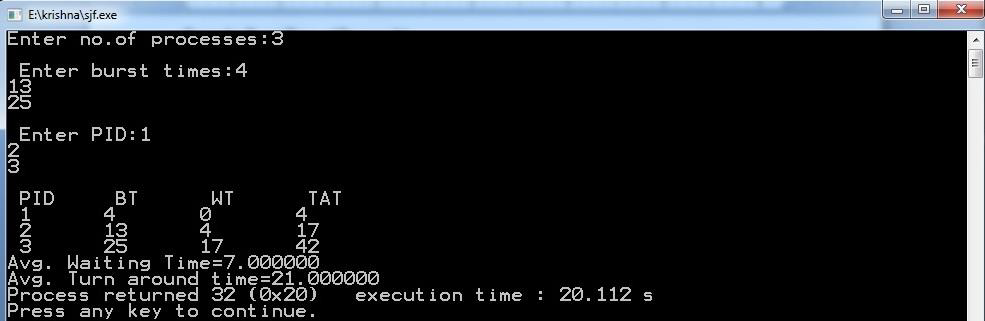

# Paging

```c
#include <stdio.h>

void main() {
    int i, j, temp, framearr[20], pages, pageno, frames, memsize, log, pagesize, prosize, base;

    // Concept: Paging in Memory Management
    // The program simulates a paging system to convert logical addresses to physical addresses.

    printf("Enter the Process size: ");
    scanf("%d", &prosize); // 'prosize' represents the size of the process.

    printf("\nEnter the main memory size: ");
    scanf("%d", &memsize); // 'memsize' represents the size of the main memory.

    printf("\nEnter the page size: ");
    scanf("%d", &pagesize); // 'pagesize' represents the size of each page.

    pages = prosize / pagesize; // Calculate the number of pages in the process.
    printf("\nThe process is divided into %d pages", pages);

    frames = memsize / pagesize; // Calculate the number of frames in the main memory.
    printf("\n\nThe main memory is divided into %d frames\n", frames);

    for (i = 0; i < frames; i++)
        framearr[i] = -1; /* Initializing array elements with -1*/

    // Assign pages to frames in the main memory.
    for (i = 0; i < pages; i++) {
        pos: printf("\nEnter the frame number of page %d: ", i);
        scanf("%d", &temp); /* storing frameno in temporary variable*/

        if (temp >= frames) /*checking whether frameno is valid or not*/ {
            printf("\n\t****Invalid frame number****\n");
            goto pos;
        }

        /* storing pageno (i.e 'i') in framearr at frameno (i.e temp) index */
        for (j = 0; j < frames; j++)
            if (temp == j)
                framearr[temp] = i;
    }

    // Display the frame table with frame numbers, corresponding page numbers, and validation bits.
    printf("\n\nFrameno\tpageno\tValidationBit\n------\t------\t----------");
    for (i = 0; i < frames; i++) {
        printf("\n %d \t %2d \t", i, framearr[i]);
        if (framearr[i] == -1)
            printf(" 0");
        else
            printf(" 1");
    }

    printf("\nEnter the logical address: ");
    scanf("%d", &log); // 'log' represents the logical address.

    printf("\nEnter the base address: ");
    scanf("%d", &base); // 'base' represents the base address of the process in the main memory.

    pageno = log / pagesize; // Determine the page number from the logical address.

    // Find the corresponding frame number for the given page number.
    for (i = 0; i < frames; i++)
        if (framearr[i] == pageno) {
            temp = i;
            break;
        }

    j = log % pagesize; /* here 'j' is displacement */

    // Calculate the physical address using the base address, frame number, and displacement.
    temp = base + (temp * pagesize) + j; // lhs 'temp' is physical address rhs and 'temp' is frame num

    printf("\nPhysical address is : %d", temp); // Display the physical address.
}

```


# FIFO Page Replacement

```c
#include <stdio.h>

void main() {
    int i, j, n, a[50], frame[10], fno, k, avail, pagefault = 0;

    // Concept: FIFO Page Replacement Algorithm
    // The program simulates FIFO (First-In-First-Out) page replacement algorithm in the memory management.

    printf("\nEnter the number of Frames : ");
    scanf("%d", &fno); // 'fno' represents the number of frames in the memory.

    printf("\nEnter number of reference string :");
    scanf("%d", &n); // 'n' represents the length of the reference string.

    printf("\n Enter the Reference string :\n");
    for (i = 0; i < n; i++)
        scanf("%d", &a[i]); // 'a' array stores the reference string.

    // Initialize frame array with -1 to indicate empty frames.
    for (i = 0; i < fno; i++)
        frame[i] = -1;

    j = 0; // 'j' represents the current frame to be replaced.

    printf("\n FIFO Page Replacement Algorithm\n\n The given reference string is:\n\n");
    for (i = 0; i < n; i++) {
        printf(" %d ", a[i]);
    }
    printf("\n");

    // Implement FIFO page replacement algorithm.
    for (i = 0; i < n; i++) {
        printf("\nReference No %d-> ", a[i]);
        avail = 0;

        // Check if the page is already in a frame.
        for (k = 0; k < fno; k++)
            if (frame[k] == a[i])
                avail = 1;

        // If page is not present in any frame, perform page replacement.
        if (avail == 0) {
            frame[j] = a[i]; // Replace the page in the current frame 'j'.
            j = (j + 1) % fno; // Move to the next frame for replacement in a circular manner.
            pagefault++;

            // Display the contents of frames after a page fault.
            for (k = 0; k < fno; k++)
                if (frame[k] != -1)
                    printf(" %2d", frame[k]);
        }
        printf("\n");
    }
    printf("\nPage Fault Is %d", pagefault); // Display the total number of page faults occurred.
}
```


# LRU Page Replacement

```c
#include<stdio.h>

void main() {
    int i, j, l, max, n, a[50], frame[10], flag, fno, k, avail, pagefault = 0, lru[10];
    
    // Concept: The 'frame' array represents the memory frames, and each element represents the content of a frame.
    //          The 'lru' array is used to track the least recently used frames.

    printf("\nEnter the number of Frames : ");
    scanf("%d", &fno); // 'fno' represents the number of memory frames.

    printf("\nEnter the number of reference strings: ");
    scanf("%d", &n); // 'n' represents the number of memory reference strings.

    printf("\nEnter the Reference strings: ");
    for (i = 0; i < n; i++)
        scanf("%d", &a[i]); // 'a' array represents the memory reference strings.

    // Initialize the memory frames and lru array with default values.
    for (i = 0; i < fno; i++) {
        frame[i] = -1; // Initialize the frames to -1 to indicate they are empty.
        lru[i] = 0; // Initialize the lru array to 0 (indicating all frames are equally recent).
    }

    printf("\nLRU Page Replacement Algorithm\n\n");
    printf("The given reference string is:\n\n");
    for (i = 0; i < n; i++) {
        printf(" %d ", a[i]);
    }
    printf("\n");

    j = 0; // 'j' represents the index of the least recently used frame.

    // Loop through the memory reference strings to simulate the LRU page replacement algorithm.
    for (i = 0; i < n; i++) {
        max = 0; // 'max' is used to find the index of the least recently used frame.
        flag = 0;
        printf("\nReference No %d-> ", a[i]);
        avail = 0;

        // Check if the referenced page is already present in any of the memory frames.
        for (k = 0; k < fno; k++){
            if (frame[k] == a[i]) {
                avail = 1; // Set 'avail' to 1 if the page is found in a frame.
                lru[k] = 0; // Reset the lru value for the found frame.
                break;
            }
        }

        if (avail == 1) {
            // If the page is present in a frame, we update the lru values for other frames.
            for (k = 0; k < fno; k++)
                if (frame[k] != -1)
                    ++lru[k];

            // Find the index of the least recently used frame (page) in the 'lru' array.
            max = 0;
            for (k = 1; k < fno; k++)
                if (lru[k] > lru[max])
                    max = k;
            j = max; // Update the 'j' index with the index of the least recently used frame.
        }

        if (avail == 0) {
            // If the page is not found in any frame (page fault occurs), we update the 'j' index.
            lru[j] = 0;
            frame[j] = a[i]; // Replace the least recently used frame with the new page.

            // Search for an empty frame to place the new page.
            for (k = 0; k < fno; k++) {
                if (frame[k] != -1)
                    ++lru[k];
                else {
                    j = k;
                    flag = 1;
                    break;
                }
            }

            // If there is no empty frame, we find the index of the least recently used frame.
            if (flag == 0) {
                max = 0;
                for (k = 1; k < fno; k++)
                    if (lru[k] > lru[max])
                        max = k;
                j = max; // Update the 'j' index with the index of the least recently used frame.
            }

            pagefault++; // Increment the page fault count.
            for (k = 0; k < fno; k++)
                if (frame[k] != -1)
                    printf(" %2d", frame[k]); // Print the frames' content after the page fault.
        }
        printf("\n");
    }
    printf("\nPage Fault Is %d", pagefault); // Print the total number of page faults at the end.
}
```


# Optimal Page Replacement

```c
#include <stdio.h>

int main() {
    int i, j, l, min, flag1, n, a[50], temp, frame[10], flag, fno, k, avail, pagefault = 0, opt[10];

    // Concept: LFU (Least Frequently Used) Page Replacement Algorithm
    // The program simulates the LFU page replacement algorithm in memory management.

    printf("\nEnter the number of Frames : ");
    scanf("%d", &fno); // 'fno' represents the number of frames in the memory.

    printf("\nEnter number of reference string :");
    scanf("%d", &n); // 'n' represents the length of the reference string.

    printf("\n Enter the Reference string :\n");
    for (i = 0; i < n; i++)
        scanf("%d", &a[i]); // 'a' array stores the reference string.

    for (i = 0; i < fno; i++) {
        frame[i] = -1; // Initialize frame array with -1 to indicate empty frames.
        opt[i] = 0; // Initialize the 'opt' array to store the frequency of each frame.
    }

    printf("\nLFU Page Replacement Algorithm\n\nThe given reference string is:\n\n");
    for (i = 0; i < n; i++)
        printf(" %d ", a[i]);
    printf("\n");
    j = 0; // 'j' represents the current frame to be replaced.

    // Implement LFU page replacement algorithm.
    for (i = 0; i < n; i++) {
        flag = 0;
        flag1 = 0;
        printf("\nReference No %d-> ", a[i]);
        avail = 0;

        // Check if the page is already in a frame.
        for (k = 0; k < fno; k++)
            if (frame[k] == a[i]) {
                avail = 1;
                break;
            }

        // If page is not present in any frame, perform page replacement.
        if (avail == 0) {
            temp = frame[j];
            frame[j] = a[i]; // Replace the page in the current frame 'j'.

            // Find an empty frame for replacement if available.
            for (k = 0; k < fno; k++) {
                if (frame[k] == -1) {
                    j = k;
                    flag = 1;
                    break;
                }
            }

            // If no empty frame available, find the least frequently used page.
            if (flag == 0) {
                for (k = 0; k < fno; k++) {
                    opt[k] = 0;

                    // Calculate the frequency of each frame.
                    for (l = i; l < n; l++) {
                        if (frame[k] == a[l]) {
                            flag1 = 1;
                            break;
                        }
                    }
                    if (flag1 == 1)
                        opt[k] = l - i;
                    else {
                        opt[k] = -1;
                        break;
                    }
                }

                // Find the frame with the least frequency and replace it.
                min = 0;
                for (k = 0; k < fno; k++)
                    if (opt[k] < opt[min] && opt[k] != -1)
                        min = k;
                    else if (opt[k] == -1) {
                        min = k;
                        frame[j] = temp;
                        frame[k] = a[i];
                        break;
                    }
                j = min;
            }

            pagefault++;
            for (k = 0; k < fno; k++)
                if (frame[k] != -1)
                    printf(" %2d", frame[k]);
        }
        printf("\n");
    }
    printf("\nPage Fault Is %d", pagefault); // Display the total number of page faults occurred.
    return 0;
}
```

# Round Robin Scheduling (RR)

```c
#include <stdio.h>

void main() {
    int ts, bt1[10], wt[10], tat[10], i, j = 0, n, bt[10], ttat = 0, twt = 0, tot = 0;
    float awt, atat;

    printf("Enter the number of Processes \n");
    scanf("%d", &n); // 'n' represents the number of processes.

    printf("\n Enter the Timeslice \n");
    scanf("%d", &ts); // 'ts' represents the time slice.

    printf("\n Enter the Burst Time for each process");
    for (i = 1; i <= n; i++) {
        scanf("%d", &bt1[i]); // 'bt1' array stores the burst time for each process.
        bt[i] = bt1[i]; // Copy burst time to another array 'bt' for calculation.
    }

    // Perform Round Robin scheduling algorithm.
    while (j < n) {
        for (i = 1; i <= n; i++) {
            if (bt[i] > 0) {
                if (bt[i] >= ts) {
                    tot += ts; // Increment total time with time slice.
                    bt[i] -= ts; // Reduce burst time by time slice.
                    if (bt[i] == 0) {
                        j++; // Increment process count that has finished executing.
                        tat[i] = tot; // Calculate turnaround time for the process.
                    }
                } else {
                    tot += bt[i]; // Increment total time with remaining burst time.
                    bt[i] = 0; // Set burst time to zero since process execution is complete.
                    j++; // Increment process count that has finished executing.
                    tat[i] = tot; // Calculate turnaround time for the process.
                }
            }
        }
    }

    // Calculate waiting time for each process and average waiting time.
    for (i = 1; i <= n; i++) {
        wt[i] = tat[i] - bt1[i]; // Waiting time = Turnaround time - Burst time.
        twt += wt[i]; // Calculate total waiting time.
        ttat += tat[i]; // Calculate total turnaround time.
    }

    awt = (float)twt / n; // Calculate average waiting time.
    atat = (float)ttat / n; // Calculate average turnaround time.

    printf("\n PID \t BT \t WT \t TAT\n");
    for (i = 1; i <= n; i++) {
        printf("\n %d \t %d \t %d \t %d \t\n", i, bt1[i], wt[i], tat[i]);
    }

    printf("\n The average Waiting Time = %f", awt); // Display average waiting time.
    printf("\n The average Turn around Time = %f", atat); // Display average turnaround time.
}
```


# Linked File Allocation

```c
#include<stdio.h>

// Structure to represent a file
struct file {
    char fname[10]; // File name
    int start; // Starting block of the file
    int size; // Number of blocks occupied by the file
    int block[10]; // Array to store block numbers
};

main() {
    int i, j, n;
    printf("Enter no. of files:");
    scanf("%d", &n); // 'n' represents the number of files.

    // Input file details
    for (i = 0; i < n; i++) {
        printf("Enter file name:");
        scanf("%s", &f[i].fname); // Read the file name.

        printf("Enter starting block:");
        scanf("%d", &f[i].start); // Read the starting block of the file.
        f[i].block[0] = f[i].start; // Store the starting block in the block array.

        printf("Enter no.of blocks:");
        scanf("%d", &f[i].size); // Read the number of blocks occupied by the file.

        printf("Enter block numbers:");
        for (j = 1; j < f[i].size; j++) {
            scanf("%d", &f[i].block[j]); // Read the block numbers occupied by the file.
        }
    }

    // Display file details
    printf("File\tstart\tsize\tblock\n");
    for (i = 0; i < n; i++) {
        printf("%s\t%d\t%d\t", f[i].fname, f[i].start, f[i].size); // Display file name, start, and size.

        for (j = 0; j < f[i].size - 1; j++) {
            printf("%d--->", f[i].block[j]); // Display block numbers occupied by the file.
        }
        printf("%d\n", f[i].block[j]);
    }
}
```


# Sequential File Allocation

```c
#include <stdio.h>

int main() {
    int n, i, j, b[20], sb[20], t[20], x, c[20][20];

    // Input the number of files
    printf("Enter no. of files:");
    scanf("%d", &n);

    // Input the number of blocks occupied by each file and the starting block of each file
    for (i = 0; i < n; i++) {
        printf("Enter no. of blocks occupied by file %d:", i + 1);
        scanf("%d", &b[i]);
        printf("Enter the starting block of file %d:", i + 1);
        scanf("%d", &sb[i]);

        // Store the starting block of each file in a temporary array 't'
        t[i] = sb[i];

        // Calculate the blocks occupied by each file and store in a 2D array 'c'
        for (j = 0; j < b[i]; j++)
            c[i][j] = sb[i]++;
    }

    // Display filename, start block, and length for each file
    printf("Filename\tStart block\tlength\n");
    for (i = 0; i < n; i++)
        printf("%d\t %d \t%d\n", i + 1, t[i], b[i]);

    // Input the file name to display its details
    printf("Enter file name:");
    scanf("%d", &x);
    printf("\nFile name is:%d", x);
    printf("\nlength is:%d", b[x - 1]);

    // Display blocks occupied by the selected file
    printf("\nblocks occupied:");
    for (i = 0; i < b[x - 1]; i++)
        printf("%4d", c[x - 1][i]);

    return 0;
}
```


# Indexed File Allocation

```c
#include<stdio.h>

int main() {
    int n, m[20], i, j, sb[20], b[20][20], x;

    // Input the number of files
    printf("Enter no. of files:");
    scanf("%d", &n);

    // Input the index block and length of each file and the blocks occupied by each file
    for (i = 0; i < n; i++) {
        printf("\nEnter index block of file %d:", i + 1);
        scanf("%d", &sb[i]);
        printf("Enter length of file %d:", i + 1);
        scanf("%d", &m[i]);
        printf("Enter blocks of file %d:", i + 1);
        for (j = 0; j < m[i]; j++)
            scanf("%d", &b[i][j]);
    }

    // Display the index block and length for each file
    printf("\nFile\t Index\tLength\n");
    for (i = 0; i < n; i++) {
        printf("%d\t%d\t%d\n", i + 1, sb[i], m[i]);
    }

    // Input the file name (index) to view more details about a specific file
    printf("\nEnter file name:");
    scanf("%d", &x);
    printf("\nFile name is:%d", x);
    printf("\nIndex is:%d", sb[x - 1]);

    // Display the blocks occupied by the selected file
    printf("\nBlocks occupied are:");
    for (j = 0; j < m[x - 1]; j++)
        printf("%4d", b[x - 1][j]);

    return 0;
}
```


# SJF Scheduling

```c
#include <stdio.h>

void main() {
    int pid[10], bt[10], wt[10], tat[10], n, twt = 0, ttat = 0, i, j, t;
    float awt, atat;

    // Input the number of processes
    printf("Enter no. of processes:");
    scanf("%d", &n);

    // Input burst times for each process
    printf("\n Enter burst times:");
    for (i = 0; i < n; i++)
        scanf("%d", &bt[i]);

    // Input PIDs for each process
    printf("\n Enter PID:");
    for (i = 0; i < n; i++)
        scanf("%d", &pid[i]);

    // Sort processes based on their burst times in ascending order
    for (i = 0; i < n; i++) {
        for (j = i + 1; j < n; j++) {
            if (bt[i] > bt[j]) {
                t = bt[i];
                bt[i] = bt[j];
                bt[j] = t;

                t = pid[i];
                pid[i] = pid[j];
                pid[j] = t;
            }
        }
    }

    // Calculate waiting time and turnaround time for each process
    wt[0] = 0;
    tat[0] = bt[0];
    for (i = 1; i < n; i++) {
        wt[i] = tat[i - 1];
        tat[i] = bt[i] + wt[i];
    }

    // Calculate total waiting time and total turnaround time
    for (i = 0; i < n; i++) {
        ttat = ttat + tat[i];
        twt = twt + wt[i];
    }

    // Display PID, burst time, waiting time, and turnaround time for each process
    printf("\n PID \t BT \t WT \t TAT");
    for (i = 0; i < n; i++)
        printf("\n %d\t%d\t%d\t%d", pid[i], bt[i], wt[i], tat[i]);

    // Calculate and display average waiting time and average turnaround time
    awt = (float)twt / n;
    atat = (float)ttat / n;
    printf("\nAvg. Waiting Time=%f", awt);
    printf("\nAvg. Turnaround Time=%f", atat);
}
```

