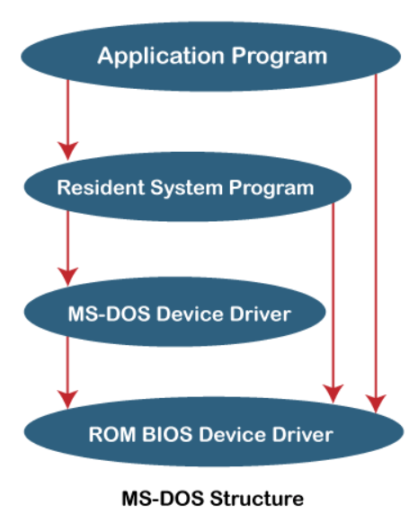
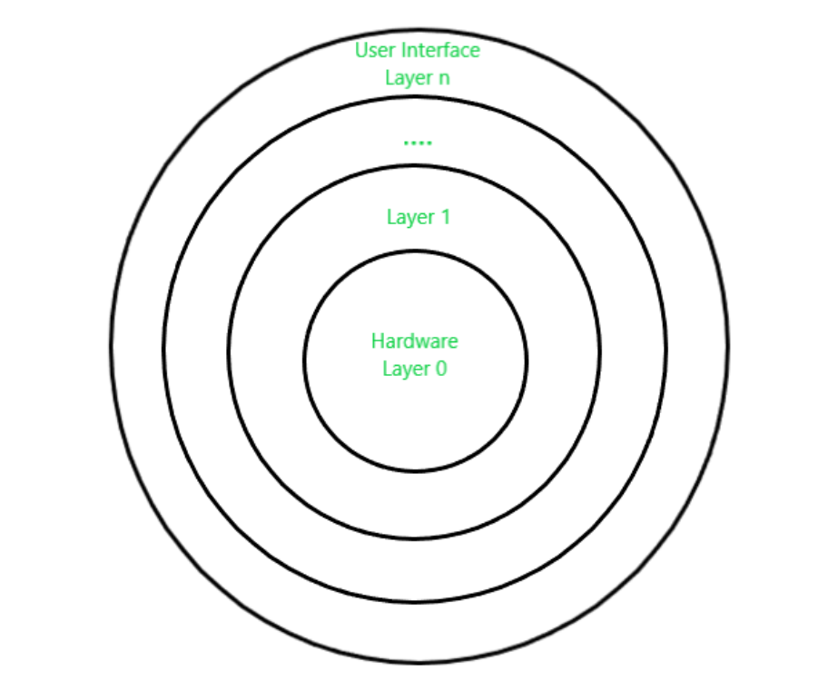
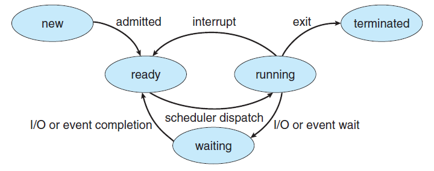
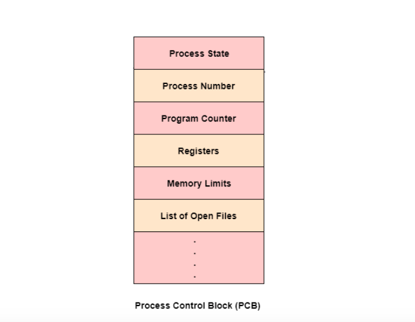
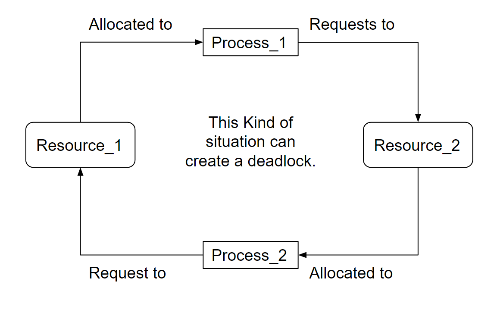
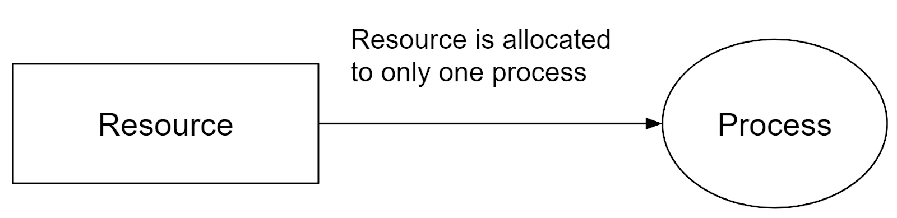
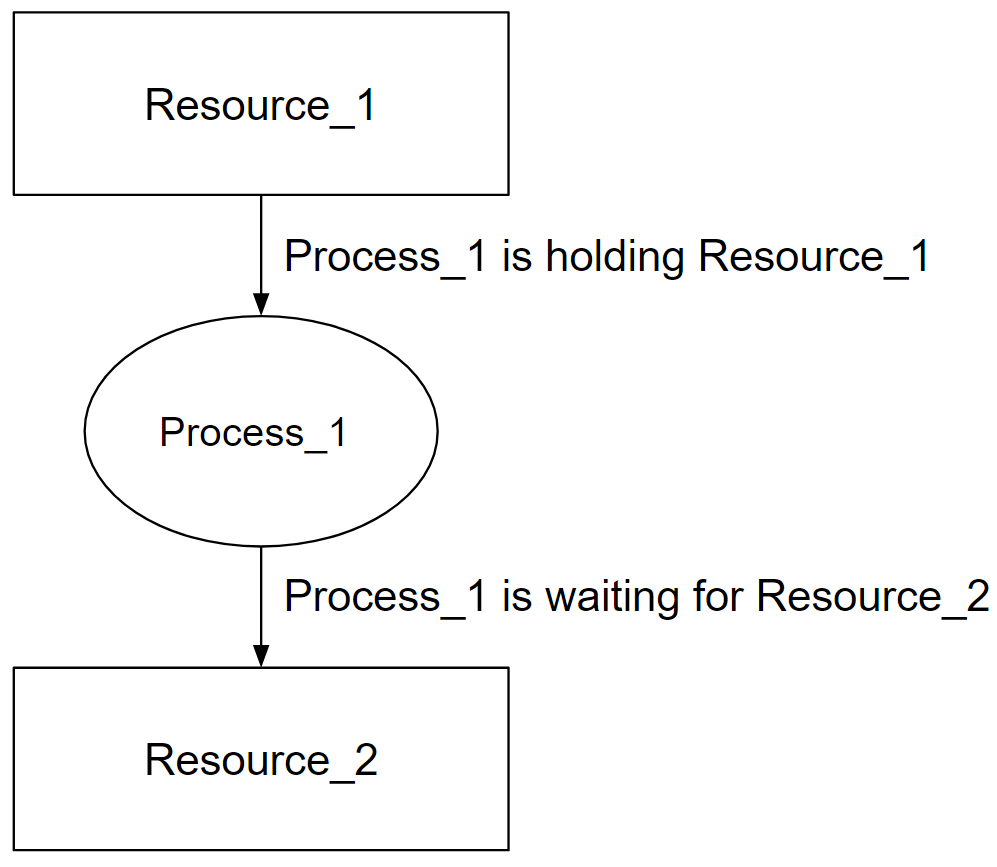

# 
 Unit 1 

## Operating System Objectives and Functions

An operating system (OS) acts as an intermediary between computer hardware and users, coordinating application execution, software resources, and hardware functionalities. It manages tasks like file and memory management, input/output, and peripheral devices. This article discusses the objectives and functions of operating systems.

**Objectives of the Operating System**

The operating system serves as a bridge between users and computer hardware, facilitating access to hardware resources required for application execution. Its key objectives include:

1. **Efficiency:** The OS enhances production efficiency by managing system tasks like resource allocation and conflict resolution, saving user time and ensuring efficiency in results.

2. **Hardware Abstraction:** The OS hides intricate hardware details, allowing users to fully utilize computer hardware without coping with complexities. It facilitates communication between user programs and hardware.

3. **Convenience:** Operating systems provide pre-configured utility packages, sparing users from direct hardware interaction. This convenience enables users to focus on tasks without setting up the system.

4. **System Resource Management:** The OS acts as an impartial arbitrator, managing resource distribution equitably among operations and users in the computer system.

**Functions of Operating System**

An operating system orchestrates the various components of a computer system, ensuring their proper coordination and operation. It performs functions such as:

1. **Processor Management:** In a multiprogramming environment, the OS allocates processor time and duration for process execution. It tracks processor and process status, assigns processors to processes, and deallocates them when processes are done.

2. **Device Management:** The OS manages device communication using drivers. It tracks devices, assigns them to processes, and ensures efficient allocation and deallocation, enhancing overall system efficiency.

3. **Memory Management:** The OS controls primary memory by tracking its usage, allocating memory to processes, and deallocating it when no longer needed.

4. **File Management:** Operating systems organize files and directories, tracking data, location, and usage. They allocate and deallocate resources and manage access control, ensuring efficient file handling.

5. **Security:** The OS safeguards applications and data from unauthorized access, controlling system and resource access on shared or public systems.

6. **Accounting:** Operating systems track resource usage by different jobs and users, aiding in system performance prediction, optimization, and task accounting.

7. **Controlling System Performance:** The OS collects resource consumption statistics and monitors performance metrics like response time, enhancing system performance.

8. **Error Detection:** Operating systems identify and respond to errors, including hardware and software faults, minimizing damage to ongoing programs and ensuring system stability.

## Design Approaches in Operating System

Operating systems can be implemented using various design structures that dictate how common components are integrated and merged into the kernel. The design approaches in operating systems include the following structures:

### Simple Structure
Simple structured operating systems are small, uncomplicated, and lack a well-defined structure. There is minimal separation between interfaces and functionality levels. An example of such an operating system is MS-DOS. In this structure, application programs can directly access basic I/O functions. However, if a user program fails, the entire system crashes due to the lack of isolation between modules.

**Advantages:**
- Superior application performance due to limited interfaces.
- Simplicity for kernel development.

**Disadvantages:**
- Complex structure due to lack of clear module boundaries.
- No data concealment in the operating system.

### Micro-Kernel Structure
The micro-kernel structure involves eliminating non-essential kernel components and implementing them as user programs and systems. This results in a smaller kernel known as a micro-kernel. New services are added to userspace instead of the kernel, making it more secure and reliable. If a service fails, the rest of the OS remains unaffected. Mac OS is an example of an operating system following this structure.

**Advantages:**
- Portability across platforms.
- Effective testing due to small microkernels.

**Disadvantages:**
- Performance degradation with increased inter-module communication.

### Layered Structure
The layered structure divides an operating system into sections, or layers, with control retained over the system. Hardware resides in the bottom layer (layer 0), while the user interface is in the top layer (layer N). Each layer only relies on functions from lower-level layers, simplifying debugging and testing. UNIX is an example of an operating system using the layered structure.

**Advantages:**
- Easy OS improvement by changing a layer's implementation without affecting others.
- Simplified debugging and system verification.

**Disadvantages:**
- Reduced application performance compared to a simple structure.
- Requires careful planning of layers.

### Modular Structure or Approach
The modular structure, considered the best approach, involves designing a modular kernel. It resembles a layered structure with specified and protected interfaces for each kernel module. Modules can call any other module, making it more flexible. The kernel contains only essential components, and additional services are dynamically loaded into the kernel as modules during runtime or boot time.

## Modular Approach vs. Microkernel Approach

The modular approach and the microkernel approach are both design strategies for operating systems, but they have distinct characteristics and differences in their implementation and philosophy.

**Modular Approach:**

The modular approach involves designing an operating system with a modular kernel. Each module has specific and protected interfaces, and additional services can be added as dynamically loadable modules during runtime or boot time. In simple words, the modular approach involves designing a modular kernel with loadable kernel modules.

**Microkernel Approach:**

The microkernel approach involves designing an operating system by moving non-essential kernel components into user-space and implementing them as separate user programs and services. in simple words, the microkernel approach involves moving non-essential services into user-level processes.
The microkernel itself provides only essential services, such as process management, memory management, and inter-process communication.

**Key Differences:**

1. **Kernel Size:** In the modular approach, the kernel contains essential modules and services, while in the microkernel approach, the kernel is minimal and contains only core functions.
   
2. **Module vs. Process:** The modular approach uses loadable kernel modules, while the microkernel approach moves non-essential services into user-level processes.
   
3. **Flexibility:** The modular approach offers more flexibility in module interactions, whereas the microkernel approach prioritizes isolation and minimalism.
   
4. **Dynamic Loading:** The modular approach allows dynamic loading and unloading of modules, while the microkernel approach moves services to separate processes.
   
5. **Security and Reliability:** The microkernel approach tends to offer better security and reliability due to service isolation.

6. **Performance:** The modular approach offers better performance due to reduced inter-process communication, while the microkernel approach suffers from increased inter-process communication.

7. **Portability:** The microkernel approach is more portable across platforms due to its minimalistic design, while the modular approach is less portable due to its reliance on kernel modules.

8. **Development:** The modular approach is easier to develop due to its simple design, while the microkernel approach is more complex to develop due to its minimalistic design.

In summary, the modular approach focuses on flexible module interactions within the kernel, while the microkernel approach prioritizes isolating non-essential services into separate user-level processes for enhanced security and system stability. Both approaches have their advantages and trade-offs, and the choice depends on the specific goals and requirements of the operating system being designed.

## Types of System Calls

A system call is a mechanism that allows a program to request services from the kernel of an operating system. These services can include operations such as creating, managing processes, file operations, device operations, and communication. System calls provide an interface between user-level programs and the kernel. Here are the various types of system calls:

**1. Process Control System Calls**

Process control system calls are used to manage processes, which are running instances of programs. These system calls allow programs to create new processes, terminate existing ones, and manage their execution states. Some examples of process control system calls include:

- `fork()`: Create a new process.
- `exec()`: Replace the current process with a new process.
- `exit()`: Terminate the calling process.
- `wait()`: Wait for a child process to terminate.
- `kill()`: Send a signal to a specified process.
- `nice()`: Change the priority of a process.

**2. File Management System Calls**

File management system calls enable programs to perform various operations on files and directories. These operations include creating, opening, reading, writing, and closing files. Some examples of file management system calls are:

- `open()`: Open a file for reading or writing.
- `read()`: Read data from an open file.
- `write()`: Write data to an open file.
- `close()`: Close an open file.
- `create()`: Create a new file.
- `delete()`: Delete an existing file.
- `seek()`: Change the current position in a file.

**3. Device Management System Calls**

Device management system calls are used to interact with devices attached to the computer, such as printers, disks, and network interfaces. These system calls allow programs to perform input and output operations on devices. Examples of device management system calls include:

- `read()`: Read data from a device.
- `write()`: Write data to a device.
- `ioctl()`: Control various device parameters.
- `open()`: Open a device for communication.
- `close()`: Close a device.

**4. Information Maintenance System Calls**

Information maintenance system calls provide ways to retrieve and set system information, such as time and date settings, system configuration, and process-related information. Examples of information maintenance system calls include:

- `getpid()`: Get the process ID of the current process.
- `getppid()`: Get the parent process ID.
- `time()`: Get the current time.
- `setuid()`: Set the user ID of the calling process.
- `getuid()`: Get the user ID of the calling process.

**5. Communication System Calls**

Communication system calls facilitate inter-process communication (IPC) between different processes. These system calls are used to establish connections, send messages, and synchronize processes. Examples of communication system calls include:

- `socket()`: Create a new communication endpoint (socket).
- `bind()`: Bind a name to a socket.
- `send()`: Send data to another process.
- `receive()`: Receive data from another process.
- `connect()`: Initiate a connection to another socket.

All these system calls are used to perform various operations on the system. They are used to create, manage, and terminate processes, perform file operations, interact with devices, retrieve and set system information, and communicate with other processes.

## Types of System Programs

System Programs are programs that provide essential functionality to the operating system. They bridge the gap between the user interface and the underlying hardware and system services.

System programs provide essential functionality that enhances the user experience and enables efficient interaction between users and the computer system. These programs bridge the gap between the user interface and the underlying hardware and system services. There are several types of system programs, each serving specific purposes:

**1. File Manipulation Programs**

File manipulation programs manage system files and perform operations such as creation, deletion, copying, renaming, and printing of files. They provide users with the ability to organize and manage their data. Examples of file manipulation programs include file managers, file browsers, and command-line utilities like `cp`, `mv`, and `rm`.

**2. Status Information Programs**

Status information programs provide users with current or historical system status details. These programs offer data about the system's date, time, available memory, disk space usage, and currently logged-in users. Users can access this information to monitor and manage system resources effectively.

**3. File Modification Programs**

File modification programs are used to edit or modify the content of files. Text editors and other document editing tools fall under this category. These programs enable users to create, edit, and save various types of documents, ensuring data flexibility and user-friendly document management.

**4. Programming Language Support Programs**

Programming language support programs assist developers in creating and managing software applications. Compilers, interpreters, debuggers, and development environments fall into this category. They help developers write, debug, and optimize code in various programming languages, making software development more efficient.

**5. Program Loading and Execution Programs**

Program loading and execution programs handle the loading of programs into memory and their execution. Loaders and linkers are examples of such programs. They ensure that programs are correctly loaded into memory, linked with libraries, and executed according to the user's intent.

**6. Communication Programs**

Communication programs facilitate interaction between the computer system and external networks or devices. Web browsers, email clients, FTP clients, and messaging applications fall under this category. These programs enable users to access and exchange information over the internet or other communication channels.

**7. Application Programs**

Application programs are diverse and cater to various user needs. These programs provide specific functionalities, such as word processing, spreadsheet creation, database management, gaming, graphics editing, and more. They serve as tools for users to accomplish specific tasks or activities efficiently.

## Types of Operating Systems

Sure, here's a short note on each type of operating system along with their merits and demerits:

### 1. Batch Operating System
A batch operating system executes tasks in batches without user interaction. It is suitable for executing repetitive tasks without human intervention.

**Merits:**
- Efficient utilization of resources as tasks are executed in batches.
- Reduced idle time for CPU and devices, enhancing system efficiency.

**Demerits:**
- Limited user interaction and responsiveness due to lack of interactivity.
- Difficult to prioritize tasks dynamically, affecting critical tasks.

### 2. Multi-Programming System
A multi-programming system allows multiple programs to be loaded into memory simultaneously. It is suitable for executing multiple programs concurrently.

**Merits:**
- Improved CPU utilization by switching between programs during idle times.
- Enhanced throughput as programs are executed concurrently.
  
**Demerits:**
- Complexity in memory management and resource allocation.
- Possibility of one program affecting the execution of others in case of errors.

### 3. Multi-Processing System
A multi-processing system uses multiple processors to perform tasks. It is suitable for applications that require high processing power.

**Merits:**
- Higher processing power and performance due to multiple processors.
- Improved multitasking capability and faster execution of tasks.
  
**Demerits:**
- Increased complexity in synchronization and communication between processors.
- Higher hardware and energy costs due to multiple processors.

### 4. Multi-Tasking Operating System
A multi-tasking operating system allows multiple tasks or processes to run simultaneously. It is suitable for applications that require concurrent execution of multiple tasks.

**Merits:**
- Enhanced user productivity by running multiple applications concurrently.
- Efficient utilization of CPU time, minimizing idle periods.
  
**Demerits:**
- Complexity in managing task priorities and avoiding resource conflicts.
- May require more memory and processing power.

### 5. Time-Sharing Operating System
A time-sharing operating system allows multiple users to interact with the system simultaneously. It uses CPU scheduling and multi-tasking to provide each user with a small time slice of CPU time. It is suitable for applications that require multiple users to access the system concurrently.

**Merits:**
- Fair resource allocation among users, providing equal access.
- Improved user satisfaction and responsiveness.
  
**Demerits:**
- Overhead due to context switching and maintaining user sessions.
- Increased complexity in managing and securing user interactions.

### 6. Distributed Operating System
A distributed operating system spreads tasks across multiple interconnected computers. It uses distributed computing to coordinate tasks and resources across the network. It is suitable for applications that require distributed resources.

**Merits:**
- Scalability and improved fault tolerance through distributed resources.
- Enhanced performance by utilizing resources from multiple machines.
  
**Demerits:**
- Complexity in communication and synchronization among distributed nodes.
- Increased management and maintenance challenges.

### 7. Network Operating System
A network operating system manages network resources and allows sharing of files and devices. It uses network protocols to facilitate communication between connected devices. It is suitable for applications that require network connectivity.

**Merits:**
- Centralized management of network resources, improving control.
- Efficient resource sharing among connected devices.
  
**Demerits:**
- Reliance on network stability; network failures affect system functionality.
- Increased security challenges due to shared resources.

### 8. Real-Time Operating System
A real-time operating system guarantees timely execution of tasks, critical for real-time applications. It uses real-time scheduling to ensure that critical tasks are executed within a specified time frame. It is suitable for applications that require precise timing and execution of tasks.

**Merits:**
- Precise timing and execution of critical tasks for real-time applications.
- Predictable performance, crucial for industries like aerospace and medical devices.
  
**Demerits:**
- Limited flexibility and adaptability due to stringent timing requirements.
- Complexity in design and debugging real-time applications.

Different types of Real-Time Operating Systems:

- **Hard Real-Time Operating System:** A hard real-time operating system guarantees that critical tasks are executed within a specified time frame. It is suitable for applications that require precise timing and execution of tasks. In simple words, it guarantees that all tasks will be completed within the specified time frame.
- **Soft Real-Time Operating System:** A soft real-time operating system guarantees that critical tasks are executed within a specified time frame, but it allows some flexibility. It is suitable for applications that require precise timing and execution of tasks, but can tolerate occasional delays. In simple words, it guarantees that critical tasks will be completed within the specified time frame, but it allows some flexibility.
- **Firm Real-Time Operating System:** A firm real-time operating system guarantees that critical tasks are executed within a specified time frame, but it allows some flexibility. It is suitable for applications that require precise timing and execution of tasks, but can tolerate occasional delays. However, it does not guarantee that all tasks will be completed within the specified time frame. In simple words, it guarantees that critical tasks will be completed within the specified time frame, but it does not guarantee that all tasks will be completed within the specified time frame.

# 
 Unit 2 

## Process and Process Life Cycle

A process in an operating system represents a program in execution, with its own memory space and resources. The process life cycle describes the various stages that a process goes through during its execution. While specific states and terminology may vary across different operating systems, the general process life cycle consists of the following stages:

1. **Start:**
   - This is the initial state when a process is first created or launched.
   - Resources such as memory space and system structures are allocated to the process.
   - The process is prepared to execute its instructions.

2. **Ready:**
   - In the ready state, the process is waiting to be assigned to a processor for execution.
   - The operating system's scheduler manages the process queue and determines which process will be allocated the CPU next.
   - Processes in this state are capable of running but are waiting for CPU time.

3. **Running:**
   - Once a process is selected by the scheduler to run, it enters the running state.
   - The processor executes the instructions of the selected process.
   - The process uses the CPU to perform its operations and computations.
   - If the process is interrupted, it moves back to the ready state.

4. **Waiting:**
   - A process moves to the waiting state if it needs to wait for a certain event or resource.
   - This can include waiting for user input, waiting for a specific condition to be met, or waiting for I/O operations.
   - While in this state, the process is blocked, and the operating system may allocate CPU time to another process.
   - Once the event or resource is available, the process moves back to the ready state.

5. **Terminated or Exit:**
   - When a process completes its execution or is terminated by the operating system, it enters the terminated state.
   - Resources used by the process, such as memory and open files, are released.
   - The process waits to be removed from main memory and other system structures.

It's important to note that the sequence of these states may not always be linear, as a process can transition between states based on its execution needs and the activities of other processes. The operating system's scheduler plays a crucial role in managing these transitions and determining which process to execute next.

## Process Vs. Thread

| **S.NO** | **Process**                                                | **Thread**                                                  |
|----------|------------------------------------------------------------|-------------------------------------------------------------|
| 1.       | A process refers to any program that is currently in execution. | A thread is a smaller unit of a process.                  |
| 2.       | Processes take more time to terminate as they have their own resources and need to release them properly. | Threads take less time to terminate as they share resources with other threads in the same process. |
| 3.       | Creating a process takes more time due to the allocation of separate resources. | Creating a thread takes less time as it shares resources with the parent process. |
| 4.       | Context switching between processes is relatively slower, involving more overhead. | Context switching between threads is faster since they share resources and require fewer changes. |
| 5.       | Processes are less efficient in terms of communication, often requiring inter-process communication mechanisms. | Threads are more efficient in terms of communication as they can directly share data within the process. |
| 6.       | Multiprogramming involves managing multiple processes.    | Threads do not require multiple programs for execution; they can exist within a single process. |
| 7.       | Processes are isolated from each other and do not share memory. | Threads within the same process share memory and resources. |
| 8.       | Processes are considered heavyweight due to their resource allocation. | Threads are lightweight since they share code, data, and resources with other threads in the process. |
| 9.       | Process switching involves using an interface in the operating system. | Thread switching does not require calling the operating system and causes fewer interrupts to the kernel. |
| 10.      | If one process is blocked, it does not impact the execution of other processes. | If a user-level thread is blocked, it can block all other user-level threads within the same process. |
| 11.      | A process has its own Process Control Block, Stack, and Address Space. | Threads within a process share the parent process's PCB, have their own Thread Control Block and Stack, and use the common address space. |
| 12.      | Changes to the parent process do not affect child processes. | Threads within a process share resources, so changes to one thread can affect the behavior of other threads in the same process. |
| 13.      | System calls are involved in creating, managing, and terminating processes. | Threads can be created using APIs and do not require system calls for management within a process. |
| 14.      | Processes do not share data with each other.             | Threads can share data directly with other threads within the same process. |

## Process Control Block (PCB)

A Process Control Block (PCB) is a data structure used by the operating system to store information about a process. It contains information about the process's execution status, memory usage, and resource requirements. The PCB is also known as the Task Control Block (TCB).

## Structure of the Process Control Block

The Process Control Block (PCB) is a vital data structure in an operating system that holds various data items essential for efficient process management. The PCB's structure and content play a critical role in managing processes effectively. The diagram below illustrates the components of a PCB:

The PCB contains the following information about a process:

1. **Process State:**
   - Represents the current state of the process (new, ready, running, waiting, terminated).

2. **Process Number:**
   - Unique identifier assigned to each process, allowing the system to distinguish between processes.

3. **Program Counter:**
   - Holds the address of the next instruction to be executed within the process.

4. **Registers:**
   - Stores various registers used by the process, such as accumulators, index registers, stack pointers, and general-purpose registers.

5. **List of Open Files:**
   - Contains references to files that are associated with the process.

6. **CPU Scheduling Information:**
   - Includes details about process priority, pointers to scheduling queues, and other scheduling-related parameters.

7. **Memory Management Information:**
   - Holds memory-related information, such as page tables or segment tables (depending on the memory system used), base and limit registers, and more.

8. **I/O Status Information:**
   - Encompasses a list of I/O devices used by the process and information about open files.

9. **Accounting Information:**
   - Stores various accounting details, including time limits, process numbers, account numbers, and the amount of CPU time used.

The location of the PCB is crucial for security and efficient management:

- **Protected Memory Area:**
  - The PCB is stored in a memory region that is protected from normal user access to prevent unauthorized modifications.
  
- **Kernel Stack:**
  - In some operating systems, the PCB is placed at the beginning of the kernel stack allocated for the process. This positioning ensures the PCB's safety and accessibility during the process's execution.

## Inter-Process Communication (IPC)

Inter-Process Communication (IPC) is a mechanism that enables processes to communicate and synchronize with each other within an operating system. It's essential for scenarios where multiple processes need to share information or collaborate on tasks. There are two primary types of processes:

1. **Independent Processes:**
   - These processes do not influence or get influenced by other processes.
   
2. **Cooperating Processes:**
   - These processes can impact and be impacted by other processes. They engage in inter-process communication.

The need for inter-process communication arises due to various factors:

- Processes share data when multiple processes concurrently access a particular file or resource.
- Dividing a large task into smaller tasks executed concurrently speeds up system functioning. Inter-process communication is crucial in a multiprocessor environment.
- Modules within a system may require sharing information to accomplish tasks.
- Running multiple processes simultaneously enhances user experience and system responsiveness.

**Types of IPC:**

1. **Shared Memory:**
   - In this method, processes communicate through a shared memory area. Both processes can access and modify this shared memory.
   - Useful for high-speed communication and data sharing.
   - Commonly used in producer-consumer scenarios, where one process generates data and another consumes it.
   - Requires synchronization to prevent data inconsistency issues.

2. **Message Passing:**
   - This method facilitates communication and synchronization between processes that do not share memory space.
   - Utilized in distributed systems where processes are on separate computers connected by a network.
   - Involves two fundamental operations: send(message) and receive(message).
   - Messages can be of fixed or variable size.

**Shared Memory IPC:**

Shared memory communication involves two processes interacting with a common memory region. This region resides in the address space of the processes involved.

- **Working:**
  - Process P1 writes data into the shared memory region.
  - Process P2 reads the data from the same shared memory region.
  - Both processes can perform these actions concurrently.

- **Example: Producer-Consumer Problem:**
  - In scenarios where a producer creates goods consumed by a consumer, shared memory acts as a buffer for their interaction. In simple words, the producer produces goods and places them in the buffer, and the consumer consumes them from the buffer.
  - Synchronization is maintained between producer and consumer processes to avoid consuming empty buffer or overfilling it.

**Message Passing IPC:**

Message passing allows processes to communicate without shared memory. It is particularly suitable for distributed systems.

- **Basic Operations:**
  - `send(message)`: Used by a process to send a message to another process.
  - `receive(message)`: Used by a process to receive a message from another process.

- **Message Sizes:**
  - Messages can be of fixed or variable size.

- **Communication Link:**
  - Implemented through communication links, serving as the medium for message exchange.

- **Example: Client-Server Model:**
  - In this model, the server process provides services to the client process.
  - The client process sends a request to the server process, which processes the request and sends a response back to the client process.
  - The client process can be a user process or another server process.
  - The server process can be a user process or a system process.

## Process Scheduling

Process scheduling is a mechanism that allows the operating system to allocate CPU time to processes. It determines which process will run next when multiple processes are ready to run. The goal of process scheduling is to maximize CPU utilization and system throughput while ensuring fairness and responsiveness.

**Types of Process Scheduling:**

1. **Long-Term Scheduling:**
   - Also known as job scheduling, it determines which processes should be admitted to the system for processing.
   - It selects processes from the pool of processes residing on the disk and loads them into memory for execution.
   - It is performed when a new process is created or an existing process is terminated.
   - It is a relatively slow process as it involves I/O operations and memory allocation.

2. **Short-Term Scheduling:**
   - Also known as CPU scheduling, it determines which process should be executed next.
   - It selects processes from the pool of processes residing in memory and allocates CPU time to them.
   - It is performed when a process is blocked, terminated, or switches from running to waiting state.
   - It is a relatively fast process as it does not involve I/O operations or memory allocation.

3. **Medium-Term Scheduling:**
    - Also known as swapping, it determines which processes should be swapped out of memory and onto the disk.
    - It selects processes from the pool of processes residing in memory and moves them to the disk.
    - It is performed when the system is low on memory.
    - It is a relatively slow process as it involves I/O operations and memory allocation.

**Scheduling Algorithms:**

1. **First Come First Serve (FCFS):**
   - Also known as FIFO (First In First Out), it allocates CPU time to processes in the order they arrive in the ready queue.
   - It is a non-preemptive algorithm as the process currently using the CPU cannot be preempted. Preemeted means to stop the process.
   - It is easy to implement and ensures fairness as processes are executed in the order they arrive.
   - It is not suitable for time-sharing systems as it does not prioritize short processes.

2.  **Shortest Job First (SJF):**
   - Also known as Shortest Process Next (SPN), it allocates CPU time to the process with the shortest expected processing time.
   - It is a non-preemptive algorithm as the process currently using the CPU cannot be preempted.
   - It is optimal in terms of average waiting time as it minimizes the waiting time of short processes.
   - It is not suitable for time-sharing systems as it does not prioritize short processes.

3. **Priority Scheduling:**
   - It allocates CPU time to processes based on their priority.
   - It is a preemptive algorithm as the process currently using the CPU can be preempted.
   - It is suitable for time-sharing systems as it prioritizes short processes.
   - It can lead to starvation of low-priority processes if high-priority processes are continually added. Meaning, low-priority processes may not get CPU time when high-priority processes are added.

4. **Round Robin (RR):**
   - It allocates CPU time to processes in a circular fashion.
   - It is a preemptive algorithm as the process currently using the CPU can be preempted.
   - It is suitable for time-sharing systems as it prioritizes short processes.
   - It can lead to high average waiting time if the time quantum is too large.

# 
 Unit 3 

## Deadlock

A deadlock in an operating system refers to a situation where multiple processes are trapped in a state of waiting for an event that will never occur, leading to a standstill in their execution. Deadlocks can occur due to various reasons, including resource contention and circular wait. They can be prevented or mitigated using effective resource utilization and preemptive strategies.

**Deadlock Scenario**

Imagine two processes, Process_1 and Process_2, as depicted in Figure 1:

- Process_1 holds Resource_1 and is awaiting Resource_2.
- Process_2 holds Resource_2 and is awaiting Resource_1.

In this state, both the processes are waiting for resources held by each other, and neither can proceed. This situation is known as a deadlock.

**Necessary Conditions for Deadlock**

Deadlock arises due to four necessary conditions:

1. **Mutual Exclusion:**
   - Resources can only be used by one process at a time.
   - Mutex (binary semaphore) ensures exclusive access to shared resources.
   - Deadlocks commonly occur with resources that require exclusive access, like printers or tape drives.
   - 

2. **No Preemption:**
   - Processes cannot forcibly take resources from others.
   - A process that is blocked and waiting for resources will retain the ones it holds.
   - Preemption can prevent deadlocks by forcing processes to relinquish resources.

3. **Hold and Wait:**
   - Processes hold resources while simultaneously waiting for others.
   - A process can request resources while holding others.
   - In the example above, Process_1 holds Resource_1 and requests Resource_2, while Process_2 holds Resource_2 and requests Resource_1.
   - 

4. **Circular Wait:**
   - Processes form a circular chain of waiting.
   - The last process in the chain is waiting for a resource held by the first process.
   - In this example, Process_1 is waiting for Resource_2, which is held by Process_2, and Process_2 is waiting for Resource_1, which is held by Process_1 which is a circular chain of waiting.

### Resource Utilization

Resource utilization involves three key actions:

- **Request:** Processes request resources; if unavailable, they wait until resources become free.
- **Use:** Processes use the allocated resources to complete their tasks.
- **Release:** Processes release resources once tasks are finished, making them available to other processes.

**Real-World Example**

- Imagine a bridge with a single lane that can only accommodate one vehicle at a time.
- A deadlock can occur if two vehicles approach the bridge from opposite directions and both wait for the other to pass.

- Imagine a printer that can only print one document at a time.
- When two processes attempt to print documents simultaneously, a deadlock can occur if both processes wait for the printer to become available.

## Methods to Handle Deadlocks in Operating Systems

Deadlocks, a state where processes are indefinitely waiting for each other to release resources, can cripple system performance. Handling deadlocks requires effective strategies to either prevent or resolve them. Several methods are employed to manage deadlocks:

**1. Deadlock Ignorance (Ostrich Method)**

This method assumes that deadlocks never occur and ignores the possibility of their existence. It is suitable for single-user systems where the chances of deadlocks are minimal, and users perform routine tasks like browsing. This approach is commonly used by most Windows and Linux users.

**2. Deadlock Prevention**

Deadlock prevention aims to break one or more of the necessary conditions for deadlock formation, namely, mutual exclusion, hold and wait, no preemption, and circular wait.

- **Mutual Exclusion Avoidance:** Allow multiple processes to access a resource simultaneously. This is not always feasible as some resources are inherently non-shareable, like printers.
- **Hold and Wait Avoidance:** Mandate processes to request and acquire all necessary resources at the start, rather than acquiring them incrementally.
- **No Preemption Avoidance:** Enable the OS to preempt resources from processes to allocate them to other waiting processes. This can lead to low resource utilization.
- **Circular Wait Avoidance:** Impose a global ordering on resource requests to ensure that circular waits cannot occur.

**3. Deadlock Avoidance**

Deadlock avoidance employs a dynamic approach to assess whether the system is in a safe or unsafe state before granting resources to processes. It utilizes algorithms like the Banker's algorithm to ascertain whether resource allocation will lead to a safe state. Resources are allocated if a safe state is predicted; otherwise, the process waits. If a requested resource makes the system unsafe, the OS backtracks and avoids the allocation.

**4. Deadlock Detection and Recovery**

This method involves periodically checking the system for deadlock occurrences. If detected, the OS applies recovery strategies to remove the deadlock and restore the system to a safe state. Strategies can include process termination, resource preemption, and process rollback. This approach is more reactive but is useful in environments where preemption is not feasible or desired.

**Advantages and Disadvantages of Deadlock Handling Methods**

**Advantages:**

- Methods like deadlock prevention and avoidance do not require forcefully taking resources from processes.
- Methods like deadlock prevention and avoidance can conveniently save and restore the state of resources, ensuring consistency.
- Deadlock avoidance can be performed using compile-time checks, avoiding runtime computational overhead.
- Deadlock prevention is resolved during the system design phase, making it easier to manage.

**Disadvantages:**

- Deadlock prevention might delay process initiation due to the need to acquire all resources upfront.
- Deadlock prevention and avoidance necessitate advance knowledge of a process's future resource needs.
- Deadlock avoidance may result in frequent preemptions, affecting system performance.
- Deadlock prevention's upfront resource acquisition prohibits incremental resource requests, leading to inefficiencies.
- Deadlock avoidance may lead to resource preemption and loss, affecting process execution.
