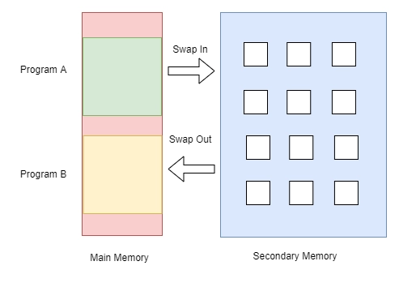
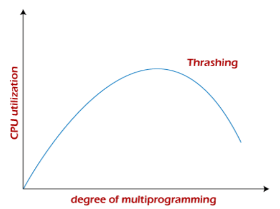
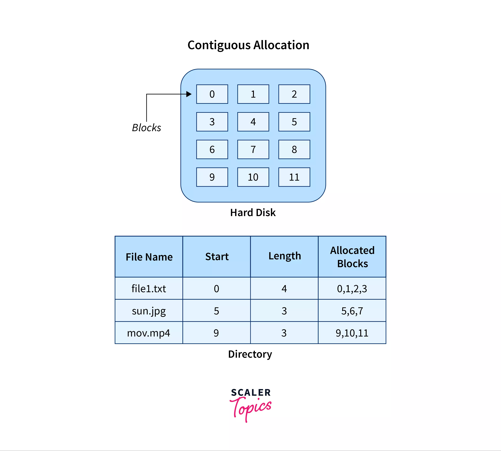
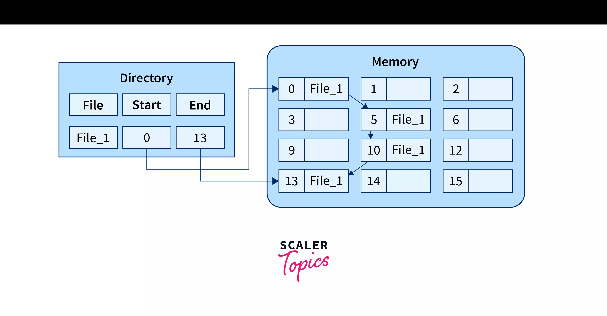
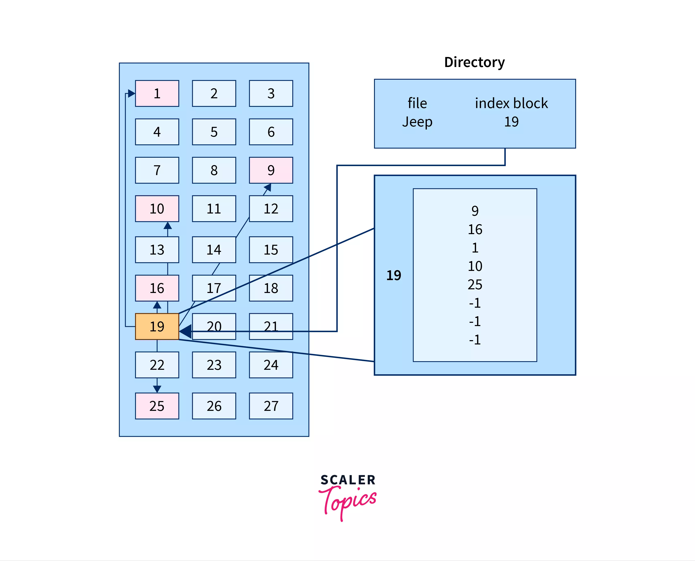
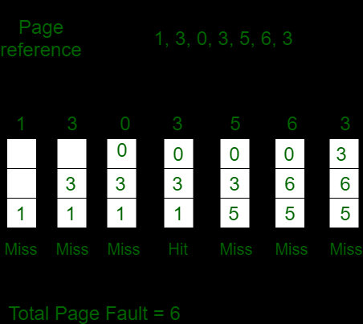
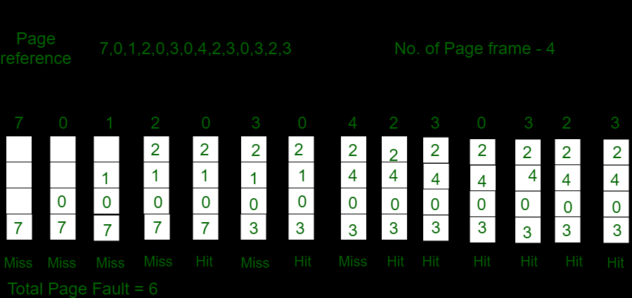
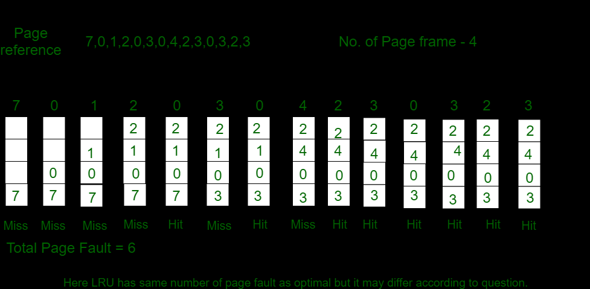

# Differentiate between internal and external fragmentation.

Fragmentation in an operating system refers to the inefficient use of memory, leading to wasted space and degraded performance. There are two types of fragmentation:

1. **Internal Fragmentation:** Internal fragmentation occurs when a memory block is allocated to a process, but the block is larger than the process requires, wasting memory space.

2. **External Fragmentation:** External fragmentation occurs when free memory space in a computer system is divided into small non-contiguous blocks, preventing larger programs from being allocated efficiently. This wastage reduces overall system performance and memory utilization.  

| Aspect                | Internal Fragmentation                   | External Fragmentation                          |
|-----------------------|-----------------------------------------|-----------------------------------------------|
| Memory Block Size     | Memory divided into fixed-sized blocks. | Memory divided into variable-sized blocks.   |
| Cause                 | Occurs when process is smaller than the block it gets. | Happens when memory is removed from use.        |
| Solution              | Best-fit block allocation strategy.     | Compaction and paging techniques.           |
| Memory Division Type  | Memory partitioned using fixed block sizes or paging. | Memory segmented or divided dynamically.    |
| Description           | Unused space within allocated memory blocks. | Free memory scattered in separate non-contiguous blocks. |
| Impact on Performance | Decreases system performance due to wasted space. | Prevents new processes from fitting into available memory.   |
| Memory Allocation     | Uses the worst-fit strategy for assigning memory. | Uses best-fit and first-fit strategies for memory allocation. |
| Memory Utilization    | Utilizes memory less efficiently.       | Utilizes memory more efficiently.           |
| Memory Wastage        | Wastes space inside allocated memory blocks. | Wastes space due to fragmented free memory blocks.   |
| Addressing Flexibility| Less flexibility due to fixed block sizes. | More flexibility with variable block sizes.   |
| Complexity            | Simpler memory management due to fixed structure. | More complex memory management with varying memory sizes. |

# Explain the structure of inverted page table?

Inverted Page Table is a global table managed by the Operating System for all processes. Unlike traditional page tables, where each process has its own table, the inverted page table has entries equal to the number of frames in the main memory. This helps overcome the drawbacks of individual page tables.

The traditional page tables look like this:

Each entry in the inverted page table reserves space for a page regardless of its presence in the main memory. However, this could lead to memory wastage if the page is not present. To save memory, the inverted page table only stores details for pages that are present in the main memory. The entries are indexed by frames, and inside each entry, we save the Process ID and the corresponding page number. This way, the inverted page table efficiently manages memory usage for all processes.

# What are the different Accessing Methods of a File?

File access methods are crucial for efficiently managing data in computer systems. These methods determine how data is read and written to and from files. Choosing the right method can significantly impact the performance and efficiency of applications. Let's explore the five different accessing methods of a file:

1. **Sequential Access Method:**
   In this simple method, data is processed in order, one record after another. Read and write operations traverse records sequentially. It is widely used in applications like editors and compilers. However, its major drawback is inefficient random access, as each record must be crossed to reach the desired one.
   
   

2. **Direct Access Method:**
   Also known as relative access, this method treats files as a sequence of blocks or records. It allows random access to any block, enabling quick data retrieval. Users provide a relative block number, and the operating system calculates the exact block address. This method is commonly used in database management systems and real-time applications.

   

3. **Index Sequential Access:**
   To address the limitation of sequential access, this method adds an index to the file. The index holds pointers to various blocks, enabling random access. By accessing the index first, the pointers to specific blocks are obtained. This method is similar to indexed file allocation, where an index block holds pointers to allocated disk blocks.

4. **Relative Record Access:**
   Relative Record Access uses relative record numbers (RRN's) to represent the order of records in a file. Each record has a unique RRN and fixed size. Data can be directly accessed using its RRN and fixed record size, making it efficient for random or non-sequential access.

5. **Content Addressable Access:**
   This method retrieves data based on its content rather than its location or identifier. Data is stored with a unique content-based address, often generated using a hash function. When specific data is required, its content is provided, and the system uses the content-based address to locate and return the matching data. This method is useful for applications like caching and data deduplication.

Each file access method has distinct advantages and disadvantages, making it suitable for specific use cases. The selection of the appropriate method depends on the application's data access patterns, performance requirements, and data integrity considerations.

# Explain various directory structure used in operating system for storing files give its merits and demerits?

**Directory Structures in Operating Systems for Storing Files**

A directory in an operating system acts as a container that organizes files and folders in a hierarchical manner. There are several logical directory structures, each with its own merits and demerits. Let's explore each one:

1. **Single-Level Directory:**
   - All files are stored in a single directory, making it easy to manage and understand. However, it lacks scalability and may lead to name collisions when the number of files or users increases.
   - Advantages: Simple to implement, fast searching for smaller files, easy file operations (creation, deletion, etc.).
   - Disadvantages: Limited when the number of files or users increases, potential name collision issues.

2. **Two-Level Directory:**
   - Each user has a separate directory, preventing name conflicts and enhancing security. But it hinders file sharing between users and lacks subdirectory creation.
   - Advantages: Provides a separate directory for each user, avoids name conflicts, easy file searching.
   - Disadvantages: Users cannot share files, users cannot create subdirectories.

3. **Tree Structure (Hierarchical Structure):**
   - Directories are organized in a tree-like structure, allowing subdirectories, easier searching, and scalable organization. However, it restricts file sharing between users.
   - Advantages: Allows subdirectories, easier searching, file sorting becomes manageable, scalable for various users.
   - Disadvantages: Prevents file sharing among users, increased complexity with many subdirectories.

4. **Acyclic Graph Structure:**
   - This structure enables file sharing between multiple users and supports efficient searching. Still, it's more complex to implement, and file deletion requires handling multiple references.
   - Advantages: Supports sharing of files and directories among multiple users, efficient searching.
   - Disadvantages: More complex to implement, requires caution while editing or deleting shared files.

Each directory structure offers different benefits and trade-offs. The single-level directory is simple but limited, while the two-level directory solves name conflicts but restricts sharing. The tree structure is commonly used due to its flexibility and scalability, although it also has some limitations regarding file sharing and increased complexity with extensive subdirectories. The acyclic graph structure provides file sharing capabilities, but managing changes and deletions can be challenging.

# Consider the following disk queue with requests for I/O to blocks on cylinders 98, 183, 37,122,14,124,65,67 in that order, with the disk head initially at cylinder 53; using FCFS, SSTF algorithms measure the total head movement in cylinders. Also provide the necessary diagram to show the head movement for the above queue.

# Protection in OS

Protection in an operating system is a crucial aspect that ensures the safety and security of system resources, data, and processes. It is designed to prevent unauthorized access and protect the integrity and confidentiality of information. The main components of protection in an operating system are domain of protection, association, and authentication.

1. **Domain of Protection**:
   - The domain of protection refers to a set of resources controlled by a specific protection mechanism. It defines the boundaries within which processes can operate and access resources.
   - In this context, a domain is a collection of objects (resources like files, memory, I/O devices) and subjects (entities like processes, users, groups) that have access to these objects. Each domain has a set of rules that govern how subjects can access objects within that domain.
   - For example, a user may belong to a specific domain that grants them access to certain files and directories, but restricts their access to others.

2. **Association**:
   - Association in protection refers to the mapping of subjects to their corresponding domains of protection. It establishes the relationship between subjects and the set of resources they are authorized to access.
   - The process of association is typically based on authentication credentials provided by the subject, such as a password, digital certificate, or biometric identifier. When a subject is authenticated, it is assigned to its appropriate domain, allowing access to the resources within that domain.
   - For instance, when a user logs into a system with a valid username and password, the system maps the user to the domain associated with that username, determining their access rights.

3. **Authentication**:
   - Authentication is the process of verifying the identity of a subject before granting access to protected resources. It ensures that only authorized subjects can access specific domains and their corresponding resources.
   - Various authentication methods are used, such as passwords, digital certificates, smart cards, biometric identifiers (fingerprint, retina scan), and cryptographic keys.
   - Strong authentication methods like one-time passwords, encrypted passwords, and cryptography help enhance security and prevent unauthorized access to data and resources.

System protection in an operating system can be ensured through various techniques to safeguard the security and integrity of the system and its resources. Here are some different ways to achieve system protection:

1. **User Authentication:** The operating system requires users to authenticate themselves using usernames and passwords before gaining access to the system. This ensures that only authorized users can use the system and its resources.

2. **Access Control:** Access control mechanisms, such as access control lists (ACLs), are used to specify which users or processes have permission to access specific resources or perform particular actions. By defining access rights, the operating system restricts unauthorized access to sensitive data or critical system components.

3. **Encryption:** Encryption is employed to protect sensitive data by converting it into a form that is not easily readable by unauthorized users. Even if an attacker gains access to the data, they cannot understand it without the decryption key.

4. **Firewall:** Firewalls are software programs that monitor and control incoming and outgoing network traffic based on predefined security rules. They act as a barrier between the internal network and the external world, preventing unauthorized access and blocking potentially harmful traffic.

5. **Antivirus Software:** Antivirus software is used to detect, prevent, and remove viruses, malware, and other malicious software from the system. It continuously scans the system for threats and ensures a safer computing environment.

6. **System Updates and Patches:** Keeping the operating system up-to-date with the latest security patches and updates is crucial to prevent known vulnerabilities from being exploited by attackers. Regular updates ensure that the system is equipped to defend against the latest threats.

7. **Least Privilege Principle:** The principle of least privilege restricts users and processes to the minimum level of privileges required to perform their tasks. By limiting access, the potential impact of security breaches is minimized.

8. **Secure Authentication Methods:** Strong authentication methods, such as two-factor authentication or biometric authentication (fingerprint or retina scan), enhance security by requiring multiple forms of verification.

# Explain the goals and principles of system protection in detail.

**Protection in Operating System: Goals and Principles**

The goals and principles of system protection in an operating system are essential for maintaining the security, integrity, and reliability of the system. Here are the detailed explanations of these goals and principles:

**Goals of Protection:**
1. **Preventing Malicious Misuse:** The primary goal of protection is to prevent malicious users or programs from gaining unauthorized access to the system or its resources. By implementing access controls and authentication mechanisms, the operating system ensures that only authorized entities can use the system.

2. **Enforcing System Policies:** Protection mechanisms are designed to enforce system policies set by system designers or administrators. These policies dictate how resources should be accessed and used, and the protection system ensures that these policies are followed.

3. **Minimizing Damage from Failures:** The protection system aims to minimize the potential damage caused by errant programs or processes. By limiting the privileges of programs and users, the impact of failures or security breaches is mitigated.

4. **Reliable System Operation:** Protection mechanisms contribute to the overall reliability of the system. They help prevent accidental modifications or corruption of critical system components, ensuring the stability and availability of the system.

**Principles of Protection:**
1. **Principle of Least Privilege:** This principle dictates that programs, users, and systems should be granted the minimum privileges necessary to perform their tasks. By giving only the required privileges, the potential for misuse or accidental damage is minimized. For example, assigning specialized privileges to specific groups rather than root privileges to all programs reduces the scope of potential harm.

2. **Isolation and Segmentation:** Processes and users should be isolated from one another to prevent unauthorized access and interference. This is achieved through process isolation and virtual memory management. Segmentation ensures that each process operates in its own memory space, preventing interference between processes.

3. **Separation of Mechanism and Policy:** The protection mechanisms and policies should be separate. Mechanisms determine how protection is enforced, while policies define what access is permitted. This separation allows for flexibility in modifying policies without affecting the underlying mechanisms.

4. **Use of Accounts and Privileges:** Each user is typically given their own account with specific privileges. Regular users have limited privileges and can only modify their own files. The root account, with superuser privileges, should be used sparingly for tasks that require elevated permissions to minimize the risk of accidental system damage.

5. **Secure Authentication Methods:** Strong authentication methods, such as two-factor authentication, biometric authentication, or cryptographic keys, enhance security by requiring multiple forms of verification before granting access.

# Compare and contrast different contiguous memory allocation techniques.

| **Contiguous Memory Allocation Techniques**   | **Fixed-Size Partition Scheme**                                                                                                  | **Variable-Size Partition Scheme**                                                                                               |
|-----------------------------------------------|----------------------------------------------------------------------------------------------------------------------------------|-----------------------------------------------------------------------------------------------------------------------------------|
| Definition                                    | Each process is allotted a fixed size continuous block in the main memory.                                                      | Each process is allotted a variable-sized block depending upon its requirements.                                                  |
| Flexibility                                   | Less flexible, as each process is allocated a fixed block regardless of its actual size.                                       | More flexible, as each process is allocated space according to its specific requirements.                                        |
| Internal Fragmentation                        | May lead to internal fragmentation, as smaller processes may be assigned to larger blocks, leaving unused space in the block. | No internal fragmentation, as blocks are allocated based on the exact size required by each process.                             |
| Degree of Multiprogramming                    | Limited by the number of fixed blocks in memory.                                                                                | Dynamic degree of multiprogramming, depending on the number of processes and their respective sizes.                           |
| Implementation Simplicity                     | Simple to implement, as all blocks are of the same size.                                                                       | Complex to implement, as blocks vary in size, and dynamic management is required.                                               |
| Utilization of Memory                         | May lead to memory wastage if processes are smaller than the fixed block size.                                                 | More efficient memory utilization, as each block is tailored to the exact size of the process.                                  |
| Memory Compaction                            | May require memory compaction to fill gaps left by terminated processes.                                                       | Memory compaction is not required, as variable-size blocks can be efficiently allocated without gaps.                           |
| Fragmentation Handling                        | Fragmentation can be reduced through external fragmentation techniques like compaction and merging.                           | No external fragmentation, but internal fragmentation may occur if variable blocks are not optimally allocated.                 |
| Performance Impact                            | May result in less efficient memory usage and slower allocation for varying process sizes.                                    | Faster allocation and better memory usage as blocks closely match process sizes, reducing search time for suitable blocks.       |
| Space Utilization Efficiency                  | Less efficient use of memory space due to fixed-size blocks.                                                                   | More efficient use of memory space as blocks are sized to match specific process requirements.                                  |
| Memory Management Overhead                    | Lower memory management overhead due to fixed-size blocks.                                                                     | Higher memory management overhead due to variable block sizes and need for dynamic memory management.                          |
| Complexity of Memory Management               | Simpler memory management techniques and algorithms.                                                                           | More complex memory management techniques, especially for fragmentation handling and block allocation.                          |
| Suitability for Dynamic Workloads              | Less suitable for dynamic workloads with varying process sizes.                                                               | More suitable for dynamic workloads with frequent process size changes.                                                          |

# Define Demand Paging

Demand Paging in operating systems is a virtual memory management technique where only the required pages of a process are loaded into the main memory when needed. It overcomes the problem of loading the entire process into memory, thereby utilizing memory efficiently. When a page is not present in the main memory and is accessed by the CPU, a page fault occurs, and the missing page is fetched from secondary memory.

In a real-life analogy, demand paging is similar to a shopkeeper bringing a product from the warehouse only when a customer demands it, instead of keeping all products in the store.

Advantages of demand paging include better memory utilization, support for large virtual memory, and the ability to run programs larger than physical memory. However, it can lead to internal fragmentation and may take longer to access memory due to page table lookup.

The demand paging process involves the CPU checking the page table to find the page in the main memory. If not found, a page fault occurs, and the page is swapped-in from secondary memory. Valid and invalid bits are used to indicate whether the page is present in the main memory.

Common terms associated with demand paging are page fault (miss), swapping, and thrashing. Page faults occur when a referenced page is not present in the main memory. Swapping involves moving processes between secondary and main memory. Thrashing occurs when the CPU spends more time swapping pages than executing processes.

Several algorithms are used for demand paging, including First In First Out (FIFO), Optimal Page, Least Recently Used (LRU), Page Buffering, and Least Frequently Used (LFU). Each algorithm aims to minimize page faults and optimize memory access.

# Explain the concept of thrashing

Thrashing in computer science refers to the poor performance of a virtual memory system when there is a constant state of paging and page faults due to a lack of available main memory. It occurs when the system spends more time swapping pages between main memory and secondary storage than actually executing application-level processes. Thrashing severely degrades system performance, and the throughput of the system can degrade significantly.

**Concept of Thrashing**

The concept of thrashing is closely related to page faults and swapping. Page faults occur when a program attempts to access data or code that is not currently located in the main memory. Swapping is the process of moving pages between the main memory and secondary storage to accommodate page faults.

**Causes of Thrashing**

Thrashing happens when the page fault rate becomes excessively high, leading the operating system to continually swap pages between main memory and secondary storage. This results in low CPU utilization and inhibits application-level processing.

**Impact and Mitigation**

The performance degradation caused by thrashing can be severe. To mitigate thrashing, various algorithms are used, such as the Global Page Replacement Algorithm and the Local Page Replacement Algorithm. However, these may not always be effective in preventing thrashing.

**Preventive Measures**

To avoid thrashing, various techniques and preventive measures can be employed. These include adjusting the swap file size, increasing the amount of RAM, closing unnecessary background applications, and replacing memory-intensive programs with lighter alternatives.

**Techniques for Controlling Thrashing**

The locality model and working-set model are techniques used to control thrashing by managing the working set size for each process. The page fault frequency approach focuses on controlling the page fault rate to keep it within desired upper and lower limits.

# Explain ‘File Concept’. What are the different operations performed on files.

The file concept in computer science refers to a collection of related data stored on secondary storage, organized in a sequence of operations. Files are created and managed by the operating system and can be accessed by various applications. Different operations can be performed on files, allowing users to read, write, open, close, and manipulate the file contents. The main file operations are as follows:

1. **Create**: The create operation is used to create a new file in the file system. It allocates space for the file but does not add any data to it initially.

2. **Open**: After a file is created, the open operation is performed to open the file for further processing. This operation is essential for performing other file operations.

3. **Read**: The read operation allows the user to read data from the file. The operating system maintains a read pointer to track the position up to which data has been read.

4. **Write**: The write operation is used to add information to the file. It increases the file length and repositions the file pointer after the last byte is written.

5. **Reposition/Seek**: The seek operation is used to reposition the file pointer to a specific position in the file, allowing random access to the file data.

6. **Truncate**: The truncate operation is used to delete the data stored inside the file without releasing the disk space. It clears the file content.

7. **Delete**: The delete operation is used to remove the file from the file system. It deletes all the data stored in the file and frees up the disk space occupied by the file.

8. **Rename**: The rename operation changes the name of an existing file. It allows the user to assign a new name to the file.

9. **Append**: The append operation is used to add data to the end of the file. It is similar to the write operation, but data is added at the end of the file.

10. **Close**: The close operation is performed when the processing of the file is finished. It releases all the resources occupied by the file and makes any changes permanent.

# Describe the various file allocation methods.

File allocation methods in operating systems are different techniques used to store files on the hard disk efficiently and enable faster access by the operating system. There are three main file allocation methods:

1. **Contiguous File Allocation**:
In this method, each file is allocated a continuous set of blocks on the disk. When a file is created, the required number of contiguous blocks are allocated, and the file's data is stored in these blocks. This method ensures that file data is stored sequentially, making it easy to access and read the entire file. However, it suffers from external fragmentation, where small gaps between allocated blocks can occur, leading to inefficient disk usage.

2. **Linked File Allocation**:
The linked file allocation method overcomes the limitations of contiguous allocation by storing file data in a scattered manner across the disk. In this approach, each block of a file contains a pointer to the next block of the same file. The file's directory entry stores the address of the first block. While this method reduces external fragmentation, it introduces the overhead of maintaining and traversing the linked list of blocks, making direct access slower.

3. **Indexed File Allocation**:
Indexed file allocation combines the advantages of both contiguous and linked allocation methods. It uses an index block that contains pointers to all the blocks of a file. The file's directory entry contains the address of the index block. Each entry in the index block points to a specific data block of the file. This method enables direct access to any block of the file without the need to traverse a linked list. Although it reduces external fragmentation and allows random access, it introduces additional overhead for maintaining the index block.

**Advantages and Disadvantages**:

- **Contiguous File Allocation**:
  - Advantages: Simple implementation, minimum seek time, faster memory access, and supports sequential as well as direct access.
  - Disadvantages: Requires pre-allocation of file size, cannot dynamically increase file size, and may lead to internal or external fragmentation.

- **Linked File Allocation**:
  - Advantages: No external fragmentation, flexible memory allocation, and minimal directory entry information required.
  - Disadvantages: No random access or direct access support, slower due to linked block traversal, and extra space needed for pointers.

- **Indexed File Allocation**:
  - Advantages: Reduces external fragmentation, supports direct access to any block, and allows dynamic file size growth.
  - Disadvantages: More pointer overhead, possibility of losing the index block leading to data inaccessibility, and becomes inefficient for small files.

# Paging 

Paging is a memory management scheme used by operating systems to manage the allocation of memory in a computer system. In a paging system, the memory is divided into fixed-size blocks called "pages," and the program's virtual address space is divided into the same size blocks called "page frames." The mapping between the virtual pages and physical page frames is maintained by a page table. When a program accesses a memory address, the operating system translates the virtual address to a physical address using the page table.

One of the key challenges in paging is handling page faults, which occur when a program accesses a page that is not currently in the main memory (RAM). This happens when the required page is not mapped to a physical frame in memory and needs to be fetched from secondary storage (e.g., the hard disk). When a page fault occurs, the operating system needs to decide which page to replace in order to bring the required page into memory. Different page replacement algorithms are used to make this decision, aiming to minimize the number of page faults and optimize memory usage.

1. **First In First Out (FIFO)**:
   - In FIFO, the pages in memory are treated as a queue, and the page that has been in memory the longest (the first page in the queue) is replaced.
   - Simple to implement but may not be efficient in reducing page faults, as demonstrated by Belady's anomaly.
   - May lead to more page faults as the number of page frames increases.

2. **Optimal Page Replacement**:
   - This algorithm selects the page that will not be used for the longest time in the future for replacement.
   - It is considered the best possible algorithm as it results in the minimum number of page faults. However, it requires knowledge of future page references, making it impractical for real-world use.

3. **Least Recently Used (LRU)**:
   - LRU replaces the page that has not been used for the longest time. It relies on the principle that the least recently used page is the best candidate for replacement.
   - LRU is challenging to implement efficiently, as it requires keeping track of the order in which pages are used. It may require hardware support like special counters or software algorithms.
   - LRU performs well and reduces page faults but can be expensive to maintain in large systems.

Each page replacement algorithm has its advantages and disadvantages, and the choice of the algorithm depends on the specific requirements of the system, the workload characteristics, and available resources. Operating systems typically use a combination of paging, page tables, and page replacement algorithms to optimize memory usage and provide efficient memory management for running programs.