# Differentiate between internal and external fragmentation.

Fragmentation in an operating system refers to the inefficient use of memory, leading to wasted space and degraded performance. There are two types of fragmentation:

1. **Internal Fragmentation:** Internal fragmentation occurs when a memory block is allocated to a process, but the block is larger than the process requires, wasting memory space.

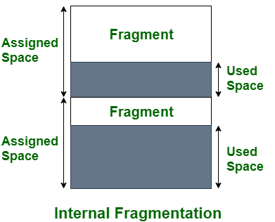

2. **External Fragmentation:** External fragmentation occurs when free memory space in a computer system is divided into small non-contiguous blocks, preventing larger programs from being allocated efficiently. This wastage reduces overall system performance and memory utilization.  

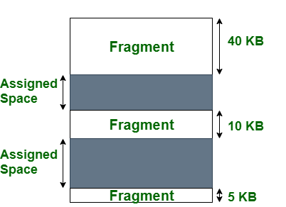

| Aspect                | Internal Fragmentation                   | External Fragmentation                          |
|-----------------------|-----------------------------------------|-----------------------------------------------|
| Memory Block Size     | Memory divided into fixed-sized blocks. | Memory divided into variable-sized blocks.   |
| Cause                 | Occurs when process is smaller than the block it gets. | Happens when memory is removed from use.        |
| Solution              | Best-fit block allocation strategy.     | Compaction and paging techniques.           |
| Memory Division Type  | Memory partitioned using fixed block sizes or paging. | Memory segmented or divided dynamically.    |
| Description           | Unused space within allocated memory blocks. | Free memory scattered in separate non-contiguous blocks. |
| Impact on Performance | Decreases system performance due to wasted space. | Prevents new processes from fitting into available memory.   |
| Memory Allocation     | Uses the worst-fit strategy for assigning memory. | Uses best-fit and first-fit strategies for memory allocation. |
| Memory Utilization    | Utilizes memory less efficiently.       | Utilizes memory more efficiently.           |
| Memory Wastage        | Wastes space inside allocated memory blocks. | Wastes space due to fragmented free memory blocks.   |
| Addressing Flexibility| Less flexibility due to fixed block sizes. | More flexibility with variable block sizes.   |
| Complexity            | Simpler memory management due to fixed structure. | More complex memory management with varying memory sizes. |

# Explain the structure of inverted page table?

Inverted Page Table is a global table managed by the Operating System for all processes. Unlike traditional page tables, where each process has its own table, the inverted page table has entries equal to the number of frames in the main memory. This helps overcome the drawbacks of individual page tables.

The traditional page tables look like this:

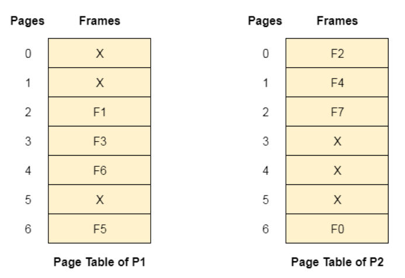

Each entry in the inverted page table reserves space for a page regardless of its presence in the main memory. However, this could lead to memory wastage if the page is not present. To save memory, the inverted page table only stores details for pages that are present in the main memory. The entries are indexed by frames, and inside each entry, we save the Process ID and the corresponding page number. This way, the inverted page table efficiently manages memory usage for all processes.

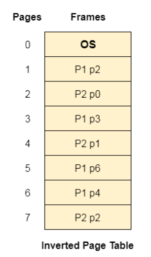

# What are the different Accessing Methods of a File?

File access methods are crucial for efficiently managing data in computer systems. These methods determine how data is read and written to and from files. Choosing the right method can significantly impact the performance and efficiency of applications. Let's explore the five different accessing methods of a file:

1. **Sequential Access Method:**
   In this simple method, data is processed in order, one record after another. Read and write operations traverse records sequentially. It is widely used in applications like editors and compilers. However, its major drawback is inefficient random access, as each record must be crossed to reach the desired one.
   
   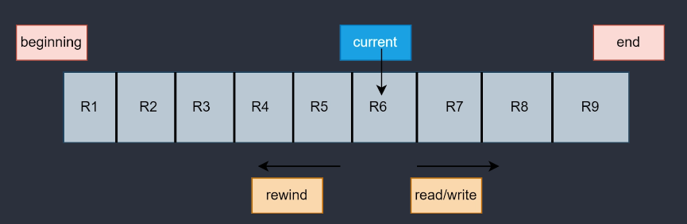

2. **Direct Access Method:**
   Also known as relative access, this method treats files as a sequence of blocks or records. It allows random access to any block, enabling quick data retrieval. Users provide a relative block number, and the operating system calculates the exact block address. This method is commonly used in database management systems and real-time applications.

   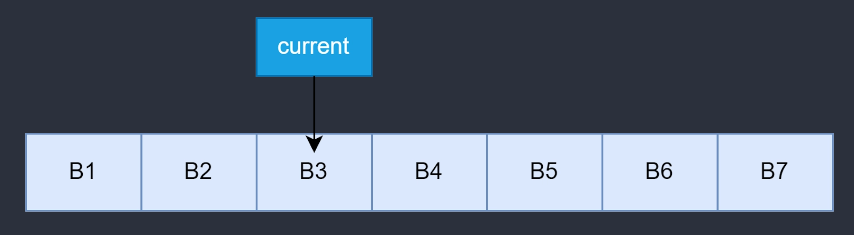

3. **Index Sequential Access:**
   To address the limitation of sequential access, this method adds an index to the file. The index holds pointers to various blocks, enabling random access. By accessing the index first, the pointers to specific blocks are obtained. This method is similar to indexed file allocation, where an index block holds pointers to allocated disk blocks.

4. **Relative Record Access:**
   Relative Record Access uses relative record numbers (RRN's) to represent the order of records in a file. Each record has a unique RRN and fixed size. Data can be directly accessed using its RRN and fixed record size, making it efficient for random or non-sequential access.

5. **Content Addressable Access:**
   This method retrieves data based on its content rather than its location or identifier. Data is stored with a unique content-based address, often generated using a hash function. When specific data is required, its content is provided, and the system uses the content-based address to locate and return the matching data. This method is useful for applications like caching and data deduplication.

Each file access method has distinct advantages and disadvantages, making it suitable for specific use cases. The selection of the appropriate method depends on the application's data access patterns, performance requirements, and data integrity considerations.

# Explain various directory structure used in operating system for storing files give its merits and demerits?

**Directory Structures in Operating Systems for Storing Files**

A directory in an operating system acts as a container that organizes files and folders in a hierarchical manner. There are several logical directory structures, each with its own merits and demerits. Let's explore each one:

1. **Single-Level Directory:**
   - All files are stored in a single directory, making it easy to manage and understand. However, it lacks scalability and may lead to name collisions when the number of files or users increases.
   - Advantages: Simple to implement, fast searching for smaller files, easy file operations (creation, deletion, etc.).
   - Disadvantages: Limited when the number of files or users increases, potential name collision issues.

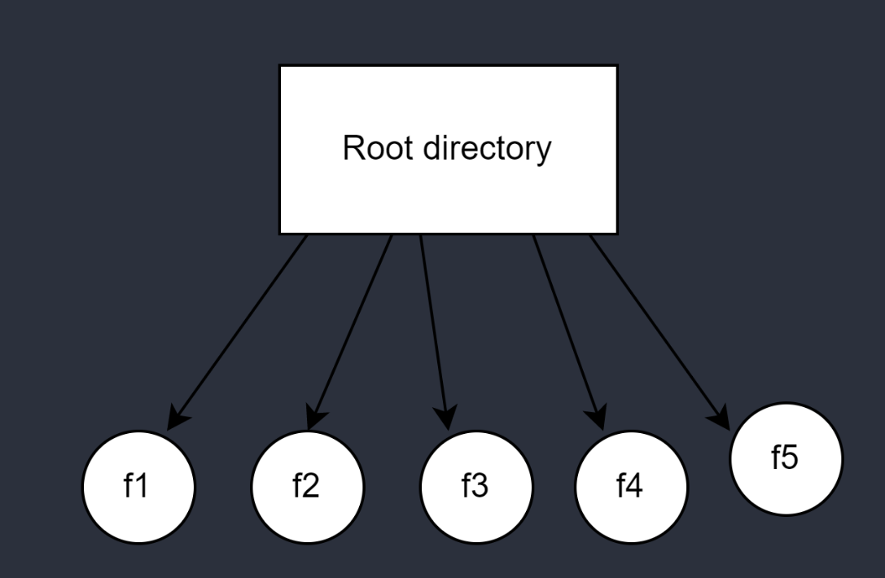

2. **Two-Level Directory:**
   - Each user has a separate directory, preventing name conflicts and enhancing security. But it hinders file sharing between users and lacks subdirectory creation.
   - Advantages: Provides a separate directory for each user, avoids name conflicts, easy file searching.
   - Disadvantages: Users cannot share files, users cannot create subdirectories.

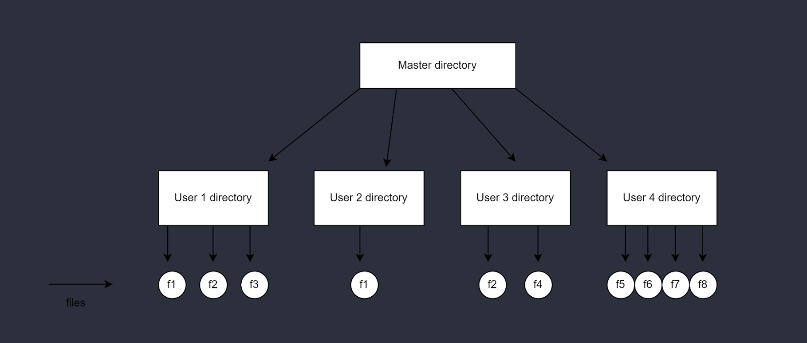

3. **Tree Structure (Hierarchical Structure):**
   - Directories are organized in a tree-like structure, allowing subdirectories, easier searching, and scalable organization. However, it restricts file sharing between users.
   - Advantages: Allows subdirectories, easier searching, file sorting becomes manageable, scalable for various users.
   - Disadvantages: Prevents file sharing among users, increased complexity with many subdirectories.

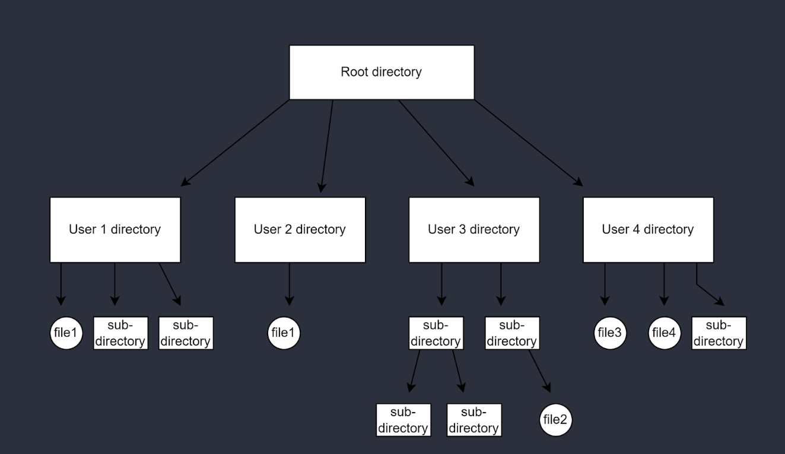

4. **Acyclic Graph Structure:**
   - This structure enables file sharing between multiple users and supports efficient searching. Still, it's more complex to implement, and file deletion requires handling multiple references.
   - Advantages: Supports sharing of files and directories among multiple users, efficient searching.
   - Disadvantages: More complex to implement, requires caution while editing or deleting shared files.

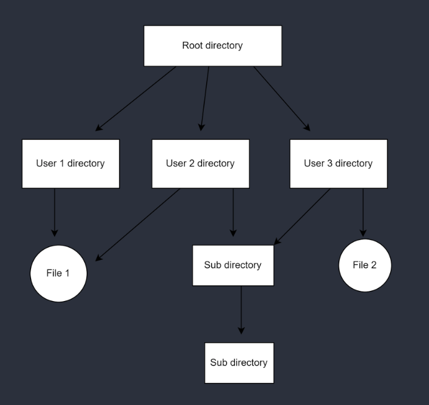

Each directory structure offers different benefits and trade-offs. The single-level directory is simple but limited, while the two-level directory solves name conflicts but restricts sharing. The tree structure is commonly used due to its flexibility and scalability, although it also has some limitations regarding file sharing and increased complexity with extensive subdirectories. The acyclic graph structure provides file sharing capabilities, but managing changes and deletions can be challenging.

# Consider the following disk queue with requests for I/O to blocks on cylinders 98, 183, 37,122,14,124,65,67 in that order, with the disk head initially at cylinder 53; using FCFS, SSTF algorithms measure the total head movement in cylinders. Also provide the necessary diagram to show the head movement for the above queue.

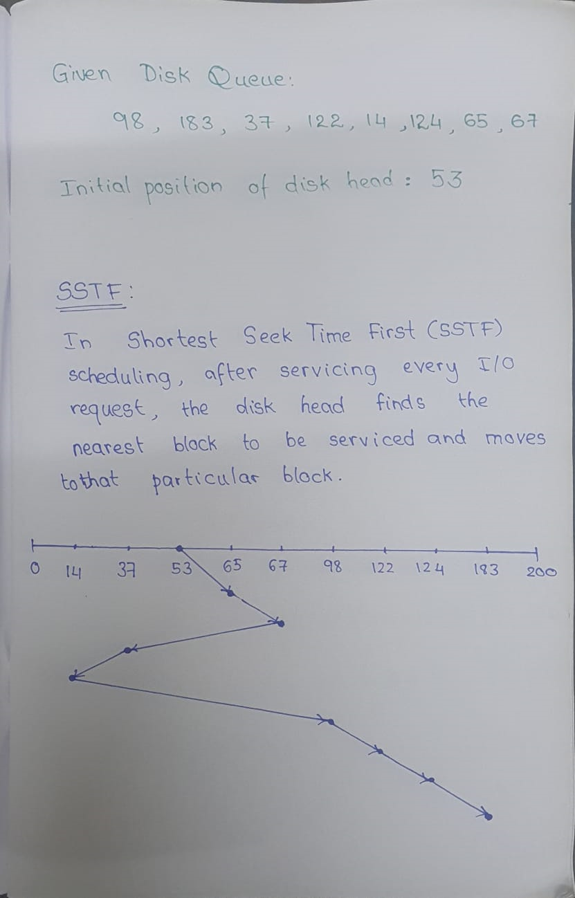

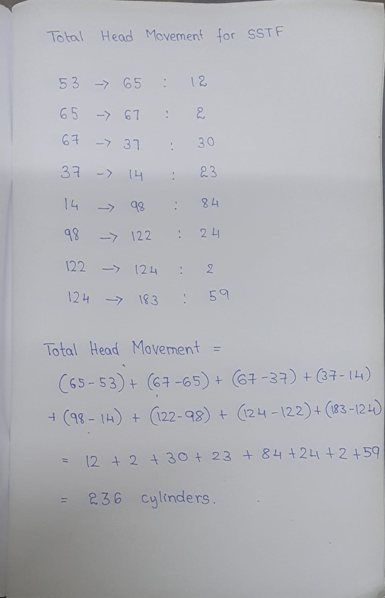

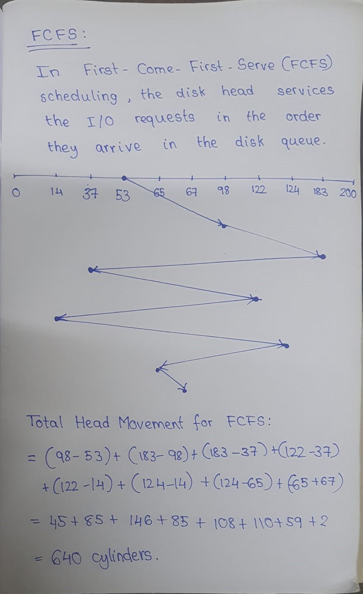

# Explain the goals and principles of system protection in detail.

**Protection in Operating System: Goals and Principles**

Protection in an operating system is essential when multiple users share computer resources, such as CPU, memory, and other assets. Its primary goal is to provide a mechanism that protects each process from unauthorized access and ensures data integrity. Here are the goals and principles of system protection in detail:

**Goals of System Protection:**
1. **Security:** Protection ensures the security of computer resources and prevents unauthorized access to sensitive data. It safeguards against illegal reading, writing, modification, and system malfunctioning for authorized users.

2. **Data Protection:** Protection mechanisms protect data, processes, and programs from unauthorized user or program access. It ensures that access permissions, malware, and illegal access to existing data are prevented.

3. **Policy Enforcement:** The main goal is to ensure that only policies defined by the system have access to programs, resources, and data. It enforces access control policies and ensures adherence to security protocols.

**Principles of System Protection:**
1. **Domain of Protection:** The protection policies restrict access to resources within the domain of each process. A process can only use resources required to complete its task within defined time restrictions and mode requirements. Each domain comprises a set of objects and the operations exclusive to them.

2. **Object Abstraction:** Object abstraction treats processes and resources as abstract data types with specific operations associated with them. Domains combine an object with its allowed operations. For instance, a file is treated as an object, and read, write, and delete are its associated operations, forming a domain to control access. This simplifies protection and ensures authorized access to resources.

3. **Isolation of Domains:** Each domain includes a set of objects and the operations that can be performed on them. Only one process, operation, or user constitutes a domain. Changing the domain involves altering the procedure ID, and one or more common procedures can be shared among objects.

**Security Measures in Operating System:**
Users can utilize the operating system's security features to enhance protection. Several security measures are implemented to ensure data confidentiality and integrity:

1. **Secure Network Communication:** The network used for file transfers must be secure to prevent data interception. Encrypted data transfer routes avoid network sniffing.

2. **Authentication:** Robust authentication methods, such as username-password combinations, retina scans, fingerprints, or user cards, help verify user identities.

3. **Single-Use Passwords:** One-time passwords, generated for each user login, add an extra layer of security. Users must match the randomly generated number to gain access.

4. **Encrypted Passwords:** Encrypted data transfer verifies passwords securely during network communication, preventing interception.

5. **Cryptography:** Cryptographic techniques protect data during network transmission. It involves using a key to encode and decode data, ensuring unauthorized users cannot access stolen data.

# Compare and contrast different contiguous memory allocation techniques.

| **Contiguous Memory Allocation Techniques**   | **Fixed-Size Partition Scheme**                                                                                                  | **Variable-Size Partition Scheme**                                                                                               |
|-----------------------------------------------|----------------------------------------------------------------------------------------------------------------------------------|-----------------------------------------------------------------------------------------------------------------------------------|
| Definition                                    | Each process is allotted a fixed size continuous block in the main memory.                                                      | Each process is allotted a variable-sized block depending upon its requirements.                                                  |
| Flexibility                                   | Less flexible, as each process is allocated a fixed block regardless of its actual size.                                       | More flexible, as each process is allocated space according to its specific requirements.                                        |
| Internal Fragmentation                        | May lead to internal fragmentation, as smaller processes may be assigned to larger blocks, leaving unused space in the block. | No internal fragmentation, as blocks are allocated based on the exact size required by each process.                             |
| Degree of Multiprogramming                    | Limited by the number of fixed blocks in memory.                                                                                | Dynamic degree of multiprogramming, depending on the number of processes and their respective sizes.                           |
| Implementation Simplicity                     | Simple to implement, as all blocks are of the same size.                                                                       | Complex to implement, as blocks vary in size, and dynamic management is required.                                               |
| Utilization of Memory                         | May lead to memory wastage if processes are smaller than the fixed block size.                                                 | More efficient memory utilization, as each block is tailored to the exact size of the process.                                  |
| Memory Compaction                            | May require memory compaction to fill gaps left by terminated processes.                                                       | Memory compaction is not required, as variable-size blocks can be efficiently allocated without gaps.                           |
| Fragmentation Handling                        | Fragmentation can be reduced through external fragmentation techniques like compaction and merging.                           | No external fragmentation, but internal fragmentation may occur if variable blocks are not optimally allocated.                 |
| Performance Impact                            | May result in less efficient memory usage and slower allocation for varying process sizes.                                    | Faster allocation and better memory usage as blocks closely match process sizes, reducing search time for suitable blocks.       |
| Space Utilization Efficiency                  | Less efficient use of memory space due to fixed-size blocks.                                                                   | More efficient use of memory space as blocks are sized to match specific process requirements.                                  |
| Memory Management Overhead                    | Lower memory management overhead due to fixed-size blocks.                                                                     | Higher memory management overhead due to variable block sizes and need for dynamic memory management.                          |
| Complexity of Memory Management               | Simpler memory management techniques and algorithms.                                                                           | More complex memory management techniques, especially for fragmentation handling and block allocation.                          |
| Suitability for Dynamic Workloads              | Less suitable for dynamic workloads with varying process sizes.                                                               | More suitable for dynamic workloads with frequent process size changes.                                                          |
