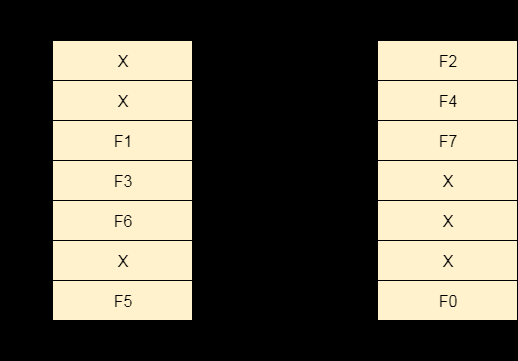
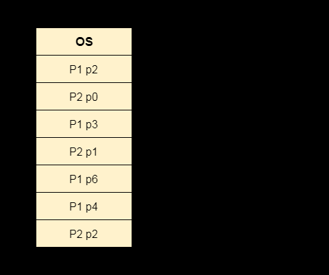

# Differentiate between internal and external fragmentation.

Fragmentation in an operating system refers to the inefficient use of memory, leading to wasted space and degraded performance. There are two types of fragmentation:

1. **Internal Fragmentation:** Internal fragmentation occurs when a memory block is allocated to a process, but the block is larger than the process requires, wasting memory space.

2. **External Fragmentation:** External fragmentation occurs when free memory space in a computer system is divided into small non-contiguous blocks, preventing larger programs from being allocated efficiently. This wastage reduces overall system performance and memory utilization.  

| Aspect                | Internal Fragmentation                   | External Fragmentation                          |
|-----------------------|-----------------------------------------|-----------------------------------------------|
| Memory Block Size     | Memory divided into fixed-sized blocks. | Memory divided into variable-sized blocks.   |
| Cause                 | Occurs when process is smaller than the block it gets. | Happens when memory is removed from use.        |
| Solution              | Best-fit block allocation strategy.     | Compaction and paging techniques.           |
| Memory Division Type  | Memory partitioned using fixed block sizes or paging. | Memory segmented or divided dynamically.    |
| Description           | Unused space within allocated memory blocks. | Free memory scattered in separate non-contiguous blocks. |
| Impact on Performance | Decreases system performance due to wasted space. | Prevents new processes from fitting into available memory.   |
| Memory Allocation     | Uses the worst-fit strategy for assigning memory. | Uses best-fit and first-fit strategies for memory allocation. |
| Memory Utilization    | Utilizes memory less efficiently.       | Utilizes memory more efficiently.           |
| Memory Wastage        | Wastes space inside allocated memory blocks. | Wastes space due to fragmented free memory blocks.   |
| Addressing Flexibility| Less flexibility due to fixed block sizes. | More flexibility with variable block sizes.   |
| Complexity            | Simpler memory management due to fixed structure. | More complex memory management with varying memory sizes. |

# Explain the structure of inverted page table?

Inverted Page Table is a global table managed by the Operating System for all processes. Unlike traditional page tables, where each process has its own table, the inverted page table has entries equal to the number of frames in the main memory. This helps overcome the drawbacks of individual page tables.

The traditional page tables look like this:

Each entry in the inverted page table reserves space for a page regardless of its presence in the main memory. However, this could lead to memory wastage if the page is not present. To save memory, the inverted page table only stores details for pages that are present in the main memory. The entries are indexed by frames, and inside each entry, we save the Process ID and the corresponding page number. This way, the inverted page table efficiently manages memory usage for all processes.

