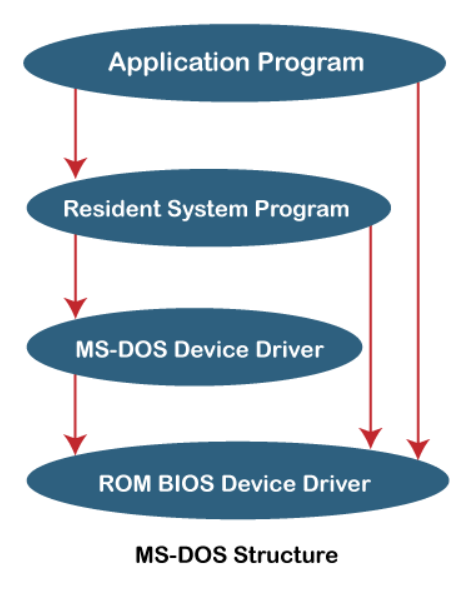
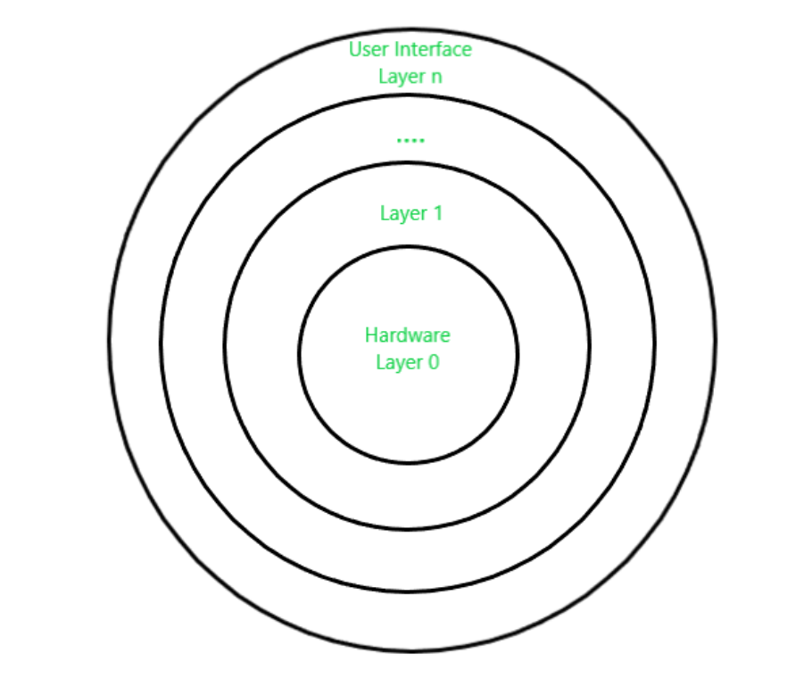

# 
 Unit 1 

## Operating System Objectives and Functions

An operating system (OS) acts as an intermediary between computer hardware and users, coordinating application execution, software resources, and hardware functionalities. It manages tasks like file and memory management, input/output, and peripheral devices. This article discusses the objectives and functions of operating systems.

**Objectives of the Operating System**

The operating system serves as a bridge between users and computer hardware, facilitating access to hardware resources required for application execution. Its key objectives include:

1. **Efficiency:** The OS enhances production efficiency by managing system tasks like resource allocation and conflict resolution, saving user time and ensuring efficiency in results.

2. **Hardware Abstraction:** The OS hides intricate hardware details, allowing users to fully utilize computer hardware without coping with complexities. It facilitates communication between user programs and hardware.

3. **Convenience:** Operating systems provide pre-configured utility packages, sparing users from direct hardware interaction. This convenience enables users to focus on tasks without setting up the system.

4. **System Resource Management:** The OS acts as an impartial arbitrator, managing resource distribution equitably among operations and users in the computer system.

**Functions of Operating System**

An operating system orchestrates the various components of a computer system, ensuring their proper coordination and operation. It performs functions such as:

1. **Processor Management:** In a multiprogramming environment, the OS allocates processor time and duration for process execution. It tracks processor and process status, assigns processors to processes, and deallocates them when processes are done.

2. **Device Management:** The OS manages device communication using drivers. It tracks devices, assigns them to processes, and ensures efficient allocation and deallocation, enhancing overall system efficiency.

3. **Memory Management:** The OS controls primary memory by tracking its usage, allocating memory to processes, and deallocating it when no longer needed.

4. **File Management:** Operating systems organize files and directories, tracking data, location, and usage. They allocate and deallocate resources and manage access control, ensuring efficient file handling.

5. **Security:** The OS safeguards applications and data from unauthorized access, controlling system and resource access on shared or public systems.

6. **Accounting:** Operating systems track resource usage by different jobs and users, aiding in system performance prediction, optimization, and task accounting.

7. **Controlling System Performance:** The OS collects resource consumption statistics and monitors performance metrics like response time, enhancing system performance.

8. **Error Detection:** Operating systems identify and respond to errors, including hardware and software faults, minimizing damage to ongoing programs and ensuring system stability.

## Design Approaches in Operating System

Operating systems can be implemented using various design structures that dictate how common components are integrated and merged into the kernel. The design approaches in operating systems include the following structures:

### Simple Structure
Simple structured operating systems are small, uncomplicated, and lack a well-defined structure. There is minimal separation between interfaces and functionality levels. An example of such an operating system is MS-DOS. In this structure, application programs can directly access basic I/O functions. However, if a user program fails, the entire system crashes due to the lack of isolation between modules.

**Advantages:**
- Superior application performance due to limited interfaces.
- Simplicity for kernel development.

**Disadvantages:**
- Complex structure due to lack of clear module boundaries.
- No data concealment in the operating system.

### Micro-Kernel Structure
The micro-kernel structure involves eliminating non-essential kernel components and implementing them as user programs and systems. This results in a smaller kernel known as a micro-kernel. New services are added to userspace instead of the kernel, making it more secure and reliable. If a service fails, the rest of the OS remains unaffected. Mac OS is an example of an operating system following this structure.

**Advantages:**
- Portability across platforms.
- Effective testing due to small microkernels.

**Disadvantages:**
- Performance degradation with increased inter-module communication.

### Layered Structure
The layered structure divides an operating system into sections, or layers, with control retained over the system. Hardware resides in the bottom layer (layer 0), while the user interface is in the top layer (layer N). Each layer only relies on functions from lower-level layers, simplifying debugging and testing. UNIX is an example of an operating system using the layered structure.

**Advantages:**
- Easy OS improvement by changing a layer's implementation without affecting others.
- Simplified debugging and system verification.

**Disadvantages:**
- Reduced application performance compared to a simple structure.
- Requires careful planning of layers.

### Modular Structure or Approach
The modular structure, considered the best approach, involves designing a modular kernel. It resembles a layered structure with specified and protected interfaces for each kernel module. Modules can call any other module, making it more flexible. The kernel contains only essential components, and additional services are dynamically loaded into the kernel as modules during runtime or boot time.

## Modular Approach vs. Microkernel Approach

The modular approach and the microkernel approach are both design strategies for operating systems, but they have distinct characteristics and differences in their implementation and philosophy.

**Modular Approach:**

The modular approach involves designing an operating system with a modular kernel. Each module has specific and protected interfaces, and additional services can be added as dynamically loadable modules during runtime or boot time. In simple words, the modular approach involves designing a modular kernel with loadable kernel modules.

**Microkernel Approach:**

The microkernel approach involves designing an operating system by moving non-essential kernel components into user-space and implementing them as separate user programs and services. in simple words, the microkernel approach involves moving non-essential services into user-level processes.
The microkernel itself provides only essential services, such as process management, memory management, and inter-process communication.

## Key Differences:

1. **Kernel Size:** In the modular approach, the kernel contains essential modules and services, while in the microkernel approach, the kernel is minimal and contains only core functions.
   
2. **Module vs. Process:** The modular approach uses loadable kernel modules, while the microkernel approach moves non-essential services into user-level processes.
   
3. **Flexibility:** The modular approach offers more flexibility in module interactions, whereas the microkernel approach prioritizes isolation and minimalism.
   
4. **Dynamic Loading:** The modular approach allows dynamic loading and unloading of modules, while the microkernel approach moves services to separate processes.
   
5. **Security and Reliability:** The microkernel approach tends to offer better security and reliability due to service isolation.

6. **Performance:** The modular approach offers better performance due to reduced inter-process communication, while the microkernel approach suffers from increased inter-process communication.

7. **Portability:** The microkernel approach is more portable across platforms due to its minimalistic design, while the modular approach is less portable due to its reliance on kernel modules.

8. **Development:** The modular approach is easier to develop due to its simple design, while the microkernel approach is more complex to develop due to its minimalistic design.

In summary, the modular approach focuses on flexible module interactions within the kernel, while the microkernel approach prioritizes isolating non-essential services into separate user-level processes for enhanced security and system stability. Both approaches have their advantages and trade-offs, and the choice depends on the specific goals and requirements of the operating system being designed.

## Types of System Calls

A system call is a mechanism that allows a program to request services from the kernel of an operating system. These services can include operations such as creating, managing processes, file operations, device operations, and communication. System calls provide an interface between user-level programs and the kernel. Here are the various types of system calls:

**1. Process Control System Calls**

Process control system calls are used to manage processes, which are running instances of programs. These system calls allow programs to create new processes, terminate existing ones, and manage their execution states. Some examples of process control system calls include:

- `fork()`: Create a new process.
- `exec()`: Replace the current process with a new process.
- `exit()`: Terminate the calling process.
- `wait()`: Wait for a child process to terminate.
- `kill()`: Send a signal to a specified process.
- `nice()`: Change the priority of a process.

**2. File Management System Calls**

File management system calls enable programs to perform various operations on files and directories. These operations include creating, opening, reading, writing, and closing files. Some examples of file management system calls are:

- `open()`: Open a file for reading or writing.
- `read()`: Read data from an open file.
- `write()`: Write data to an open file.
- `close()`: Close an open file.
- `create()`: Create a new file.
- `delete()`: Delete an existing file.
- `seek()`: Change the current position in a file.

**3. Device Management System Calls**

Device management system calls are used to interact with devices attached to the computer, such as printers, disks, and network interfaces. These system calls allow programs to perform input and output operations on devices. Examples of device management system calls include:

- `read()`: Read data from a device.
- `write()`: Write data to a device.
- `ioctl()`: Control various device parameters.
- `open()`: Open a device for communication.
- `close()`: Close a device.

**4. Information Maintenance System Calls**

Information maintenance system calls provide ways to retrieve and set system information, such as time and date settings, system configuration, and process-related information. Examples of information maintenance system calls include:

- `getpid()`: Get the process ID of the current process.
- `getppid()`: Get the parent process ID.
- `time()`: Get the current time.
- `setuid()`: Set the user ID of the calling process.
- `getuid()`: Get the user ID of the calling process.

**5. Communication System Calls**

Communication system calls facilitate inter-process communication (IPC) between different processes. These system calls are used to establish connections, send messages, and synchronize processes. Examples of communication system calls include:

- `socket()`: Create a new communication endpoint (socket).
- `bind()`: Bind a name to a socket.
- `send()`: Send data to another process.
- `receive()`: Receive data from another process.
- `connect()`: Initiate a connection to another socket.

All these system calls are used to perform various operations on the system. They are used to create, manage, and terminate processes, perform file operations, interact with devices, retrieve and set system information, and communicate with other processes.