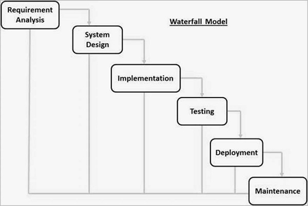
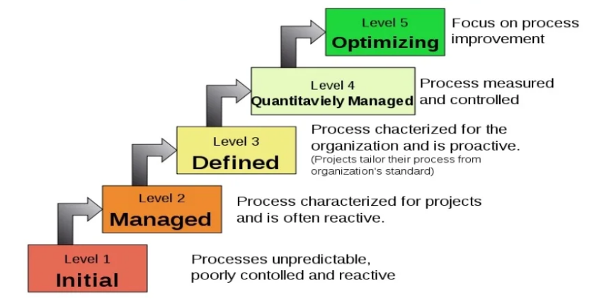
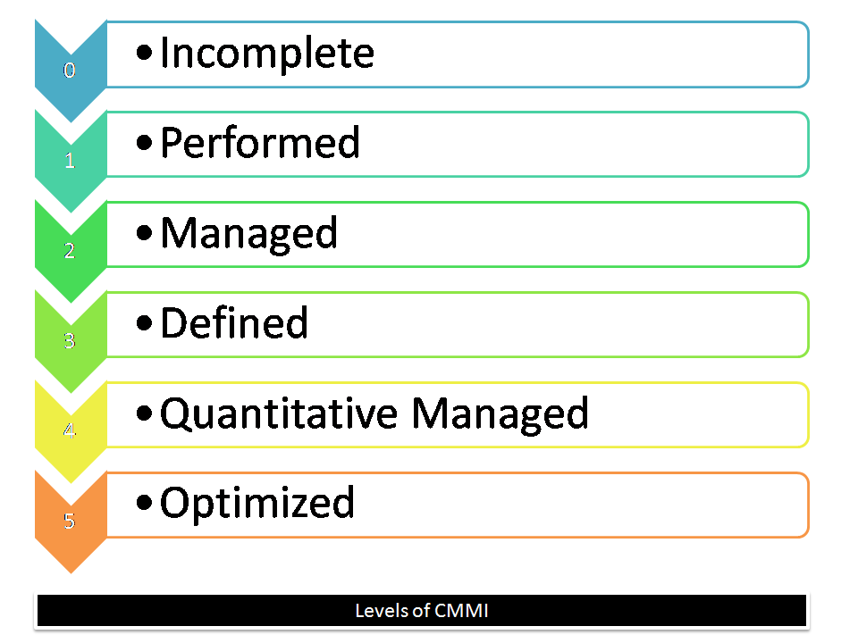

# 
 Unit 1 

# 
 <b> Software Engineering </b> 

## Software Process Assessment

Software process assessment is a critical practice in the field of software development, aimed at evaluating and improving the processes used in creating software. These assessments help organizations identify areas for improvement, ensure compliance with industry standards, and enhance the overall quality and efficiency of their software development processes. Various standards and assessment methods have been established to facilitate this process.

**Standards in Software Process Assessment:**

Standards play a crucial role in defining the criteria and best practices for software process assessment. They help ensure consistency, reliability, and quality in software development processes. Here are some of the key standards and assessment methods used in software process assessment:

1. **Standard CMMI Assessment Method for Process Improvement (SCAMPI):** The Standard CMMI Assessment Method for Process Improvement (SCAMPI) is a way to measure how mature an organization's software development processes are. It's based on the Capability Maturity Model Integration (CMMI), which is a framework for improving processes. SCAMPI helps organizations figure out how good their processes are and where they can make them better. It's also used to check if an organization is ready to be evaluated using CMMI.
    - It provides a five-step process for conducting appraisals: 
        - **Step 1:** Initiating
        - **Step 2:** Diagnosing
        - **Step 3:** Establishing 
        - **Step 4:** Acting
        - **Step 5:** Learning

2. **CMM-Based Appraisal for Internal Process Improvement (CBA IPI):** The CMM-Based Appraisal for Internal Process Improvement (CBA IPI) is a way to measure how mature an organization's software development processes are compared to others. It's developed by the Software Engineering Institute (SEI) at Carnegie Mellon University. This method looks at how well an organization's processes are working and suggests improvements by comparing them to processes in other organizations that use the CMMI model.

3. **SPICE (Software Process Improvement and Capability Determination):** SPICE (Software Process Improvement and Capability Determination): SPICE, based on the ISO/IEC 15504 standard, helps assess how good an organization's software development processes are. It provides a set of rules to check these processes and see how mature they are. This standard was created by the International Organization for Standardization (ISO) and the International Electrotechnical Commission (IEC). In simple terms, it helps organizations measure the quality of their software development practices and understand how to make them better.

4. **ISO 9001:2000 for Software:** It is a generic standard for quality management systems. It provides a framework for organizations that wants to improve overall of products, systems, and services. It focuses on defining a quality management system with components like organizational structure, responsibilities, procedures, and resources. In simple terms, it guides software companies on how to make their products and services better and align with customer expectations and specifications.

**Types of Software Process Assessments:**

Software process assessments can be categorized into three main types:

1. **Self-Assessment (First-Party Assessment):** In a self-assessment, an organization's internal personnel evaluate their software development processes. This type of assessment is focused on identifying strengths and weaknesses within the organization. It is a valuable method for continuous improvement and aligning processes with industry standards and best practices.

2. **Second-Party Assessment:** A second-party assessment involves external parties, such as customers or other stakeholders, evaluating an organization's software development processes. Customers may perform these assessments to ensure that their suppliers or service providers meet their specific requirements and quality standards.

3. **Third-Party Assessment:** In a third-party assessment, an external and independent organization assesses the software development processes of another organization. This type of assessment is often used in supplier evaluations to verify a supplier's capability to enter into contracts with customers or to meet industry standards.

## Process Models

**Process Models** are frameworks that guide how software is developed. They provide a set of guidelines and best practices for creating software. The most common process models are:

1. **Waterfall Model:** A linear, sequential approach with phases like requirements, design, implementation, and testing following one after the other. No overlap between phases.

2. **Incremental Models (Incremental, RAD):** These break the project into smaller parts and develop them individually, adding each part to the whole as it's completed. RAD (Rapid Application Development) emphasizes speedy development.

3. **Iterative Models (Prototype, Spiral):** These models involve repeating cycles of development, evaluation, and refinement. Prototyping involves creating a basic version of the software for early feedback, while the Spiral model focuses on risk management.

4. **Evolutionary Model:** This is about gradually refining the software based on user feedback. It starts with a basic version and evolves over time.

5. **Unified Model:** A blend of different models to cater to the specific needs of a project. It's flexible and can be adapted as needed.

## Waterfall Model

The **Waterfall Model** is one of the earliest and simplest approaches to software development. It's like a step-by-step sequence for building software, with each phase following the previous one in a linear way. There's no overlap between the phases.

The Waterfall Model has six phases:

1. **Requirement Analysis:** First, you collect and document all the requirements for the software you want to build.

2. **System Design:** Once you know what's needed, you create a design for the software. This design specifies how the software will work and what it needs in terms of hardware and architecture.

3. **Implementation:** This is where the actual coding happens. The software is developed in small pieces or units and tested to make sure each part works correctly (Unit Testing).

4. **Integration and Testing:** After individual units are created, they're put together to form the complete software system. Then, rigorous testing is done to find any issues or faults.

5. **Deployment:** Once everything is tested and works as expected, the software is deployed to the customer's environment or released to the market.

6. **Maintenance:** After deployment, you may need to fix issues that arise in the customer's environment. Sometimes, you release patches or new versions to improve the software.

The key idea is that you finish one phase before starting the next, like water flowing down a waterfall. This approach is suitable when requirements are clear, technology is stable, and you have ample resources for a short project.

**Advantages:**
- It's simple and easy to manage.
- Phases are well-defined, making it easy to track progress.
- Works well for smaller projects with clear requirements.
- Stages are documented, making it easy to understand the project's history.

**Disadvantages:**
- You don't see working software until late in the process.
- High risk and uncertainty, especially for complex projects.
- Not suitable for long or changing projects.
- Adjusting requirements mid-process can be problematic.
- Integration and testing are done late, making it hard to identify issues early.

## CMMI

**CMMI:** Capability Maturity Model Integration is an advanced model that builds on the earlier Capability Maturity Model (CMM). It aims to improve an organization's processes and achieve objectives such as meeting customer needs, increasing market growth, and enhancing product quality and reputation.

**CMMI Representations:**
- **Staged Representation:** It uses predefined process areas to create a sequence of improvements, with each level building on the previous one. This helps compare organizations at different maturity levels.
- **Continuous Representation:** Allows organizations to select specific process areas and determine their improvement order, offering flexibility in meeting objectives and eliminating risks.

**CMMI Maturity Levels (Staged Representation):**

- **Initial:** Processes are poorly managed, unpredictable, and ad hoc. No defined Key Process Areas (KPAs). Lowest quality and highest risk.
- **Managed:** Requirements are managed, processes are planned and controlled. Projects are implemented according to plans, with lower risk than the Initial level.
- **Defined:** Processes are well-characterized, standardized, and described using standards, procedures, and tools. Medium quality and risk.
- **Quantitatively Managed:** Quantitative objectives for process performance and quality are set. Process performance measures are analyzed quantitatively, achieving higher quality and lower risk.
- **Optimizing:** Emphasizes continuous improvement in processes and their performance, both incrementally and innovatively. Highest quality and lowest risk.

**CMMI Capability Levels (Continuous Representation):**

- **Capability Level 0 (Incomplete):** Process is partially or not performed. One or more specific goals are not met. Equivalent to Maturity Level 1.
- **Capability Level 1 (Performed):** Process performance may not be stable, and objectives for quality, cost, and schedule may not be met. All specific and generic practices for this level are expected to be performed.
- **Capability Level 2 (Managed):** Processes are planned, monitored, and controlled to achieve objectives, including cost, quality, and schedule, using metrics.
- **Capability Level 3 (Defined):** A well-defined process is managed and meets the organization's standards. Emphasis on process standardization.
- **Capability Level 4 (Quantitatively Managed):** Process is controlled using statistical and quantitative techniques. Process performance and quality are understood through metrics, with established quantitative objectives.
- **Capability Level 5 (Optimizing):** Focuses on continuous improvement in process performance through incremental and innovative means, analyzing performance results across the organization to identify and fix common issues.