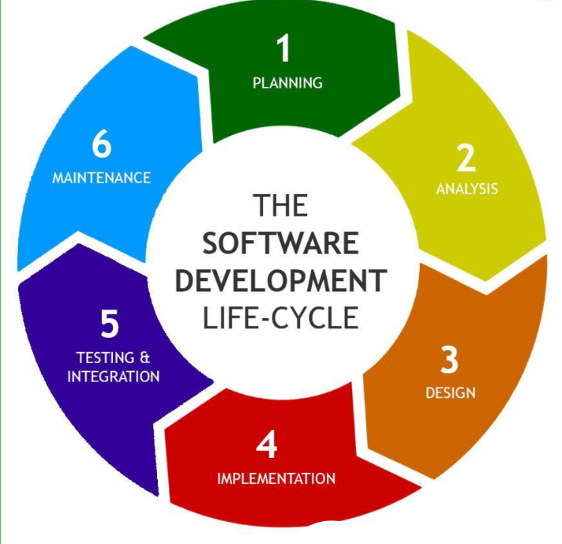
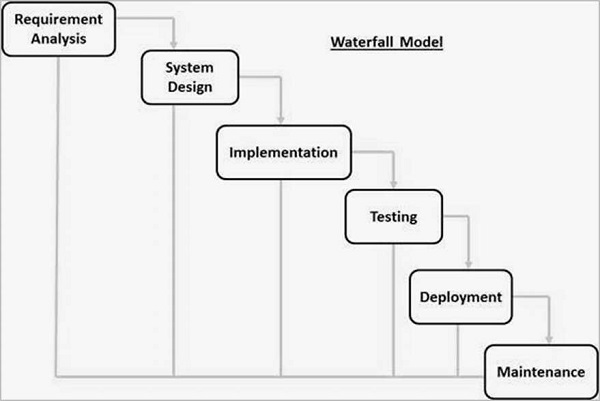
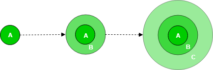
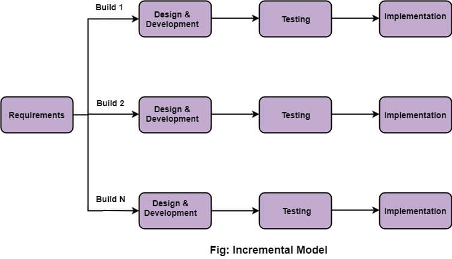
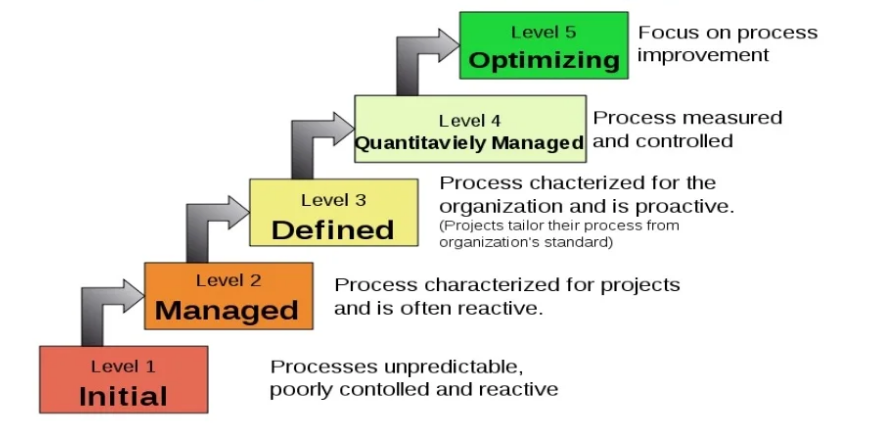
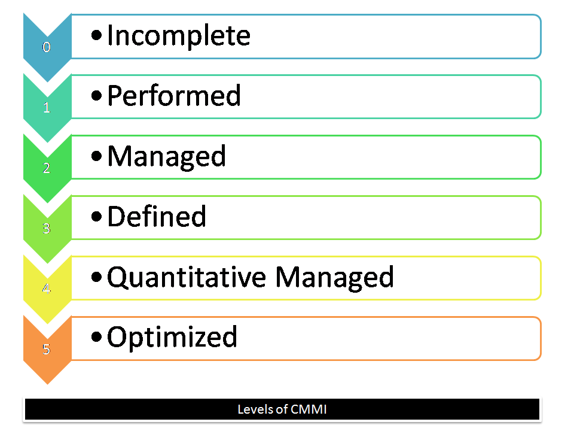
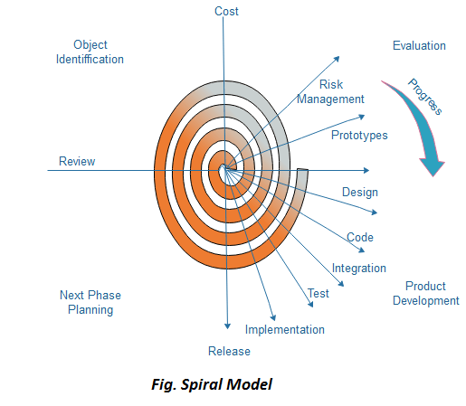
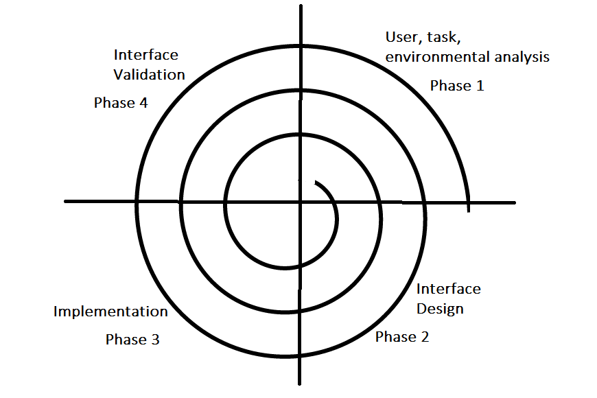
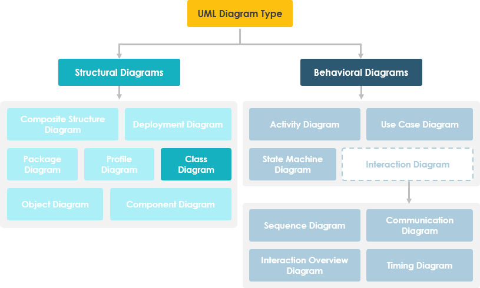
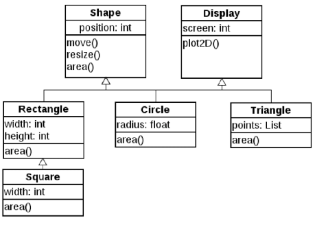

# 
 Unit 1 

# 
 <b> Software Engineering </b> 

## SDLC

The Software Development Life Cycle (SDLC) is a structured approach that software organizations employ to design, create, maintain, and enhance software systems. It's essentially a roadmap that guides the development process from conception to deployment, ensuring the delivery of high-quality software that meets user requirements.

The Software Development Life Cycle (SDLC) consists of several stages that guide the development process of software systems. These stages are essential to ensure the successful creation, maintenance, and enhancement of high-quality software that meets user requirements. Each stage serves a specific purpose and contributes to the overall success of the project. 

**The SDLC stages are:**

1. **Planning and Requirement Analysis:** The initial phase involves meticulous planning and gathering of requirements. It's where project outlines are shaped using inputs from customers and market analysis, forming the foundation of the entire project.

2. **Defining Requirements:** Here, all the necessary software requirements are clearly specified, validated, and approved by stakeholders. The Software Requirement Specification (SRS) document plays a pivotal role in outlining these requirements.

3. **Designing Architecture:** Multiple software architecture designs are conceived based on the requirements outlined in the SRS. The best-suited design is chosen after evaluations and assessments.

4. **Developing Product:** The actual development phase kicks off, where developers write the software code based on the chosen design. This involves following established protocols and using appropriate programming languages.

5. **Product Testing and Integration:** Thorough testing is conducted to identify and rectify potential flaws. This ensures that the software meets the quality standards specified in the SRS. It also involves documentation, training, and ongoing support.

6. **Deployment and Maintenance:** The final product undergoes phased release and real-world testing. Feedback is gathered, and the product is fine-tuned based on user experiences. Continuous monitoring and maintenance ensure sustained performance.

**The Significance of SDLC:**
SDLC serves as a blueprint for software development, ensuring a systematic approach to create robust, user-centric, and cost-effective software solutions. Understanding and adhering to this process is crucial for developers to navigate complexities and deliver successful software products.

## Software Process Assessment

Software process assessment is a critical practice in the field of software development, aimed at evaluating and improving the processes used in creating software. These assessments help organizations identify areas for improvement, ensure compliance with industry standards, and enhance the overall quality and efficiency of their software development processes. Various standards and assessment methods have been established to facilitate this process.

**Standards in Software Process Assessment:**

Standards play a crucial role in defining the criteria and best practices for software process assessment. They help ensure consistency, reliability, and quality in software development processes. Here are some of the key standards and assessment methods used in software process assessment:

1. **Standard CMMI Assessment Method for Process Improvement (SCAMPI):** The Standard CMMI Assessment Method for Process Improvement (SCAMPI) is a way to measure how mature an organization's software development processes are. It's based on the Capability Maturity Model Integration (CMMI), which is a framework for improving processes. SCAMPI helps organizations figure out how good their processes are and where they can make them better. It's also used to check if an organization is ready to be evaluated using CMMI.
    - It provides a five-step process for conducting appraisals: 
        - **Step 1:** Initiating
        - **Step 2:** Diagnosing
        - **Step 3:** Establishing 
        - **Step 4:** Acting
        - **Step 5:** Learning

2. **CMM-Based Appraisal for Internal Process Improvement (CBA IPI):** The CMM-Based Appraisal for Internal Process Improvement (CBA IPI) is a way to measure how mature an organization's software development processes are compared to others. It's developed by the Software Engineering Institute (SEI) at Carnegie Mellon University. This method looks at how well an organization's processes are working and suggests improvements by comparing them to processes in other organizations that use the CMMI model.

3. **SPICE (Software Process Improvement and Capability Determination):** SPICE (Software Process Improvement and Capability Determination): SPICE, based on the ISO/IEC 15504 standard, helps assess how good an organization's software development processes are. It provides a set of rules to check these processes and see how mature they are. This standard was created by the International Organization for Standardization (ISO) and the International Electrotechnical Commission (IEC). In simple terms, it helps organizations measure the quality of their software development practices and understand how to make them better.

4. **ISO 9001:2000 for Software:** It is a generic standard for quality management systems. It provides a framework for organizations that wants to improve overall of products, systems, and services. It focuses on defining a quality management system with components like organizational structure, responsibilities, procedures, and resources. In simple terms, it guides software companies on how to make their products and services better and align with customer expectations and specifications.

**Types of Software Process Assessments:**

Software process assessments can be categorized into three main types:

1. **Self-Assessment (First-Party Assessment):** In a self-assessment, an organization's internal personnel evaluate their software development processes. This type of assessment is focused on identifying strengths and weaknesses within the organization. It is a valuable method for continuous improvement and aligning processes with industry standards and best practices.

2. **Second-Party Assessment:** A second-party assessment involves external parties, such as customers or other stakeholders, evaluating an organization's software development processes. Customers may perform these assessments to ensure that their suppliers or service providers meet their specific requirements and quality standards.

3. **Third-Party Assessment:** In a third-party assessment, an external and independent organization assesses the software development processes of another organization. This type of assessment is often used in supplier evaluations to verify a supplier's capability to enter into contracts with customers or to meet industry standards.

## Process Models

**Process Models** are frameworks that guide how software is developed. They provide a set of guidelines and best practices for creating software. The most common process models are:

1. **Waterfall Model:** A linear, sequential approach with phases like requirements, design, implementation, and testing following one after the other. No overlap between phases.

2. **Incremental Models (Incremental, RAD):** These break the project into smaller parts and develop them individually, adding each part to the whole as it's completed. RAD (Rapid Application Development) emphasizes speedy development.

3. **Iterative Models (Prototype, Spiral):** These models involve repeating cycles of development, evaluation, and refinement. Prototyping involves creating a basic version of the software for early feedback, while the Spiral model focuses on risk management.

4. **Evolutionary Model:** This is about gradually refining the software based on user feedback. It starts with a basic version and evolves over time.

5. **Unified Model:** A blend of different models to cater to the specific needs of a project. It's flexible and can be adapted as needed.

## Waterfall Model

The **Waterfall Model** is one of the earliest and simplest approaches to software development. It's like a step-by-step sequence for building software, with each phase following the previous one in a linear way. There's no overlap between the phases.

The Waterfall Model has six phases:

1. **Requirement Analysis:** First, you collect and document all the requirements for the software you want to build.

2. **System Design:** Once you know what's needed, you create a design for the software. This design specifies how the software will work and what it needs in terms of hardware and architecture.

3. **Implementation:** This is where the actual coding happens. The software is developed in small pieces or units and tested to make sure each part works correctly (Unit Testing).

4. **Integration and Testing:** After individual units are created, they're put together to form the complete software system. Then, rigorous testing is done to find any issues or faults.

5. **Deployment:** Once everything is tested and works as expected, the software is deployed to the customer's environment or released to the market.

6. **Maintenance:** After deployment, you may need to fix issues that arise in the customer's environment. Sometimes, you release patches or new versions to improve the software.

The key idea is that you finish one phase before starting the next, like water flowing down a waterfall. This approach is suitable when requirements are clear, technology is stable, and you have ample resources for a short project.

**Advantages:**
- It's simple and easy to manage.
- Phases are well-defined, making it easy to track progress.
- Works well for smaller projects with clear requirements.
- Stages are documented, making it easy to understand the project's history.

**Disadvantages:**
- You don't see working software until late in the process.
- High risk and uncertainty, especially for complex projects.
- Not suitable for long or changing projects.
- Adjusting requirements mid-process can be problematic.
- Integration and testing are done late, making it hard to identify issues early.

## Incremental Model

The incremental model is a software development approach that breaks a project into smaller pieces and develops each piece individually. Each piece is called an increment. The increments are developed in a series of cycles, with each cycle adding more features to the software. The software is tested after each cycle to ensure it works as expected. This approach is also known as the Iterative Enhancement Model.

- **Development Phases:** It begins with a simple working system delivering basic features, followed by successive iterations until the desired system is achieved.

- **Module-based Development:** Modules (A, B, C) of software products are incrementally developed and delivered, focusing on core features first.

- **Iterative Process:** Each version builds upon the previous one, incorporating feedback from customers, with new functions added to increase capability.

- **Incremental Construction:** Requirements are split into versions, starting with version 1, developed and deployed successively, culminating in the final release.

**Types of Incremental Models:**
1. **Staged Delivery Model:** Construction of one project part at a time.
2. **Parallel Development Model:** Developing different subsystems simultaneously, reducing development time if adequate resources are available.  

**When to Use:**
- Funding schedule, risk, program complexity, or early benefit realization.
- Known upfront requirements.
- Lengthy development schedules or projects involving new technology.

**Characteristics:**
- System development divided into smaller projects.
- Partial systems constructed successively to create the final system.
- Priority requirements addressed first, with frozen requirements for each increment.

**Advantages:**
- Rapid software preparation.
- Clear project understanding for clients.
- Easy implementation of changes.
- Flexible scope adjustment, risk handling, and error identification.

**Disadvantages:**
- Requires a skilled team and well-planned execution.
- Increased cost due to continuous iterations.
- Issues may arise if all needs aren't gathered upfront, leading to design issues and time-consuming error corrections across iterations.

## CMMI

**CMMI:** Capability Maturity Model Integration is an advanced model that builds on the earlier Capability Maturity Model (CMM). It aims to improve an organization's processes and achieve objectives such as meeting customer needs, increasing market growth, and enhancing product quality and reputation.

**CMMI Representations:**
- **Staged Representation:** It uses predefined process areas to create a sequence of improvements, with each level building on the previous one. This helps compare organizations at different maturity levels.
- **Continuous Representation:** Allows organizations to select specific process areas and determine their improvement order, offering flexibility in meeting objectives and eliminating risks.

**CMMI Maturity Levels (Staged Representation):**

- **Initial:** Processes are poorly managed, unpredictable, and ad hoc. No defined Key Process Areas (KPAs). Lowest quality and highest risk.
- **Managed:** Requirements are managed, processes are planned and controlled. Projects are implemented according to plans, with lower risk than the Initial level.
- **Defined:** Processes are well-characterized, standardized, and described using standards, procedures, and tools. Medium quality and risk.
- **Quantitatively Managed:** Quantitative objectives for process performance and quality are set. Process performance measures are analyzed quantitatively, achieving higher quality and lower risk.
- **Optimizing:** Emphasizes continuous improvement in processes and their performance, both incrementally and innovatively. Highest quality and lowest risk.

**CMMI Capability Levels (Continuous Representation):**

- **Capability Level 0 (Incomplete):** Process is partially or not performed. One or more specific goals are not met. Equivalent to Maturity Level 1.
- **Capability Level 1 (Performed):** Process performance may not be stable, and objectives for quality, cost, and schedule may not be met. All specific and generic practices for this level are expected to be performed.
- **Capability Level 2 (Managed):** Processes are planned, monitored, and controlled to achieve objectives, including cost, quality, and schedule, using metrics.
- **Capability Level 3 (Defined):** A well-defined process is managed and meets the organization's standards. Emphasis on process standardization.
- **Capability Level 4 (Quantitatively Managed):** Process is controlled using statistical and quantitative techniques. Process performance and quality are understood through metrics, with established quantitative objectives.
- **Capability Level 5 (Optimizing):** Focuses on continuous improvement in process performance through incremental and innovative means, analyzing performance results across the organization to identify and fix common issues.

## Spiral Model

The **Spiral Model** is a software development approach that combines elements of iterative development with the controlled aspects of the waterfall model. It emphasizes risk analysis and allows incremental releases and refinement of the product through multiple iterations.

**Phases of the Spiral Model:**

1. **Identification:** This phase begins with gathering business requirements in the baseline spiral. As the project progresses, it identifies system requirements, subsystem requirements, and unit requirements. Continuous communication with the customer is crucial in understanding system requirements. The product is deployed in the identified market at the end of the spiral.

2. **Design:** The design phase starts with conceptual design in the baseline spiral and evolves into architectural design, logical design of modules, physical product design, and the final design in subsequent spirals.

3. **Construct or Build:** This phase involves producing the actual software product in each spiral. In the baseline spiral, a Proof of Concept (POC) is developed to get customer feedback. In subsequent spirals, with clearer requirements and design details, a working model of the software is built, and these builds are sent to the customer for feedback.

4. **Evaluation and Risk Analysis:** This phase includes identifying, estimating, and monitoring technical feasibility and management risks. After testing the build, the customer evaluates the software and provides feedback. Based on this feedback, the development process enters the next iteration, implementing customer-suggested changes.

**Spiral Model Application:**
- It's used when budget constraints and risk evaluation are important.
- Suitable for medium to high-risk projects.
- Ideal for long-term projects with changing requirements.
- Effective when customer requirements are unclear or complex and need evaluation for clarity.
- Suitable for new product lines released in phases to gather customer feedback.
- When significant changes are expected during development.

**Pros and Cons of the Spiral Model:**
- **Advantages:** Allows elements of the product to be added when known, early user involvement, and orderly transition to maintenance.
- **Challenges:** Requires strict management to prevent endless iterations and proper handling of change requests.

## Software Requirements Specification 

A **Software Requirements Specification (SRS) Document** is like a blueprint for the software you're going to build. It outlines what the software will do and how it should perform, ensuring it meets the needs of all stakeholders, including businesses and users. You can break down the creation of an SRS into four simple steps:

1. **Define the Purpose:** Start by describing the purpose of your product. Determine who will use the SRS, how they should use it, and what the product aims to achieve. This section should also clarify key terms and acronyms used in the document.

2. **Describe What You Will Build:** Provide a clear description of the product. Who needs it? Is it a new product or an extension of an existing one? Will it integrate with other software or systems? Identify user needs, assumptions, and dependencies.

3. **Detail Specific Requirements:** Specify the functional aspects of the software—what it will do. Identify how it will interact with other components, including users, hardware, software, and communications. Define system features and outline nonfunctional requirements related to performance, safety, security, usability, and scalability.

4. **Deliver for Approval:** Once you've completed the SRS, it needs to be reviewed and approved by key stakeholders. This document acts as a single source of truth for your entire development process, ensuring everyone is aligned and working toward the same goal.

An SRS document is essential for keeping your development teams on the same page, meeting requirements, and making informed decisions throughout the product's lifecycle. It may be challenging to create, but the effort pays off in better understanding the product, its users, and the time needed for development. While you can use tools like Microsoft Word to create SRS documents, be cautious of versioning issues and the potential for documents to become out-of-date.

## Functional and Non-Functional Requirements

Functional and non-functional requirements are two types of requirements that are essential for building software. Functional requirements describe what the software should do, while non-functional requirements describe how the software should perform. Both are important for ensuring that the software meets user needs and expectations.

| Functional Requirements                  | Non-Functional Requirements                 |
|------------------------------------------|--------------------------------------------|
| Explain what a system or part does.     | Define how well the system performs.       |
| Say "What should be done by the system."| Describe "How the system should perform its tasks."|
| Found in use case stories.              | Describe system qualities.                 |
| Decided by users.                       | Defined by tech experts.                   |
| Necessary for system working.           | Not must-have but impacts performance.    |
| Checked with regular tests.             | Checked with quality-focused tests.        |
| Usually easier to explain.              | Often trickier to define clearly.          |
| Applies to smaller parts of the system. | Applies to the whole system.               |
| Focuses on system actions.              | Focuses on how well the system works.     |
| Examples: User login, System shutdown, Email alerts. | Examples: Speed, Security, User-friendliness.|
| Tested through various functional checks.| Tested through checks focused on quality.  |
| Guides system behavior.                 | Affects overall system performance.        |
| Can change based on user needs.         | Often stays consistent without changes.   |

<h1> 
 Unit 2 
 </h1>

<h1> 
 Software Design 
 </h1>

## Golden rules of Software Design

The three Golden Rules of User Interface Design:

1. **Place the User in Control:**
   - Define interaction modes that don't force users into unnecessary actions.
   - Provide flexibility in interaction mechanisms, like keyboard, mouse, or touch screen.
   - Allow users to interrupt and undo actions, so they can switch tasks without losing progress.
   - Streamline interaction as users become more skilled and offer customization options.
   - Shield casual users from technical complexities, allowing them to focus on their tasks.
   - Enable direct interaction with on-screen objects for easier control and manipulation.

2. **Reduce the User's Memory Load:**
   - Minimize the demand on short-term memory by helping users keep track of their actions.
   - Provide meaningful defaults to save time and offer the option to customize features.
   - Use intuitive shortcuts (mnemonics) to perform actions quickly.
   - Design the interface based on real-world metaphors, making it more relatable.

3. **Make the Interface Consistent:**
   - Create a meaningful context for the current task and provide clear indicators for navigation.
   - Maintain consistency across a family of applications, ensuring a unified design approach.
   - Avoid making changes to past interactive models if there's no compelling reason, as it may disrupt user expectations.

## User Interface Design

User Interface Design is the process of creating the front-end view that users interact with when using software. An effective user interface makes software more popular by being:

1. **Attractive:** It should have a visually appealing design.
2. **Simple to Use:** Users should easily understand how to navigate and interact with the software.
3. **Responsive:** It should respond quickly to user actions.
4. **Clear to Understand:** Information and functions should be presented in a straightforward manner.
5. **Consistent:** The interface should maintain a uniform design across all screens.

There are two main types of user interfaces:

1. **Command Line Interface (CLI):** Users interact by typing commands, which requires memorizing command syntax and usage.

2. **Graphical User Interface (GUI):** This interface provides a visually interactive way to interact with the system, making it easier for users to interpret the software.

The User Interface Design Process involves several key activities:

1. **User, Task, Environmental Analysis, and Modeling:** This step focuses on understanding user profiles, their skills, knowledge, and requirements. It categorizes users based on their profiles and gathers their requirements. It also identifies the tasks users perform and analyzes the user's work environment, including physical and environmental factors.

2. **Interface Design:** The goal of this phase is to define the set of interface objects and actions that allow users to perform tasks. It involves creating control mechanisms and user scenarios that specify how users interact with the system. Design principles like the three golden rules are followed, and aspects like response time, command structure, error handling, and help features are considered.

3. **Interface Construction and Implementation:** The implementation phase begins with creating prototypes to evaluate usage scenarios. An interface toolkit is used to build windows, menus, error messages, commands, and other interactive elements. This phase is vital for building the actual interface based on the design.

4. **Interface Validation:** The final phase focuses on testing the interface to ensure it performs tasks correctly, handles various scenarios, meets user requirements, and is user-friendly. It should be easy to use, easy to learn, and widely accepted by users as a valuable tool for their work.

## Design Concepts

Design concepts in software engineering play a critical role in shaping the structure, functionality, and quality of software systems. These concepts provide a foundational framework for creating efficient, maintainable, and robust software. Here's an explanation of the design concepts mentioned in your provided information:

1. **Abstraction:**
   - **Definition:** Abstraction involves representing complex systems by simplifying them into their essential characteristics. It allows developers to focus on high-level concepts without getting lost in details.
   - **Example:** In software, abstraction can be seen in the use of functions and data structures. For instance, a function can be considered a high-level abstraction that hides the implementation details, allowing developers to use it without needing to understand its internal workings.

2. **Architecture:**
   - **Definition:** Software architecture refers to the high-level structure of a software system. It defines the components, their relationships, and their interactions.
   - **Example:** An e-commerce application's architecture may consist of components like user interface, database, payment processing, and shipping modules. The interactions between these components define the software's architecture.

3. **Patterns:**
   - **Definition:** Design patterns are reusable solutions to common software design problems. They help standardize the design process and promote best practices.
   - **Example:** The "Singleton" pattern ensures that a class has only one instance, the "Observer" pattern is used to implement event handling, and the "Factory" pattern creates objects without specifying the exact class to be instantiated.

4. **Modularity:**
   - **Definition:** Modularity is the practice of dividing a software system into separate, manageable components or modules. Each module has a specific function and can be developed, tested, and maintained independently.
   - **Example:** In a web application, you can have separate modules for user authentication, database access, and user interface. These modules can be developed and updated without affecting the others.

5. **Information Hiding:**
   - **Definition:** Information hiding restricts access to certain details within a module or component. It ensures that the internal workings of a module are hidden from other parts of the software.
   - **Example:** Encapsulation in object-oriented programming is an example of information hiding. An object's data is kept private and is accessed only through well-defined interfaces (methods).

6. **Functional Independence:**
   - **Definition:** Functional independence involves minimizing the interaction between different components or modules to keep them self-contained and focused on their specific tasks.
   - **Example:** Cohesion and coupling are criteria used to assess functional independence. High cohesion means that a module performs a single, well-defined task. Low coupling indicates that modules have minimal interdependence.

7. **Refinement:**
   - **Definition:** Refinement is a top-down design process where a high-level description is progressively detailed into lower-level components. It involves breaking down functions into smaller, more manageable steps.
   - **Example:** In structured programming, the refinement process starts with a problem statement and is gradually refined into detailed algorithms and code.

8. **Refactoring:**
   - **Definition:** Refactoring is the process of restructuring code to improve its internal structure without changing its external behavior. It enhances the code's readability, maintainability, and performance.
   - **Example:** Refactoring might involve renaming variables, splitting large functions into smaller ones, or optimizing data structures.

9. **Design Classes:**
   - **Definition:** Design classes are a way of organizing software models. Each class describes elements of the problem domain, focusing on user-visible features and behaviors.
   - **Example:** In an object-oriented design, classes represent objects or entities within the problem domain. For a banking system, design classes could include "Account," "Transaction," and "Customer."

<h1> 
 Unit 3 
 </h1>

<h1> 
 Modelling 
 </h1>

## UML

The Unified Modeling Language (UML) is a visual language for modeling software systems. It's used to specify, visualize, construct, and document the artifacts of a software system. UML is a standard language for modeling software systems. It's used to specify, visualize, construct, and document the artifacts of a software system.  
In simpler terms, UML is a way to visualize a software program using diagrams. It will help you understand how the software works and how it's structured. It's also used to communicate with other developers about the software.

Unified Modeling Language (UML) diagrams are visual representations used to design and understand software systems. They help in depicting the structure, behavior, and interactions within a system. The purpose of UML diagrams is to provide a standardized way of visualizing and communicating system design concepts and complexities to different stakeholders involved in software development.

**Usage and Purpose:**
- **Design Communication:** They serve as a common language for developers, stakeholders, and designers to discuss and comprehend the structure and behavior of a system.
- **Visualization:** UML diagrams provide a visual blueprint of the software system, aiding in understanding its components, relationships, and flow.
- **Documentation:** They facilitate documentation by offering clear, concise, and standardized representations of various aspects of the system.
- **Planning and Development:** UML diagrams help in planning software development phases and serve as a guide during the implementation process.

**Classification into Structural and Behavioral:**

UML diagrams can be classified into two main categories:  

1. **Structural Diagrams:** These diagrams focus on the static aspects of the system, such as the components that make up the system and their relationships. They include Class Diagrams, Object Diagrams, Component Diagrams, and Deployment Diagrams.
2. **Behavioral Diagrams:** These diagrams focus on the dynamic aspects of the system, such as the interactions between the components and how the system behaves in response to certain events. They include Use Case Diagrams, Activity Diagrams, State Machine Diagrams, and Sequence Diagrams.

| Structural UML Diagrams                | Behavioral UML Diagrams                 |
|---------------------------------------|-----------------------------------------|
| Depict static aspects of the system, focusing on its components, relationships, and organization. | Emphasize dynamic aspects, showcasing system interactions, state changes, and functionality over time. |
| **Examples:**                         | **Examples:**                           |
| - Class Diagrams: Show classes, attributes, relationships. | - Use Case Diagrams: Illustrate user interactions and system functionalities from a user's perspective. |
| - Object Diagrams: Display instances of classes and their relationships at a specific point in time. | - Sequence Diagrams: Display object interactions and message sequences over time. |
| - Component Diagrams: Represent physical system components and their connections. | - Activity Diagrams: Illustrate workflows and processes within the system. |
| - Deployment Diagrams: Depict physical deployment of software components in hardware environments. | - State Machine Diagrams: Represent state transitions of an object in response to events. | 

**Principles of Modeling in UML:**

1. **Choose Your Model Well:** Select a modeling approach or technique that best suits the purpose and context of what you're trying to represent. Different situations may require different models for accuracy and clarity.

2. **Levels of Precision:** Models can be represented at various levels of detail or accuracy. Depending on the intended use, a model can range from a high-level overview to a detailed representation, each serving different purposes.

3. **Connected to Reality:** Effective models accurately reflect or represent real-world systems or concepts. The closer the model aligns with reality, the more reliable and useful it becomes for understanding and prediction.

4. **No Single Model is Sufficient:** One model might not capture all aspects or perspectives of a system comprehensively. Using multiple models or viewpoints can offer a more holistic understanding of complex systems, ensuring a more complete representation. Each model might highlight different aspects, contributing to a comprehensive understanding when combined.

*Kinda Extra*

- **Abstraction:** Focus on relevant information while hiding unnecessary details.
- **Modularity:** Divide the system into manageable parts or modules.
- **Clarity:** Create diagrams that are easy to understand and interpret.
- **Consistency:** Ensure uniformity in notation and representation throughout the diagrams.
- **Reusability:** Design diagrams that can be reused or adapted for similar systems or scenarios.

## Class Diagram

A **Class Diagram** is a type of UML diagram that shows the structure of a system by depicting the classes of the system, their attributes, operations, and the relationships between them. It's a static model that describes the structure of a system, showing the system's classes, their attributes, operations, and relationships. 

- Class diagrams show a set of classes, interfaces, and collaborations and their relationships.
- It is the most common diagram found modeling object-oriented systems.

**Purposes of Class Diagrams:**

- **Design and Planning:** Helps in visualizing the structure of a system during the design phase.
- **Communication:** Serves as a communication tool among stakeholders to convey system structure and relationships.
- **Responsibility Assignment:** Aids in assigning responsibilities to different teams during system development.
- **Analysis:** Aids in identifying classes, their attributes, and relationships for further analysis and system development.
- **Documentation:** Provides a clear and concise representation of the system's class structure for future reference.
- **Forward and Reverse Engineering:** Helps in generating code from class diagrams (forward engineering) and vice versa (reverse engineering).

**Components of Class Diagrams:**

1. **Class:** Represents a blueprint or template for creating objects. It contains attributes (characteristics or properties) and methods (functions or behaviors) that define the behavior of the objects.

2. **Attributes:** Characteristics or properties of a class that describe the state of objects. These are depicted as named slots within the class, representing data associated with objects.

3. **Methods:** Functions or behaviors of a class that describe how objects interact and operate. They are depicted as named operations within the class, showing what the objects of that class can do.

4. **Relationships:** Define how classes are associated or connected to each other. Common relationships include associations, aggregations, compositions, inheritance (generalization), and dependencies.

**Things to Remember:**

- The name of the class should be meaningful and descriptive of its purpose in the system.
- Each element within the class should be named and described clearly and identified before the construction of the class diagram.
- Responsibilities (attributes and methods) should be assigned to the class based on its purpose and behavior.
- For each class, minimum number of attributes and methods should be defined to ensure cohesion and avoid redundancy. It should be neither too large nor too small to not make it complex or useless.
- Finally, before making the final version, the class diagram should be drawn on paper and reviewed by the team to ensure it's accurate and complete.

