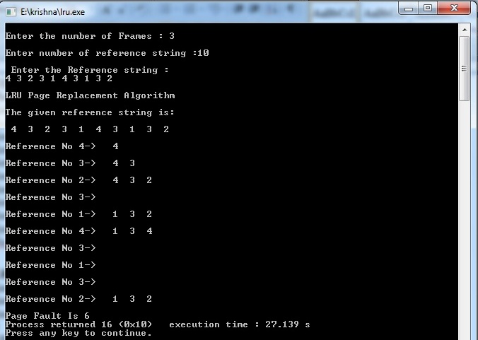

# Mid

## Priority Scheduling

```c
#include <stdio.h>

void main() {
    int pid[10], bt[10], pr[10], wt[10], tat[10], n, twt = 0, ttat = 0, i, j, t;
    float awt, atat;

    // Concept: Priority Scheduling algorithm
    // The program calculates the Waiting Time and Turnaround Time for a given set of processes with their burst times and priorities.
    // It arranges the processes in ascending order based on priorities.

    printf("Enter no. of processes:");
    scanf("%d", &n); // 'n' represents the number of processes.

    printf("\nEnter burst times:");
    for (i = 0; i < n; i++)
        scanf("%d", &bt[i]); // 'bt' array represents the burst times of each process.

    printf("\nEnter PID:");
    for (i = 0; i < n; i++)
        scanf("%d", &pid[i]); // 'pid' array represents the Process IDs.

    printf("\nEnter Priorities:");
    for (i = 0; i < n; i++)
        scanf("%d", &pr[i]); // 'pr' array represents the priorities of each process.

    // Sort the processes based on priority using Bubble Sort
    for (i = 0; i < n; i++) {
        for (j = i + 1; j < n; j++) {
            if (pr[i] > pr[j]) {
                // Swap priorities, burst times, and Process IDs
                t = pr[i];
                pr[i] = pr[j];
                pr[j] = t;

                t = bt[i];
                bt[i] = bt[j];
                bt[j] = t;

                t = pid[i];
                pid[i] = pid[j];
                pid[j] = t;
            }
        }
    }

    // Calculate Waiting Time (wt) and Turnaround Time (tat) for each process
    wt[0] = 0;
    tat[0] = bt[0];
    for (i = 1; i < n; i++) {
        wt[i] = tat[i - 1];
        tat[i] = bt[i] + wt[i];
    }

    // Calculate total Waiting Time (twt) and total Turnaround Time (ttat)
    for (i = 0; i < n; i++) {
        ttat = ttat + tat[i];
        twt = twt + wt[i];
    }

    // Print the results: Process ID, Priority, Burst Time, Waiting Time, and Turnaround Time
    printf("\n PID PRIORITY \t BT \t WT \t TAT");
    for (i = 0; i < n; i++)
        printf("\n %d\t%d\t%d\t%d\t%d", pid[i], pr[i], bt[i], wt[i], tat[i]);

    // Calculate and print the average Waiting Time and average Turnaround Time
    awt = (float) twt / n;
    atat = (float) ttat / n;
    printf("\nAvg. Waiting Time=%f", awt);
    printf("\nAvg. Turnaround time=%f", atat);
}
```


## LRU paging

```c
#include<stdio.h>

void main() {
    int i, j, l, max, n, a[50], frame[10], flag, fno, k, avail, pagefault = 0, lru[10];
    
    // Concept: The 'frame' array represents the memory frames, and each element represents the content of a frame.
    //          The 'lru' array is used to track the least recently used frames.

    printf("\nEnter the number of Frames : ");
    scanf("%d", &fno); // 'fno' represents the number of memory frames.

    printf("\nEnter the number of reference strings: ");
    scanf("%d", &n); // 'n' represents the number of memory reference strings.

    printf("\nEnter the Reference strings: ");
    for (i = 0; i < n; i++)
        scanf("%d", &a[i]); // 'a' array represents the memory reference strings.

    // Initialize the memory frames and lru array with default values.
    for (i = 0; i < fno; i++) {
        frame[i] = -1; // Initialize the frames to -1 to indicate they are empty.
        lru[i] = 0; // Initialize the lru array to 0 (indicating all frames are equally recent).
    }

    printf("\nLRU Page Replacement Algorithm\n\n");
    printf("The given reference string is:\n\n");
    for (i = 0; i < n; i++) {
        printf(" %d ", a[i]);
    }
    printf("\n");

    j = 0; // 'j' represents the index of the least recently used frame.

    // Loop through the memory reference strings to simulate the LRU page replacement algorithm.
    for (i = 0; i < n; i++) {
        max = 0; // 'max' is used to find the index of the least recently used frame.
        flag = 0;
        printf("\nReference No %d-> ", a[i]);
        avail = 0;

        // Check if the referenced page is already present in any of the memory frames.
        for (k = 0; k < fno; k++){
            if (frame[k] == a[i]) {
                avail = 1; // Set 'avail' to 1 if the page is found in a frame.
                lru[k] = 0; // Reset the lru value for the found frame.
                break;
            }
        }

        if (avail == 1) {
            // If the page is present in a frame, we update the lru values for other frames.
            for (k = 0; k < fno; k++)
                if (frame[k] != -1)
                    ++lru[k];

            // Find the index of the least recently used frame (page) in the 'lru' array.
            max = 0;
            for (k = 1; k < fno; k++)
                if (lru[k] > lru[max])
                    max = k;
            j = max; // Update the 'j' index with the index of the least recently used frame.
        }

        if (avail == 0) {
            // If the page is not found in any frame (page fault occurs), we update the 'j' index.
            lru[j] = 0;
            frame[j] = a[i]; // Replace the least recently used frame with the new page.

            // Search for an empty frame to place the new page.
            for (k = 0; k < fno; k++) {
                if (frame[k] != -1)
                    ++lru[k];
                else {
                    j = k;
                    flag = 1;
                    break;
                }
            }

            // If there is no empty frame, we find the index of the least recently used frame.
            if (flag == 0) {
                max = 0;
                for (k = 1; k < fno; k++)
                    if (lru[k] > lru[max])
                        max = k;
                j = max; // Update the 'j' index with the index of the least recently used frame.
            }

            pagefault++; // Increment the page fault count.
            for (k = 0; k < fno; k++)
                if (frame[k] != -1)
                    printf(" %2d", frame[k]); // Print the frames' content after the page fault.
        }
        printf("\n");
    }
    printf("\nPage Fault Is %d", pagefault); // Print the total number of page faults at the end.
}
```




# External


1.
---

### A. **Delete Directory:**
   - **Description:** The `rmdir` command is used to remove (delete) an empty directory in a Unix-based operating system.
   - **Syntax:** `rmdir [directory_name]`
   - **Example:** To delete a directory named "my_directory," you can use the following command:
     ```
     rmdir my_directory
     ```
   - **Explanation:** The `rmdir` command deletes the "my_directory" if it is empty. If the directory contains any files or subdirectories, the command will not work. To delete non-empty directories, you can use the `rm` command with the `-r` (recursive) option.

### B. **Difference between `cp` and `mv` command:**
   - **Description:** Both `cp` and `mv` commands are used to manipulate files, but they have different purposes:
     - `cp`: The `cp` command is used to copy files from one location to another.
     - `mv`: The `mv` command is used to move files from one location to another or rename files.
   - **Example for `cp`:** To copy a file named "file.txt" from the current directory to the "backup" directory, you can use the following command:
     ```
     cp file.txt backup/
     ```
   - **Example for `mv`:** To move a file named "file.txt" from the current directory to the "archive" directory, you can use the following command:
     ```
     mv file.txt archive/
     ```
   - **Explanation:** The `cp` command creates a duplicate of the original file, leaving the original intact. The `mv` command, on the other hand, moves the file from the source location to the destination location. If the destination location is the same as the source directory, `mv` can also be used to rename the file.

### C. **Command to see the content of a given file:**
   - **Description:** The `cat` command is used to display the content of a file in a Unix-based operating system.
   - **Syntax:** `cat [file_name]`
   - **Example:** To view the content of a file named "example.txt," you can use the following command:
     ```
     cat example.txt
     ```
   - **Explanation:** The `cat` command reads the content of "example.txt" and displays it in the terminal. It is commonly used to quickly view the contents of a text file.

### D. **DF:**
   - **Description:** The `df` command is used to display the amount of disk space available on the file system.
   - **Syntax:** `df [options] [file_system]`
   - **Example:** To see the disk space usage of all mounted file systems, you can use the following command:
     ```
     df
     ```
   - **Explanation:** The `df` command without any options displays information about all mounted file systems, including the total size, used space, available space, and mount points.

### E. **PS:**
   - **Description:** The `ps` command is used to display the currently running processes and their details in Unix-based operating systems.
   - **Syntax:** `ps [options]`
   - **Example:** To see the list of all processes running in the current terminal, you can use the following command:
     ```
     ps
     ```
   - **Explanation:** The `ps` command without any options displays information about processes associated with the current terminal. It shows the process ID (PID), terminal, CPU and memory usage, and other details.


2.
----

```bash
h=$(date +"%H")
if [ $h -gt 6 -a $h -le 12 ]
then
echo good morning
elif [ $h -gt 12 -a $h -le 16 ]
then
echo good afternoon
elif [ $h -gt 16 -a $h -le 20 ]
then
echo good evening
else
echo good night
fi
```


3a.
---

```c
#include <stdio.h>

void main() {
    int pid[10], bt[10], wt[10], tat[10], n, twt = 0, ttat = 0, i;
    float awt, atat;

    // Concept: Calculate Waiting Time (WT) and Turnaround Time (TAT) for a set of processes.
    // The program uses the Burst Time (BT) of each process to calculate WT and TAT.

    printf("Enter no. of processes:");
    scanf("%d", &n); // 'n' represents the number of processes.

    printf("\nEnter burst times:");
    for (i = 0; i < n; i++)
        scanf("%d", &bt[i]); // 'bt' array represents the burst times of each process.

    wt[0] = 0; // The first process has zero Waiting Time.

    tat[0] = bt[0]; // Turnaround Time of the first process is its Burst Time.

    // Calculate the Waiting Time (wt) and Turnaround Time (tat) for each process.
    for (i = 1; i < n; i++) {
        wt[i] = tat[i - 1]; // Waiting Time of process 'i' is the Turnaround Time of process 'i-1'.
        tat[i] = bt[i] + wt[i]; // Turnaround Time of process 'i' is the sum of its Burst Time and Waiting Time.
    }

    // Calculate the total Waiting Time (twt) and total Turnaround Time (ttat).
    for (i = 0; i < n; i++) {
        ttat = ttat + tat[i];
        twt = twt + wt[i];
    }

    // Print the results: Process ID (i+1), Burst Time (bt[i]), Waiting Time (wt[i]), and Turnaround Time (tat[i]).
    printf("\n PID \t BT \t WT \t TAT");
    for (i = 0; i < n; i++)
        printf("\n %d\t%d\t%d\t%d", i + 1, bt[i], wt[i], tat[i]);

    // Calculate and print the average Waiting Time and average Turnaround Time.
    awt = (float) twt / n;
    atat = (float) ttat / n;
    printf("\nAvg. Waiting Time=%f", awt);
    printf("\nAvg. Turnaround time=%f", atat);
}
```


3b.
---
    
```c
#include <stdio.h>

main() {
    int n, m[20], i, j, sb[20], b[20][20], x;

    // Concept: File Allocation in Operating Systems
    // The program allows the user to allocate and manage files using index blocks and blocks.

    printf("\nEnter no. of files:");
    scanf("%d", &n); // 'n' represents the number of files.

    // Input file details (index block, length, and blocks) for each file.
    for (i = 0; i < n; i++) {
        printf("\nEnter index block of file%d:", i + 1);
        scanf("%d", &sb[i]); // 'sb' array stores the index blocks for each file.

        printf("\nEnter length of file%d:", i + 1);
        scanf("%d", &m[i]); // 'm' array stores the lengths of each file.

        printf("Enter blocks of file%d:", i + 1);
        for (j = 0; j < m[i]; j++)
            scanf("%d", &b[i][j]); // 'b' 2D array stores the blocks of each file.
    }

    // Print the details of all files: File Number, Index Block, and Length.
    printf("\nFile\t Index\tLength\n");
    for (i = 0; i < n; i++) {
        printf("%d\t%d\t%d\n", i + 1, sb[i], m[i]);
    }

    // Search for a specific file using the file name (x).
    printf("\nEnter file name:");
    scanf("%d", &x); // 'x' represents the file name.

    // Print the details of the searched file: File Name, Index Block, and Blocks occupied by the file.
    printf("\nfile name is:%d", x);
    printf("\nIndex is:%d", sb[x - 1]);
    printf("\nBlocks occupied are:");
    for (j = 0; j < m[x - 1]; j++)
        printf("%4d", b[x - 1][j]);
}
```

